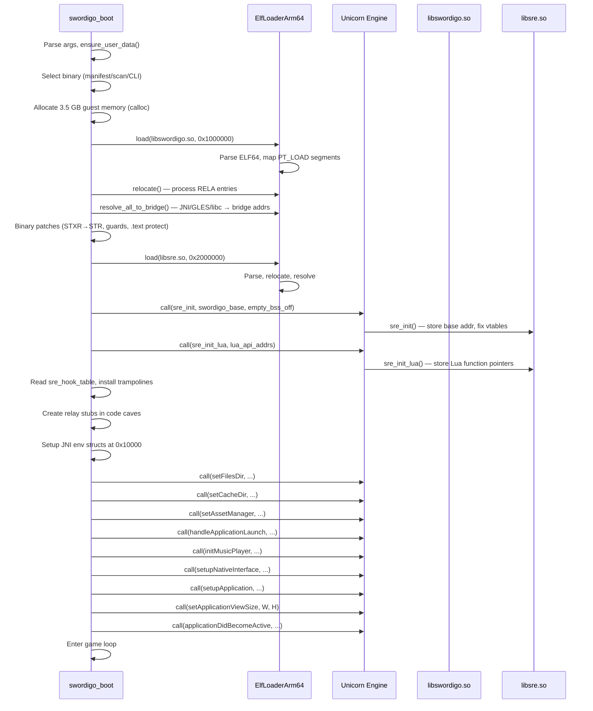

# Architecture — Swordigo Runtime (SRT)

> **Scope**: This document describes the complete architecture of Swordigo
> Desktop — how an ARM Android game runs on an x86_64 Linux desktop through
> CPU emulation, JNI bridging, function hooking, and graphics translation.
>
> **Key source files**:
> - [main.cpp](file:///home/quantumcreeper/SwordigoDesktop/src/main.cpp) — boot sequence, game loop, SRE integration
> - [sre.h](file:///home/quantumcreeper/SwordigoDesktop/src/sre/sre.h) — SRE public API
> - [sre_init.c](file:///home/quantumcreeper/SwordigoDesktop/src/sre/sre_init.c) — hook table, initialisation
> - [emulator_arm64.h](file:///home/quantumcreeper/SwordigoDesktop/src/platform/emulator_arm64.h) — ARM64 emulator wrapper
> - [elf_loader_arm64.h](file:///home/quantumcreeper/SwordigoDesktop/src/loader/elf_loader_arm64.h) — ELF loader
> - [jni_bridge_arm64.h](file:///home/quantumcreeper/SwordigoDesktop/src/jni/jni_bridge_arm64.h) — JNI function bridges
> - [fbo_scaler.h](file:///home/quantumcreeper/SwordigoDesktop/src/platform/fbo_scaler.h) — FBO + PostFX pipeline

---

## 1. Overview

Swordigo Desktop runs an unmodified Android ARM game binary (`libswordigo.so`)
on an x86_64 Linux host through **CPU emulation**. The architecture has three
main layers:

```
┌─────────────────────────────────────────────────────────┐
│                    Host (x86_64 Linux)                   │
│                                                         │
│  swordigo_boot          SDL3 Window     OpenGL/Vulkan   │
│  ├── ELF Loader         ├── Input       ├── FBO         │
│  ├── Unicorn Engine     ├── Events      ├── PostFX      │
│  ├── JNI Bridge         └── Display     └── Upscaler    │
│  └── SRT Overlay                                        │
│                                                         │
├─────────────────────────────────────────────────────────┤
│              Unicorn CPU Emulator (AArch64)              │
│                                                         │
│  ┌───────────────────────────────────────────────────┐  │
│  │               Guest Memory (3.5 GB)               │  │
│  │                                                   │  │
│  │  libswordigo.so    libsre.so    JNI structs      │  │
│  │  @ 0x1000000       @ 0x2000000  @ 0x10000        │  │
│  │                                                   │  │
│  │  ← ARM64 code executes here via uc_emu_start →   │  │
│  └───────────────────────────────────────────────────┘  │
│                                                         │
├─────────────────────────────────────────────────────────┤
│                   Bridge Layer                           │
│                                                         │
│  ~400 bridge functions at 0xFF000000                    │
│  Map Android APIs → host implementations:               │
│  ├── GLES 1.x → host OpenGL calls                      │
│  ├── OpenSL ES → host OpenAL calls                     │
│  ├── Bionic libc → host glibc wrappers                  │
│  └── JNI methods → host-side handlers                   │
└─────────────────────────────────────────────────────────┘
```

---

## 2. Components

### 2.1 swordigo_boot (Host Executable)

The main executable. Compiled for x86_64 Linux with GCC/G++. Responsibilities:

| Subsystem | Description |
|-----------|-------------|
| **ELF Loader** | Parses ARM ELF shared libraries, maps segments into guest memory, performs relocations, resolves symbols to bridge addresses |
| **Unicorn Engine** | CPU emulator wrapping QEMU. Executes ARM32 (Thumb-2) or ARM64 (AArch64) code in a single-threaded, synchronous loop |
| **JNI Bridge** | ~400 host-native functions that intercept guest calls to Android APIs (GLES, OpenSL, JNI, libc) and execute them natively on the host |
| **Binary Selector** | Discovers, hashes, and selects game binaries. See [binary-selector.md](binary-selector.md) |
| **Display** | SDL3 window management, input handling, gamepad support |
| **FBO + PostFX** | Framebuffer object pipeline with GLSL post-processing |
| **SRT Overlay** | ImGui-based debug overlay (F1), controls editor (F2), Lua console (backtick) |
| **SRE Integration** | Loads `libsre.so` into guest memory, installs trampolines |

### 2.2 libswordigo.so (Guest Binary)

The original Android game library, compiled by Touch Foo for ARM. Contains:

- **Caver Engine** — Touch Foo's proprietary game engine (C++)
- **Lua 5.1** — compiled with C++ linkage (mangled symbols)
- **Game Logic** — scenes, entities, AI, physics, rendering
- **JNI Entry Points** — `Java_com_touchfoo_swordigo_Native_*` functions

> [!IMPORTANT]
> This binary is **never modified on disk**. All patches (STXR, guards,
> trampolines) are applied to the in-memory copy in guest memory at load time.

### 2.3 libsre.so (Swordigo Runtime Engine — Guest Library)

An ARM64 shared library compiled with `aarch64-linux-gnu-gcc` that runs
**inside the guest**. It replaces problematic functions in `libswordigo.so`
with clean, non-atomic, single-threaded implementations.

**Compiled with**: `aarch64-linux-gnu-gcc -shared -fPIC -O2 -ffreestanding`

**Loaded at**: Guest address `0x2000000` (32 MB, above libswordigo's ~7 MB)

Key capabilities:
- **CppString** — eliminates atomic refcount operations (LDAXR/STLXR spin loops)
- **Lua error handling** — replaces `luaD_throw` and `__cxa_throw` with setjmp/longjmp
- **Background rendering** — custom sky renderer replacing the broken vertex pipeline
- **GUI hooks** — full DrawRect interception for all GUI classes with relay stubs
- **Music system** — writes commands to shared globals, host executes via OpenAL
- **Death/respawn fix** — bypasses Android ad SDK dependency
- **Text input** — intercepts ITextInputDelegate vtable for desktop keyboard input
- **Mod support** — injects Mini/LNI/Components Lua tables

---

## 3. Execution Flow

### 3.1 Boot Sequence (ARM64)



### 3.2 Game Loop (Per Frame)

```
┌─────────────────────────────────────────────┐
│ 1. Compute delta time (clamped to 0.1s max) │
│ 2. Process held button touch events         │
│ 3. Process macro queue                      │
│ 4. Camera override (if active)              │
│ 5. Apply game speed multiplier              │
│ 6. If not paused:                           │
│    call(updateApplication, env, dt)         │
│ 7. Handle death/respawn countdown           │
│ 8. Poll async IO callbacks                  │
│ 9. Handle snapshot load callbacks           │
│ 10. Begin FBO (fbo_begin_game)              │
│ 11. call(drawApplication, env)              │
│ 12. Flush draw batcher                      │
│ 13. PostFX + upscale (fbo_end_game_and_blit)│
│ 14. Camera position apply                   │
│ 15. Render GUI overlay (if F1 active)       │
│ 16. Render controls editor (if F2 active)   │
│ 17. Render SRT overlay (stats, console)     │
│ 18. Process SRE shared globals              │
│    (music, errors, game state)              │
│ 19. SDL_GL_SwapWindow                       │
│ 20. Process SDL events (input, window)      │
└─────────────────────────────────────────────┘
```

---

## 4. Guest Memory Layout

The entire guest address space is a single contiguous `calloc()`-allocated
buffer. Using `calloc` instead of `new uint8_t[]` is **critical** — the OS
lazy-zeroes pages via demand paging, avoiding garbage in uninitialised BSS/stack
areas that would create corrupt 64-bit pointers on ARM64.

### 4.1 Memory Map

```
Guest Address Space: 0x00000000 — 0xE0000000 (3.5 GB)

┌──────────────────────────────────────────────────────────────┐
│ 0x00000000 — 0x0000FFFF   Reserved / NULL guard             │
├──────────────────────────────────────────────────────────────┤
│ 0x00010000 — 0x00010FFF   JNI Environment (JNIEnv*)         │
│   0x10000  JNIEnv pointer → vtable at 0x10010               │
│   0x10010  JNI vtable (300 slots × 8 bytes for ARM64)       │
│   0x11000  JavaVM pointer → vtable at 0x11010               │
│   0x11010  JavaVM vtable (50 slots × 8 bytes)               │
├──────────────────────────────────────────────────────────────┤
│ 0x00020000 — 0x0002FFFF   String buffers (paths)            │
│   0x20000  filesDir string                                  │
│   0x20100  cacheDir string                                  │
├──────────────────────────────────────────────────────────────┤
│ 0x00048000 — 0x00048FFF   SRE Lua API addresses             │
│   0x48000  SreLuaAddrs (22 × uint64_t = 176 bytes)          │
│   0x48200  SreLuaExtAddrs (19 × uint64_t = 152 bytes)       │
├──────────────────────────────────────────────────────────────┤
│ 0x00050000 — 0x00050FFF   Guest globals (libc state)        │
│   GUEST_GLOBALS_BASE = 0x50000                              │
│   GUEST_GLOBALS_SIZE = 0x1000                               │
├──────────────────────────────────────────────────────────────┤
│ 0x01000000 — ~0x01800000  libswordigo.so                    │
│   Loaded at 0x1000000 (16 MB)                               │
│   .text, .rodata, .data, .bss segments                      │
│   ~7 MB typical for v1.4.12 ARM64                           │
├──────────────────────────────────────────────────────────────┤
│ 0x02000000 — ~0x02100000  libsre.so                         │
│   Loaded at 0x2000000 (32 MB)                               │
│   SRE hook implementations + data                           │
│   Includes sre_hook_table, Lua wrappers, GUI hooks          │
├──────────────────────────────────────────────────────────────┤
│ 0x02D6C000 — 0x02D6CFFF   Safety RET-page                  │
│   Filled with ARM64 RET (0xD65F03C0)                        │
│   Catches wild vtable jumps to 0x2D6CE4C                    │
├──────────────────────────────────────────────────────────────┤
│ 0x03000000 — 0x03000FFF   Code caves (relay stubs)          │
│   0x3000000  lua_resume relay (32 bytes)                    │
│   0x3000040  __cxa_throw relay (32 bytes)                   │
│   0x3000080  ProgramState::Update relay (32 bytes)          │
│   0x30000C0  GUIWindow::DrawRect relay                      │
│   0x3000100  GUIView::DrawRect relay                        │
│   ...        (64-byte spacing per relay)                    │
│   0x30002C0  MainMenuView::ButtonPressed relay              │
├──────────────────────────────────────────────────────────────┤
│ 0x3F000000                Text input scratch area            │
│   Guest jstring buffer for SDL text events                  │
├──────────────────────────────────────────────────────────────┤
│ 0x40000000 — ...          Snapshot data buffer               │
│   Save file loaded here for snapshotLoaded() callback       │
├──────────────────────────────────────────────────────────────┤
│ 0x48000000 — ...          Byte array allocator (JNI arrays)  │
│   Dynamic allocation for NewByteArray/NewIntArray           │
├──────────────────────────────────────────────────────────────┤
│ ...                       Stack (grows downward from high)   │
├──────────────────────────────────────────────────────────────┤
│ 0xE0000000                End of mapped memory               │
│   GUEST_MEM_SIZE = 0xE0000000 (3.5 GB)                      │
└──────────────────────────────────────────────────────────────┘
```

### 4.2 Why 3.5 GB?

ARM64 Swordigo allocates large contiguous buffers during area transitions
(scene loading). The original 512 MB allocation caused out-of-bounds accesses.
3.5 GB provides headroom for the game's dynamic allocations without exceeding
typical host memory limits.

### 4.3 Shared Configuration Region (0x48000 — 0x48FFF)

This region passes resolved function pointers from the host to `libsre.so`.
The host writes Lua API addresses here before calling `sre_init_lua()`:

```
0x48000: SreLuaAddrs struct (22 × uint64_t)
  [0]  lua_pcall
  [1]  lua_resume
  [2]  lua_settop
  [3]  lua_gettop
  [4]  lua_tolstring
  [5]  lua_call
  [6]  lua_pushstring
  [7]  lua_pushcclosure
  [8]  lua_setfield
  [9]  lua_getfield
  [10] lua_createtable
  [11] lua_pushnumber
  [12] lua_pushboolean
  [13] lua_pushnil
  [14] lua_tonumber
  [15] lua_toboolean
  [16] lua_type
  [17] luaL_register
  [18] lua_touserdata
  [19] lua_pushlightuserdata
  [20] lua_error
  [21] getSpeedMultiplier (SceneObject::updateSpeedMultiplier)

0x48200: SreLuaExtAddrs struct (19 × uint64_t)
  [0]  lua_pushvalue
  [1]  lua_remove
  [2]  lua_insert
  [3]  lua_replace
  [4]  lua_checkstack
  [5]  lua_rawget
  [6]  lua_rawset
  [7]  lua_rawgeti
  [8]  lua_rawseti
  [9]  lua_next
  [10] lua_objlen
  [11] lua_settable
  [12] lua_gettable
  [13] lua_isnumber
  [14] lua_isstring
  [15] lua_tointeger
  [16] lua_pushinteger
  [17] lua_concat
  [18] lua_pushlstring
```

---

## 5. JNI Bridge

### 5.1 Bridge Mechanism

When guest ARM code calls an Android API (GLES, OpenSL, libc, JNI), the call
reaches a **bridge trampoline** — a special guest address in the `0xFF000000`
range that triggers a Unicorn hook. The hook stops emulation, calls a host-side
C++ handler, and resumes execution.

```
Guest code:    BL glDrawArrays        (resolved to bridge addr)
                ↓
Unicorn hook:  PC == 0xFF000042       (bridge address for glDrawArrays)
                ↓
Host handler:  extract args from X0-X7, call real glDrawArrays()
                ↓
Resume:        set X0 = return value, jump back to guest LR
```

### 5.2 Bridge Address Space

```
0xFF000000 — Bridge base address (BRIDGE_BASE_64)
0xFF000000   First bridge function
0xFF000001   Second bridge function
...
0xFF000190   ~400th bridge function (approximate)
```

Each bridge address is a unique 64-bit value. The JniBridge64 class maintains a
bidirectional map:

```cpp
class JniBridge64 {
    map<string, uint64_t> name_to_addr;   // "glDrawArrays" → 0xFF000042
    map<uint64_t, BridgeFunction64> addr_to_func;  // 0xFF000042 → handler
    uint64_t next_addr;  // auto-incrementing allocator
};
```

### 5.3 Bridge Categories

| Category | Count (approx.) | Examples |
|----------|-----------------|----------|
| **GLES 1.x** | ~120 | `glDrawArrays`, `glBindTexture`, `glTexImage2D`, `glLoadMatrixf` |
| **OpenSL ES / Audio** | ~15 | `slCreateEngine`, `SL_IID_PLAY`, audio buffer queue |
| **Bionic libc** | ~80 | `malloc`, `free`, `memcpy`, `strlen`, `pthread_create`, `dlopen` |
| **JNI** | ~60 | `FindClass`, `GetMethodID`, `CallVoidMethodV`, `NewStringUTF` |
| **Math** | ~20 | `sinf`, `cosf`, `sqrtf`, `atan2f`, `powf` |
| **Unhandled** | ~100 | `UnhandledJNI_*`, `UnhandledVM_*` — log + return 0 |

### 5.4 JNI Environment Layout (ARM64)

The JNI environment is a fake structure in guest memory that mirrors Android's
JNIEnv layout:

```
0x10000: JNIEnv* → points to vtable at 0x10010
0x10010: JNI function table (300 entries × 8 bytes = 2400 bytes)
  [0x030] FindClass
  [0x070] ThrowNew
  [0x098] PushLocalFrame
  [0x0A0] PopLocalFrame
  [0x0A8] NewGlobalRef
  [0x108] GetMethodID
  [0x118] CallObjectMethodV
  [0x1F0] CallVoidMethodV
  [0x388] GetStaticMethodID
  [0x538] NewStringUTF
  [0x548] GetStringUTFChars
  [0x6B8] RegisterNatives
  ... (all ARM64 offsets = ARM32 offset × 2)

0x11000: JavaVM* → points to vtable at 0x11010
0x11010: JavaVM function table (50 entries × 8 bytes)
  [0x030] GetEnv
```

> [!NOTE]
> ARM64 JNI offsets are exactly **2× the ARM32 offsets** because pointers are
> 8 bytes instead of 4. For example, `FindClass` is at ARM32 offset `0x18`
> → ARM64 offset `0x30`.

---

## 6. Hook Mechanism

### 6.1 SreHookEntry

The hook table is defined in `libsre.so` and read by the host at boot:

```cpp
typedef struct {
    uint64_t    target_offset;  // File offset in libswordigo.so (0 = resolve by symbol)
    const char* symbol_name;    // Symbol name in libsre.so (replacement function)
    uint64_t    orig_func;      // Reserved: relay stub address (set by host)
} SreHookEntry;
```

### 6.2 Trampoline Installation

For each hook entry, the host writes a **16-byte trampoline** at the target
address in the guest copy of `libswordigo.so`:

```
Original code at target:       Patched code:
  SUB SP, SP, #0x40              LDR X16, [PC, #8]    ; 0x58000050
  STP X29, X30, [SP, #0x30]     BR  X16               ; 0xD61F0200
  MOV X29, SP                    .quad replacement_addr ; 8 bytes
  ...                            (original 4th instruction onwards)
```

The trampoline is exactly 16 bytes (4 ARM64 instructions), replacing the first
4 instructions of the target function. When the game calls this function, it
immediately jumps to the SRE replacement.

### 6.3 Relay Stubs (Call-Through)

Some SRE hooks need to call the **original** function after their own logic
(e.g., GUI DrawRect hooks that add overlays). Relay stubs preserve the original
instructions:

```
Code Cave (e.g., 0x30000C0):
  [0..15]   First 4 original instructions (saved from before trampoline)
  [16..19]  LDR X16, [PC, #8]     ; 0x58000050
  [20..23]  BR  X16               ; 0xD61F0200
  [24..31]  .quad (target + 16)   ; jump past the trampoline back into original
```

The SRE hook calls the relay stub via a global pointer:

```c
// In libsre.so
uint64_t g_orig_GUIWindow_DrawRect = 0;  // Set by host to 0x30000C0

void sre_GUIWindow_DrawRect(void* self, ...) {
    // Custom overlay logic...

    // Call original via relay stub
    typedef void (*DrawRect_t)(void*, ...);
    ((DrawRect_t)g_orig_GUIWindow_DrawRect)(self, ...);
}
```

### 6.4 Hook Categories

The current hook table installs hooks in these categories:

| Category | Hooks | Purpose |
|----------|-------|---------|
| **CppString** | 4 | Replace atomic LDAXR/STLXR refcounting with simple non-atomic operations |
| **Lua Error** | 2 | Replace `luaD_throw` and `__cxa_throw` with setjmp/longjmp recovery |
| **ProgramState** | 2-3 | Safe Lua resume execution with error recovery |
| **Background** | 3 | Custom sky/background renderer (BackgroundComponent, RotatingBackground) |
| **GUI DrawRect** | 8 | Full GUI stack interception (Window, View, Button, Label, Frame, Alert, Slider, Menu) |
| **Music** | 7 | Full MusicPlayer replacement (play, fade, update, volume, enable, suspend) |
| **Game Logic** | 2 | GameSceneView::Update (stats extraction), GameOverVC::ShowAdMaybe (death fix) |
| **Text Input** | 4 | Full text input chain (start/stop delegate, text change, finish) |
| **Menu** | 1 | MainMenuVC::DidOpenShop intercept |
| **Total** | ~30 | Active hooks (plus ~10 disabled/reserved entries) |

### 6.5 Dynamic Symbol Resolution

Some hooks have `target_offset = 0`, meaning the target function's address
must be resolved by C++ mangled symbol name at boot:

```cpp
// Mapping table: SRE symbol → engine mangled name
{"sre_ProgramState_Execute", "_ZN5Caver12ProgramState7ExecuteEi"},
{"sre_ProgramState_Resume",  "_ZN5Caver12ProgramState6ResumeEi"},
{"sre_ProgramState_Update",  "_ZN5Caver12ProgramState6UpdateEf"},
```

---

## 7. Binary Patches (Version-Independent)

These patches are applied to **every** ARM64 binary, regardless of version:

### 7.1 STXR → STR Patcher

ARM64 uses `LDXR`/`STXR` (Load-Exclusive / Store-Exclusive) for **all** atomic
operations: `shared_ptr` refcounts, mutexes, condition variables. In Unicorn's
single-threaded emulation, the exclusive monitor is unreliable, causing STXR to
spin indefinitely.

**Fix**: Scan the entire `.text` section and replace every STXR with a plain STR:

```
Before:                          After:
  LDXR  W1, [X0]                  LDXR  W1, [X0]       (unchanged)
  ADD   W1, W1, #1                ADD   W1, W1, #1     (unchanged)
  STXR  W2, W1, [X0]              STR   W1, [X0]       ← always succeeds
  CBNZ  W2, retry                  NOP                  ← no retry needed
```

The patcher also fixes the retry branch:
- `CBNZ Rs, retry` → `NOP` (don't retry, store always succeeds)
- `CBZ Rs, success` → `B success` (unconditional branch to success path)

### 7.2 __cxa_guard_* Replacement

C++ static local variable initialisation uses `__cxa_guard_acquire/release/abort`
which internally use atomics. Replaced with simple byte-flag check:

```asm
; __cxa_guard_acquire: check if already initialised
LDRB  W1, [X0]        ; load guard byte
CBNZ  W1, .already    ; if nonzero, already done
MOV   W0, #1          ; return 1 (needs init)
RET
.already:
MOV   W0, #0          ; return 0 (skip init)
RET

; __cxa_guard_release: mark as initialised
MOV   W1, #1
STRB  W1, [X0]        ; set guard byte
RET

; __cxa_guard_abort: no-op
RET
```

### 7.3 .text Section Protection

After all patches are applied, the `.text` section is marked read+execute only
(no write) via Unicorn's memory protection API. This catches accidental writes
to code memory.

---

## 8. Graphics Pipeline

### 8.1 Rendering Flow

The game uses **OpenGL ES 1.x** (fixed-function pipeline). All GLES calls from
the guest are intercepted by bridge functions and forwarded to the host's
desktop OpenGL:

```
Guest ARM64 code                    Host x86_64
─────────────────                   ────────────
glEnable(GL_TEXTURE_2D)       →     glEnable(GL_TEXTURE_2D)
glBindTexture(GL_TEXTURE_2D, id) →  glBindTexture(GL_TEXTURE_2D, mapped_id)
glVertexPointer(3, FLOAT, ...)  →   glVertexPointer(3, FLOAT, guest_mem + ptr)
glDrawArrays(TRIANGLES, 0, 6)  →   glDrawArrays(GL_TRIANGLES, 0, 6)
```

> [!IMPORTANT]
> Vertex/index pointers from the guest point into guest memory. The bridge
> converts these to host pointers by adding the guest memory base address.

### 8.2 FBO Pipeline

```
┌───────────────────────────────────────────────────────┐
│                      Game Frame                        │
│                                                       │
│  1. fbo_begin_game()                                  │
│     └── Bind FBO, set viewport to GAME_W × GAME_H    │
│                                                       │
│  2. drawApplication() [guest]                         │
│     └── All GLES calls render to FBO texture          │
│                                                       │
│  3. draw_batcher_flush()                              │
│     └── Flush batched draw calls                      │
│                                                       │
│  4. fbo_end_game_and_blit(win_w, win_h, mode, postfx) │
│     ├── If PostFX enabled:                            │
│     │   ├── Vignette pass                             │
│     │   ├── Film grain pass                           │
│     │   ├── Chromatic aberration pass                  │
│     │   ├── Color adjustment pass                     │
│     │   ├── Sharpen pass                              │
│     │   ├── God rays pass                             │
│     │   ├── SSAO pass                                 │
│     │   ├── Bloom pass                                │
│     │   ├── Shadows pass                              │
│     │   └── Outlines pass                             │
│     └── Upscale to window:                            │
│         ├── SHARP_BILINEAR (default)                  │
│         ├── NEAREST (pixel-perfect)                   │
│         ├── CRT_SCANLINE (retro CRT simulation)       │
│         └── FSR (AMD FidelityFX Super Resolution 1.0) │
│                                                       │
│  5. GUI overlays render directly to window             │
│                                                       │
│  6. SDL_GL_SwapWindow()                               │
└───────────────────────────────────────────────────────┘
```

### 8.3 PostFX Presets

| Preset | Effects | Description |
|--------|---------|-------------|
| `OFF` | None | Raw game output |
| `SW_PLUS` | God rays + warm glow + vignette | "Swordigo Plus" — enhanced atmospheric |
| `ATMOSPHERIC` | SSAO + volumetric + vignette | Depth-based ambient occlusion |
| `ETHEREAL` | God rays + warm colour grading | Dreamy, golden light |
| `CINEMATIC` | Vignette + colour adjust + grain | Film-like presentation |
| `RETRO` | CRT scanlines + chromatic aberration | Retro console look |
| `FANTASY` | Bloom + saturation + sharpening | Vibrant, saturated colours |
| `NOIR` | Desaturated + high contrast + outlines | Dark, moody atmosphere |
| `CUSTOM` | User-configured | All parameters individually adjustable |

### 8.4 Vulkan Backend (Optional)

When compiled with `VULKAN_BACKEND` and launched with `--vulkan`, the rendering
path uses Vulkan instead of OpenGL. The GLES bridge calls are translated to
Vulkan draw commands. This is experimental.

---

## 9. Host ↔ SRE Communication

### 9.1 Shared Volatile Globals

The host and SRE communicate through **shared memory regions** — global
variables in `libsre.so` that both sides can read/write. The host resolves
these symbols at boot and caches their guest addresses.

### 9.2 Communication Channels

#### Music Command Interface

The SRE music hooks write to shared globals instead of calling the broken
C++ MusicPlayer. The host polls these every frame:

| Global | Type | Direction | Purpose |
|--------|------|-----------|---------|
| `g_sre_music_load_name` | `char[256]` | SRE → Host | Music filename to load |
| `g_sre_music_load_pending` | `int` | SRE → Host | 1 = load requested |
| `g_sre_music_play_pending` | `int` | SRE → Host | 1 = play requested |
| `g_sre_music_pause_pending` | `int` | SRE → Host | 1 = pause requested |
| `g_sre_music_stop_pending` | `int` | SRE → Host | 1 = stop requested |
| `g_sre_music_volume` | `float` | SRE → Host | Target volume (0.0-1.0) |
| `g_sre_music_volume_dirty` | `int` | SRE → Host | 1 = volume changed |
| `g_sre_music_looping` | `int` | SRE → Host | Looping flag |
| `g_sre_music_looping_dirty` | `int` | SRE → Host | 1 = looping changed |

#### Player State (Game → Host)

Extracted by `sre_GameSceneView_Update` every frame:

| Global | Type | Purpose |
|--------|------|---------|
| `g_sre_player_hp` | `int` | Current health points |
| `g_sre_player_max_hp` | `int` | Maximum HP (level×2+4) |
| `g_sre_player_mana` | `int` | Current mana |
| `g_sre_player_max_mana` | `int` | Maximum mana (level×20+10) |
| `g_sre_player_coins` | `int` | Coins collected |
| `g_sre_player_xp` | `int` | Experience points |
| `g_sre_player_level` | `int` | Experience level |
| `g_sre_player_atk_level` | `int` | Attack attribute level |
| `g_sre_gui_scene_active` | `int` | 1 when gameplay scene is active |
| `g_sre_gamestate_ptr` | `uint64_t` | Guest pointer to GameState |
| `g_sre_menu_active` | `int` | Bitfield — nonzero = menu is open |
| `g_sre_text_input_active` | `int` | Nonzero = text input is active |
| `g_sre_hardmode` | `int` | Nonzero = hard mode active |

#### Background Renderer

| Global | Type | Purpose |
|--------|------|---------|
| `g_sre_bg_mode` | `int` | Background render mode |
| `g_sre_bg_brightness` | `float` | Background brightness |
| `g_sre_bg_depth` | `float` | Depth scale |
| `g_sre_bg_scale` | `float` | Texture scale |
| `g_sre_bg_cam_z` | `float` | Camera Z position |

#### Lua Console

| Global | Type | Purpose |
|--------|------|---------|
| `g_lua_console_buf` | `char[4096]` | Command buffer (host → SRE) |
| `g_lua_console_result` | `char[4096]` | Result buffer (SRE → host) |
| `g_lua_console_pending` | `int` | 1 = command waiting |
| `g_lua_console_status` | `int` | 0=idle, 1=success, 2=error |

#### Error Monitoring

| Global | Type | Purpose |
|--------|------|---------|
| `g_sre_resume_err_count` | `int` | Total lua_resume errors caught |
| `g_sre_resume_last_err` | `char[256]` | Last error message |
| `g_sre_cxa_throw_caller` | `uint64_t` | Address of last __cxa_throw caller |
| `g_sre_cxa_throw_unrecovered` | `int` | Count of unrecovered throws |

### 9.3 Polling Pattern

The host reads SRE globals every frame by directly accessing guest memory:

```cpp
// main.cpp — inside game loop
uint8_t* mem = g_emulator_64->get_memory_base();

// Check music commands
int load_pending = *(int*)(mem + sre_music_load_pending_addr);
if (load_pending) {
    char* name = (char*)(mem + sre_music_load_name_addr);
    sre_music_host_load(name);
    *(int*)(mem + sre_music_load_pending_addr) = 0;  // acknowledge
}

// Read player stats
int hp = *(int*)(mem + sre_player_hp_addr);
int max_hp = *(int*)(mem + sre_player_max_hp_addr);
// ... display in overlay
```

> [!TIP]
> This polling approach avoids any synchronisation primitives. Since both
> Unicorn emulation and host-side polling run on the same thread, there are no
> race conditions. Globals are marked `volatile` in SRE code to prevent
> compiler optimisation from caching stale values.

---

## 10. Threading Model

Swordigo Desktop is **strictly single-threaded** for all guest execution:

- All Unicorn CPU emulation runs on the main thread
- All GLES bridge calls execute synchronously on the main thread
- All JNI callbacks execute synchronously
- `pthread_create` calls from the guest are **deferred** — the thread function
  is queued and executed between frames via `run_pending_threads()`

The only truly concurrent thread is the **IO thread** (`io_thread`), which
handles asynchronous file operations (save file loading, snapshot export). It
communicates with the main thread through a callback queue polled via
`io_thread_poll()`.

---

## 11. CppString Internals

The Caver engine uses GNU libstdc++ COW (Copy-On-Write) `std::string`. The
string data is prefixed by a `_Rep` header:

```
Memory layout:
  [_Rep header (24 bytes)][string data (capacity+1 bytes)]
                           ^
                           std::string::_M_p points here

_Rep fields (AArch64):
  offset 0:  uint64_t length      Current string length
  offset 8:  uint64_t capacity    Allocated capacity (excl. NUL)
  offset 16: int32_t  refcount    Reference count
  offset 20: int32_t  _pad        Padding for 8-byte alignment

Refcount convention (GNU libstdc++):
  -1 = leaked/static (never delete — used by empty string sentinel)
   0 = one reference (not shared)
  >0 = N+1 references (shared)
```

The original code uses `LDAXR`/`STLXR` (atomic exclusive) for refcount
operations, causing spin loops in Unicorn. SRE replaces these with simple
non-atomic load/store, which is safe because we run single-threaded.

---

## 12. Key Design Decisions

| Decision | Rationale |
|----------|-----------|
| **Single contiguous calloc** | Zero-initialised pages prevent garbage pointers in BSS. OS lazy-zeroes via demand paging, so only touched pages consume physical RAM. |
| **Guest-side SRE library** | Running hooks inside the guest allows direct access to game data structures without crossing the host/guest boundary. |
| **Relay stubs in code caves** | Allows SRE hooks to call-through to originals without trampoline conflicts. Each relay is 32 bytes (4 saved insns + jump-back). |
| **Shared volatile globals** | Simplest possible IPC between SRE and host. No locks needed in single-threaded model. |
| **STXR scan-and-patch** | Version-independent — works for any ARM64 binary without hardcoded offsets. |
| **16-byte trampolines** | Minimal footprint (4 instructions). Enough for an indirect branch to any 64-bit address. |
| **3.5 GB guest memory** | ARM64 area transitions allocate large buffers. 512 MB caused crashes. 3.5 GB handles all known scenes. |
| **No nested uc_emu_start** | Unicorn doesn't support re-entrant emulation. Threads are deferred, bridge calls are synchronous. |
