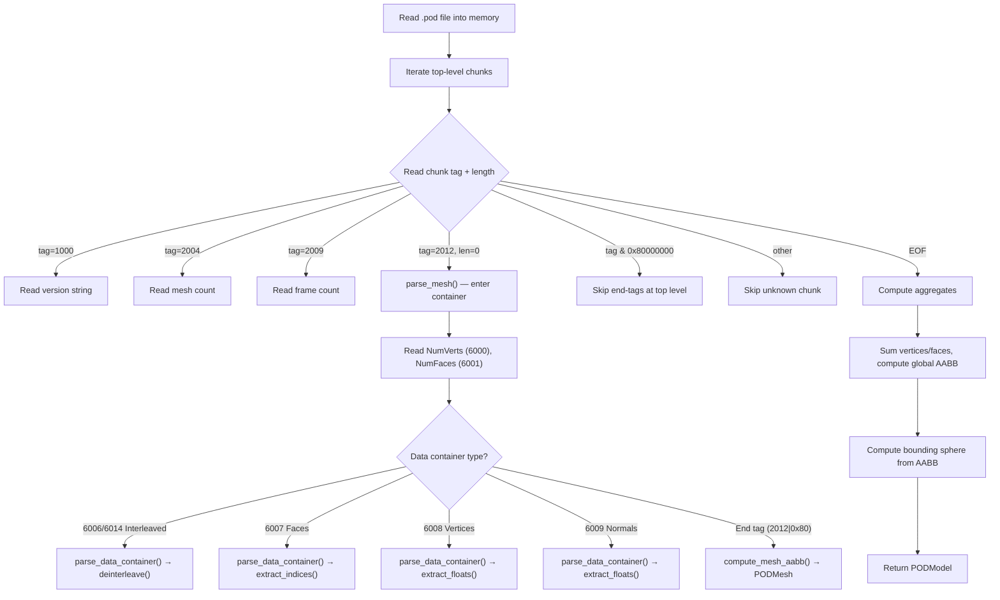

# POD Model Format (`.pod`)

> [!NOTE]
> This document describes the PowerVR POD model format as used by Swordigo (v1.4.x).
> Implementation is in
> [pod_loader.h](file:///home/quantumcreeper/SwordigoDesktop/src/tools/pod_loader.h) /
> [pod_loader.cpp](file:///home/quantumcreeper/SwordigoDesktop/src/tools/pod_loader.cpp).

---

## Overview

POD (PowerVR Object Data) is a **chunk-based tag-length-data binary format**
developed by Imagination Technologies for the PowerVR SDK. Swordigo uses POD files
for all 3D models — characters, platforms, enemies, backgrounds, and environment
geometry.

| Property      | Value                                          |
|---------------|------------------------------------------------|
| Extension     | `.pod` (case-insensitive — sometimes `.POD`)   |
| Encoding      | Chunk-based TLD (Tag-Length-Data), little-endian|
| Byte order    | Little-endian throughout                       |
| Typical size  | 1–200 KB per model                             |
| Location      | `assets/resources/Models/`                     |
| Parser        | `av::pod_load()` / `av::pod_parse()`           |

---

## Chunk Structure

Every POD file is a flat sequence of **chunks**. Each chunk has a fixed 8-byte
header followed by a variable-length data payload:

```
┌──────────────────────────────────────────────────┐
│  uint32_t  tag     ← Chunk type identifier       │
│  uint32_t  length  ← Payload size in bytes        │
│  [length bytes]    ← Payload data                 │
└──────────────────────────────────────────────────┘
```

### Container Chunks

Some chunks act as **containers** that group child chunks. Containers follow a
special pattern:

| Aspect         | Value                                                  |
|----------------|--------------------------------------------------------|
| Open tag       | `tag` with `length = 0` (no payload of its own)        |
| Child chunks   | Nested chunks follow sequentially                      |
| Close tag      | `tag \| 0x80000000` with `length = 0`                  |

```
Container Open:   tag=0x000007DC  length=0x00000000   (tag 2012 = Mesh)
  Child Chunk:    tag=0x00001770  length=0x00000004   (tag 6000 = NumVerts)
  Child Chunk:    tag=0x00001771  length=0x00000004   (tag 6001 = NumFaces)
  ...
Container Close:  tag=0x800007DC  length=0x00000000   (tag 2012 | 0x80000000)
```

### Close-Bit Constant

```cpp
static constexpr uint32_t kEndTagBit = 0x80000000u;
// Close tag = open_tag | kEndTagBit
```

---

## Tag Reference Table

### Scene-Level Tags (Top-Level)

| Tag (Dec) | Tag (Hex)    | Name          | Length  | Description                   |
|-----------|--------------|---------------|---------|-------------------------------|
| 1000      | `0x000003E8` | Version       | varies  | Null-terminated version string|
| 2004      | `0x000007D4` | NumMesh       | 4       | Total mesh count (uint32)     |
| 2009      | `0x000007D9` | NumFrame      | 4       | Animation frame count (uint32)|
| 2012      | `0x000007DC` | Mesh          | 0       | **Container** — opens a mesh  |

### Mesh-Level Tags (Inside Mesh Container)

| Tag (Dec) | Tag (Hex)    | Name             | Length  | Description                        |
|-----------|--------------|------------------|---------|------------------------------------|
| 6000      | `0x00001770` | NumVerts         | 4       | Vertex count for this mesh (uint32)|
| 6001      | `0x00001771` | NumFaces         | 4       | Face (triangle) count (uint32)     |
| 6006      | `0x00001776` | Interleaved      | 0       | **Container** — interleaved verts  |
| 6007      | `0x00001777` | Faces            | 0       | **Container** — face index data    |
| 6008      | `0x00001778` | Vertices         | 0       | **Container** — position data      |
| 6009      | `0x00001779` | Normals          | 0       | **Container** — normal data        |
| 6014      | `0x0000177E` | InterleavedAlt   | 0       | **Container** — alternate interleaved |

### Data-Element Tags (Inside Any Data Container)

| Tag (Dec) | Tag (Hex)    | Name          | Length  | Description                           |
|-----------|--------------|---------------|---------|---------------------------------------|
| 9000      | `0x00002328` | DataType      | 4       | Element data type enum (uint32)       |
| 9001      | `0x00002329` | DataN         | 4       | Components per element (uint32)       |
| 9002      | `0x0000232A` | DataStride    | 4       | Byte stride between elements (uint32) |
| 9003      | `0x0000232B` | DataPayload   | varies  | Raw vertex/index data bytes           |

---

## File Layout Diagram

```
┌─────────────────────────────────────────────────────────────┐
│                     POD File Layout                         │
├─────────────────────────────────────────────────────────────┤
│  [1000] Version     "AB.POD.2.0"  (null-terminated)         │
│  [2004] NumMesh     uint32: 3                               │
│  [2009] NumFrame    uint32: 1                               │
├─────────────────────────────────────────────────────────────┤
│  [2012] Mesh Container (length=0)                           │
│  │  [6000] NumVerts    uint32: 128                          │
│  │  [6001] NumFaces    uint32: 200                          │
│  │  [6006] Interleaved Container (length=0)                 │
│  │  │  [9000] DataType    uint32: 0  (float)                │
│  │  │  [9001] DataN       uint32: 8  (pos3+norm3+uv2)      │
│  │  │  [9002] DataStride  uint32: 32                        │
│  │  │  [9003] DataPayload [128 × 32 = 4096 bytes]           │
│  │  │  [0x80001776] End Interleaved                         │
│  │  [6007] Faces Container (length=0)                       │
│  │  │  [9000] DataType    uint32: 0  (uint16)               │
│  │  │  [9001] DataN       uint32: 3  (verts per face)       │
│  │  │  [9002] DataStride  uint32: 2                         │
│  │  │  [9003] DataPayload [200 × 3 × 2 = 1200 bytes]       │
│  │  │  [0x80001777] End Faces                               │
│  │  [0x800007DC] End Mesh                                   │
├─────────────────────────────────────────────────────────────┤
│  [2012] Mesh Container #2 ...                               │
│  ...                                                        │
│  [end-of-file tags / padding]                               │
└─────────────────────────────────────────────────────────────┘
```

---

## Interleaved Vertex Layout

Swordigo models use a **32-byte interleaved** vertex layout. All components are
packed sequentially per vertex:

```
Offset   Size    Type      Component
──────   ────    ────      ─────────
 0       12B     float3    Position  (x, y, z)
12       12B     float3    Normal    (nx, ny, nz)
24        8B     float2    UV        (u, v)
──────   ────
 0       32B               Total stride per vertex
```

### Memory Layout (Per Vertex)

```
Byte:  00 01 02 03 │ 04 05 06 07 │ 08 09 0A 0B │ 0C 0D 0E 0F
       ─────────── │ ─────────── │ ─────────── │ ───────────
       pos_x (f32) │ pos_y (f32) │ pos_z (f32) │ nrm_x (f32)

Byte:  10 11 12 13 │ 14 15 16 17 │ 18 19 1A 1B │ 1C 1D 1E 1F
       ─────────── │ ─────────── │ ─────────── │ ───────────
       nrm_y (f32) │ nrm_z (f32) │ uv_u  (f32) │ uv_v  (f32)
```

### Hex Example — One Vertex

```
00 00 80 3F    ← pos_x = 1.0f
00 00 00 40    ← pos_y = 2.0f
00 00 00 00    ← pos_z = 0.0f
00 00 00 00    ← nrm_x = 0.0f
00 00 80 3F    ← nrm_y = 1.0f
00 00 00 00    ← nrm_z = 0.0f
00 00 00 3F    ← uv_u  = 0.5f
00 00 80 3F    ← uv_v  = 1.0f
```

---

## Non-Interleaved Mode

Some POD files store vertex data in **separate containers** instead of interleaved:

| Container  | Tag  | Components | Stride   | Content               |
|------------|------|------------|----------|-----------------------|
| Vertices   | 6008 | 3 floats   | 12 bytes | Position (x, y, z)    |
| Normals    | 6009 | 3 floats   | 12 bytes | Normal (nx, ny, nz)   |

> [!TIP]
> The parser checks for interleaved data first (`has_interleaved` flag). If an
> interleaved container (6006 or 6014) is found, it deinterleaves into separate
> arrays. Otherwise it reads positions and normals from their respective containers.
> UV data is only available in interleaved mode in Swordigo's POD files.

---

## Index Data

Face indices are stored in the **Faces container** (tag 6007):

| Index Type | DataType | Stride | Description                    |
|------------|----------|--------|--------------------------------|
| uint16     | 0        | 2      | Default — most Swordigo models |
| uint32     | 1        | 4      | Large meshes (>65535 vertices) |

Each face is a triangle (3 indices), so total index count = `num_faces × 3`.

```cpp
// Index extraction logic:
bool is_u32 = false;
if (de.stride == 4)      is_u32 = true;    // stride overrides
else if (de.stride == 2) is_u32 = false;
else if (de.type == 1)   is_u32 = true;    // type fallback

// All indices are converted to uint16_t for GPU upload
```

> [!WARNING]
> Indices larger than 65535 are **truncated** to uint16 during loading. This is
> acceptable for Swordigo models which are always well under the 65K vertex limit.

---

## Data-Element Descriptor

Every data container (faces, vertices, normals, interleaved) uses the same
internal structure — a `DataElement` described by four child chunks:

```cpp
struct DataElement {
    uint32_t       type;          // Tag 9000: data type enum
    uint32_t       n;             // Tag 9001: components per element
    uint32_t       stride;        // Tag 9002: byte stride between elements
    const uint8_t* payload;       // Tag 9003: raw data pointer
    size_t         payload_size;  // Tag 9003: raw data size
};
```

---

## C++ Data Structures

### `PODMesh` — Per-Mesh Data

```cpp
struct PODMesh {
    std::vector<float>    positions;   // flat xyz, 3 floats per vertex
    std::vector<float>    normals;     // flat xyz, 3 floats per vertex
    std::vector<float>    uvs;         // flat uv,  2 floats per vertex
    std::vector<uint16_t> indices;     // triangle indices (always u16)

    int num_vertices = 0;
    int num_faces    = 0;

    // Per-mesh axis-aligned bounding box
    float min_x =  1e9f, min_y =  1e9f, min_z =  1e9f;
    float max_x = -1e9f, max_y = -1e9f, max_z = -1e9f;
};
```

### `PODModel` — Whole-Model Aggregate

```cpp
struct PODModel {
    std::vector<PODMesh> meshes;
    std::string          version;       // e.g. "AB.POD.2.0"
    int                  num_frames = 0;

    // Bounding sphere (computed from union of all mesh AABBs)
    float center_x = 0, center_y = 0, center_z = 0;
    float radius   = 1.0f;

    // Totals across all meshes
    int total_vertices = 0;
    int total_faces    = 0;

    // Global AABB
    float min_x =  1e9f, min_y =  1e9f, min_z =  1e9f;
    float max_x = -1e9f, max_y = -1e9f, max_z = -1e9f;
};
```

---

## Parsing Pipeline



---

## Bounding Geometry

The parser computes bounding geometry at two levels:

### Per-Mesh AABB

Computed by scanning all vertex positions in `compute_mesh_aabb()`:

```cpp
for each vertex position (x, y, z):
    min_x = min(min_x, x);  max_x = max(max_x, x);
    min_y = min(min_y, y);  max_y = max(max_y, y);
    min_z = min(min_z, z);  max_z = max(max_z, z);
```

### Global Bounding Sphere

Computed from the union of all mesh AABBs:

```
center = midpoint of global AABB
radius = half-diagonal of global AABB = sqrt(dx² + dy² + dz²) / 2
```

If `radius < 1e-6` (degenerate model), it defaults to `1.0`.

---

## Usage Example

```cpp
#include "tools/pod_loader.h"

// Load from file
av::PODModel model = av::pod_load("assets/resources/Models/darkhero.pod");

printf("Version: %s\n", model.version.c_str());
printf("Meshes: %zu  Frames: %d\n", model.meshes.size(), model.num_frames);
printf("Total: %d vertices, %d faces\n", model.total_vertices, model.total_faces);
printf("Bounding sphere: center=(%.2f, %.2f, %.2f) radius=%.2f\n",
       model.center_x, model.center_y, model.center_z, model.radius);

for (size_t i = 0; i < model.meshes.size(); ++i) {
    const auto& mesh = model.meshes[i];
    printf("  Mesh %zu: %d verts, %d faces, %zu indices\n",
           i, mesh.num_vertices, mesh.num_faces, mesh.indices.size());

    // Upload to GPU (OpenGL example)
    GLuint vbo, ebo;
    glGenBuffers(1, &vbo);
    glBindBuffer(GL_ARRAY_BUFFER, vbo);
    // Positions: 3 floats per vertex
    glBufferData(GL_ARRAY_BUFFER,
                 mesh.positions.size() * sizeof(float),
                 mesh.positions.data(), GL_STATIC_DRAW);
}
```

---

## Modding Implications

| Mod Operation         | Feasibility | Notes                                     |
|-----------------------|-------------|-------------------------------------------|
| Replace model mesh    | ✅ Easy      | Drop-in `.pod` replacement via VFS         |
| Resize model          | ✅ Easy      | Scale vertex positions in the POD data     |
| Change UV mapping     | ⚠️ Medium   | Modify UV floats in interleaved data       |
| Add meshes to model   | ⚠️ Medium   | Add new mesh container + update NumMesh    |
| Animation support     | ❌ NYI       | `num_frames` is parsed but anim data isn't |
| Convert from OBJ/FBX  | ⚠️ Medium   | Use PowerVR SDK's `PVRGeoPOD` converter    |

> [!TIP]
> For model replacement mods, export your model from Blender using the
> **PowerVR POD exporter** plugin, ensuring the interleaved vertex layout
> matches (32-byte stride: pos3 + norm3 + uv2). The VFS layer can then
> intercept the original `.pod` path and serve your replacement.
