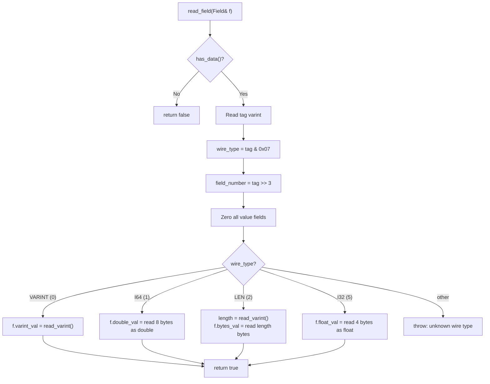

# Protobuf Wire Format — Reader/Writer Utility

> [!NOTE]
> This document describes the protobuf reader/writer utility in
> [protobuf_reader.h](file:///home/quantumcreeper/SwordigoDesktop/src/platform/protobuf_reader.h).
> This is a lightweight, **zero-dependency** Protocol Buffers implementation used
> throughout Swordigo Desktop for scene files and save data.

---

## Overview

The `proto` namespace provides a minimal, header-only protobuf wire-format
encoder/decoder. It supports the four wire types needed by Swordigo's binary
formats — no `.proto` schema files, no external protobuf library, no code
generation.

| Property        | Value                                          |
|-----------------|------------------------------------------------|
| File            | `src/platform/protobuf_reader.h`               |
| Namespace       | `proto`                                        |
| Dependencies    | None (C++ standard library only)               |
| Header-only     | Yes — single `.h` file, no `.cpp`              |
| Used by         | `scene_loader`, save editor (`.gplayer` files) |

---

## Wire Types

Protocol Buffers encodes each field as a **tag + value** pair. The tag carries
the field number and wire type:

```
tag = (field_number << 3) | wire_type
```

| Wire Type   | ID | Constant        | Fixed Size | Encodes                       |
|-------------|----|-----------------|------------|-------------------------------|
| VARINT      | 0  | `WIRE_VARINT`   | 1–10 bytes | int32, int64, uint32, uint64, bool, enum |
| I64         | 1  | `WIRE_I64`      | 8 bytes    | double, fixed64, sfixed64     |
| LEN         | 2  | `WIRE_LEN`      | varint + N | string, bytes, nested messages|
| I32         | 5  | `WIRE_I32`      | 4 bytes    | float, fixed32, sfixed32      |

```cpp
namespace proto {
enum WireType : uint8_t {
    WIRE_VARINT = 0,    // int32, int64, bool, enum
    WIRE_I64    = 1,    // double, fixed64
    WIRE_LEN    = 2,    // string, bytes, nested message
    WIRE_I32    = 5,    // float, fixed32
};
} // namespace proto
```

> [!IMPORTANT]
> Wire types 3 and 4 (start/end group) are **not supported** — they are deprecated
> in the protobuf spec and not used by Swordigo.

---

## Tag Encoding

### Encoding

```
tag_byte(s) = varint( (field_number << 3) | wire_type )
```

### Examples

| Field # | Wire Type | Calculation          | Tag (Hex) | Tag (Binary)     |
|---------|-----------|----------------------|-----------|------------------|
| 1       | LEN (2)   | `(1 << 3) \| 2 = 10`| `0A`      | `0000 1010`      |
| 2       | LEN (2)   | `(2 << 3) \| 2 = 18`| `12`      | `0001 0010`      |
| 2       | VARINT(0) | `(2 << 3) \| 0 = 16`| `10`      | `0001 0000`      |
| 3       | LEN (2)   | `(3 << 3) \| 2 = 26`| `1A`      | `0001 1010`      |
| 4       | I32 (5)   | `(4 << 3) \| 5 = 37`| `25`      | `0010 0101`      |
| 5       | I32 (5)   | `(5 << 3) \| 5 = 45`| `2D`      | `0010 1101`      |
| 8       | I32 (5)   | `(8 << 3) \| 5 = 69`| `45`      | `0100 0101`      |
| 16      | VARINT(0) | `(16<<3) \| 0 = 128`| `80 01`   | 2-byte varint    |

---

## Varint Encoding

Variable-length integer encoding using 7 bits per byte, with the MSB as a
continuation flag:

```
Byte:   1XXXXXXX  1XXXXXXX  0XXXXXXX
        ↑ more    ↑ more    ↑ last byte
        7 bits    7 bits    7 bits
```

### Decoding Algorithm

```cpp
uint64_t read_varint() {
    uint64_t value = 0;
    int shift = 0;
    while (pos_ < len_) {
        uint8_t b = data_[pos_++];
        value |= (uint64_t)(b & 0x7F) << shift;
        if ((b & 0x80) == 0) break;   // no continuation bit → done
        shift += 7;
        if (shift > 63) throw std::runtime_error("Protobuf: varint too long");
    }
    return value;
}
```

### Encoding Algorithm

```cpp
void write_varint(uint64_t value) {
    while (value > 0x7F) {
        buf_.push_back(static_cast<uint8_t>(value & 0x7F) | 0x80);
        value >>= 7;
    }
    buf_.push_back(static_cast<uint8_t>(value));
}
```

### Varint Examples

| Value      | Encoded Bytes          | Byte Count |
|------------|------------------------|------------|
| 0          | `00`                   | 1          |
| 1          | `01`                   | 1          |
| 127        | `7F`                   | 1          |
| 128        | `80 01`                | 2          |
| 300        | `AC 02`                | 2          |
| 16383      | `FF 7F`                | 2          |
| 16384      | `80 80 01`             | 3          |
| 2^32 - 1   | `FF FF FF FF 0F`       | 5          |

---

## Field Struct

The `Field` struct holds a single decoded protobuf field value:

```cpp
struct Field {
    uint32_t field_number;
    WireType wire_type;

    // Value storage (only one is valid based on wire_type)
    uint64_t    varint_val;     // WIRE_VARINT
    double      double_val;     // WIRE_I64
    float       float_val;      // WIRE_I32
    std::string bytes_val;      // WIRE_LEN (string or raw nested bytes)

    // Convenience accessors
    int64_t  as_int()    const;   // static_cast<int64_t>(varint_val)
    uint64_t as_uint()   const;   // varint_val
    bool     as_bool()   const;   // varint_val != 0
    double   as_double() const;   // double_val
    float    as_float()  const;   // float_val
    const std::string& as_string() const;  // bytes_val
};
```

### Value Storage by Wire Type

| Wire Type   | Active Field   | Access Method     | C++ Type    |
|-------------|----------------|-------------------|-------------|
| `WIRE_VARINT` | `varint_val` | `as_int()`, `as_uint()`, `as_bool()` | `uint64_t` |
| `WIRE_I64`    | `double_val` | `as_double()`    | `double`     |
| `WIRE_I32`    | `float_val`  | `as_float()`     | `float`      |
| `WIRE_LEN`    | `bytes_val`  | `as_string()`    | `std::string`|

> [!TIP]
> When a field is read, **all value fields are zeroed** first, then only the
> appropriate one is populated based on wire type. This means `float_val` is safe
> to read as `0.0f` even when the wire type is `WIRE_VARINT`.

---

## Reader API

The `Reader` class decodes a protobuf byte stream:

```cpp
class Reader {
public:
    // Construct from raw pointer + length
    Reader(const uint8_t* data, size_t len);

    // Construct from std::string (e.g. nested message bytes)
    Reader(const std::string& s);

    // State queries
    bool   has_data()   const;   // pos < len
    size_t pos()        const;   // current byte offset
    size_t remaining()  const;   // len - pos

    // Read the next field (returns false at end-of-data)
    bool read_field(Field& f);

    // Read ALL fields into a flat vector
    std::vector<Field> read_all();

    // Read ALL fields, grouped by field number
    std::map<uint32_t, std::vector<Field>> read_grouped();
};
```

### `read_field()` — Core Decode Loop



### `read_all()` — Flat Field List

Reads all fields from the current position to end-of-data:

```cpp
std::vector<Field> read_all() {
    std::vector<Field> fields;
    Field f;
    while (read_field(f)) {
        fields.push_back(f);
    }
    return fields;
}
```

### `read_grouped()` — Fields by Number

Groups repeated fields by their field number — useful for protobuf messages
with many repeated entries (like scene files):

```cpp
std::map<uint32_t, std::vector<Field>> read_grouped() {
    std::map<uint32_t, std::vector<Field>> groups;
    Field f;
    while (read_field(f)) {
        groups[f.field_number].push_back(f);
    }
    return groups;
}
```

---

## Writer API

The `Writer` class encodes protobuf fields into a byte buffer:

```cpp
class Writer {
public:
    // Write typed fields
    void write_varint_field(uint32_t field_number, uint64_t value);
    void write_double_field(uint32_t field_number, double value);
    void write_float_field(uint32_t field_number, float value);
    void write_string_field(uint32_t field_number, const std::string& value);
    void write_bytes_field(uint32_t field_number, const std::string& value);

    // Write a nested message (from a pre-serialized Writer)
    void write_nested_field(uint32_t field_number, const Writer& nested);

    // Re-emit a decoded field as-is (pass-through for unmodified fields)
    void write_field(const Field& f);

    // Output
    const std::vector<uint8_t>& data() const;
    std::string to_string() const;
    size_t size() const;
    void clear();
};
```

### Writer Method → Wire Type Mapping

| Method                | Wire Type     | Tag Bits | Encoding                  |
|-----------------------|---------------|----------|---------------------------|
| `write_varint_field`  | `WIRE_VARINT` | `0`      | Tag varint + value varint |
| `write_double_field`  | `WIRE_I64`    | `1`      | Tag varint + 8-byte LE   |
| `write_float_field`   | `WIRE_I32`    | `5`      | Tag varint + 4-byte LE   |
| `write_string_field`  | `WIRE_LEN`    | `2`      | Tag varint + len varint + bytes |
| `write_bytes_field`   | `WIRE_LEN`    | `2`      | Same as `write_string_field` |
| `write_nested_field`  | `WIRE_LEN`    | `2`      | Tag varint + len varint + nested bytes |
| `write_field`         | (from Field)  | (varies) | Re-emits the original encoding |

### `write_nested_field()` — Nested Messages

For building hierarchical protobuf messages:

```cpp
void write_nested_field(uint32_t field_number, const Writer& nested) {
    write_tag(field_number, WIRE_LEN);
    write_varint(nested.buf_.size());
    buf_.insert(buf_.end(), nested.buf_.begin(), nested.buf_.end());
}
```

### `write_field()` — Pass-Through

Re-emits a previously decoded field without modification — essential for
round-tripping (read a message, modify some fields, write back):

```cpp
void write_field(const Field& f) {
    switch (f.wire_type) {
        case WIRE_VARINT: write_varint_field(f.field_number, f.varint_val); break;
        case WIRE_I64:    write_double_field(f.field_number, f.double_val); break;
        case WIRE_I32:    write_float_field(f.field_number, f.float_val);   break;
        case WIRE_LEN:    write_bytes_field(f.field_number, f.bytes_val);   break;
    }
}
```

---

## Binary Encoding Details

### Float (I32) — 4 bytes, IEEE 754

```
Field 4, float 1.0:
  25              ← tag: (4 << 3) | 5 = 37 = 0x25
  00 00 80 3F     ← IEEE 754 LE: 1.0f = 0x3F800000
```

### Double (I64) — 8 bytes, IEEE 754

```
Field 10, double 3.14:
  51              ← tag: (10 << 3) | 1 = 81 = 0x51
  1F 85 EB 51 B8 1E 09 40   ← IEEE 754 LE: 3.14
```

### String (LEN) — varint length + UTF-8 bytes

```
Field 2, string "Hello":
  12              ← tag: (2 << 3) | 2 = 18 = 0x12
  05              ← varint length: 5
  48 65 6C 6C 6F  ← "Hello"
```

### Nested Message (LEN) — varint length + encoded message

```
Field 3, nested { field 1: "Light", field 2: varint 5 }:
  1A              ← tag: (3 << 3) | 2 = 26 = 0x1A
  09              ← varint length: 9 bytes
    0A 05 4C 69 67 68 74   ← nested field 1: "Light"
    10 05                   ← nested field 2: varint 5
```

### Varint — variable-length integer

```
Field 1, varint 300:
  08              ← tag: (1 << 3) | 0 = 8 = 0x08
  AC 02           ← varint: 300 = 0x012C
                     byte 0: 0x2C | 0x80 = 0xAC (continuation)
                     byte 1: 0x02 (final)
                     value: (0x2C) | (0x02 << 7) = 44 + 256 = 300
```

---

## Usage Examples

### Reading a Scene Object

```cpp
#include "platform/protobuf_reader.h"

// Parse a nested SceneObject from its bytes
void parse_scene_object(const std::string& bytes) {
    proto::Reader reader(bytes);
    proto::Field f;

    while (reader.read_field(f)) {
        switch (f.field_number) {
            case 2:  // name
                if (f.wire_type == proto::WIRE_LEN)
                    printf("Name: %s\n", f.as_string().c_str());
                break;
            case 4:  // pos_x
                if (f.wire_type == proto::WIRE_I32)
                    printf("X: %.2f\n", f.as_float());
                break;
            case 5:  // pos_y
                if (f.wire_type == proto::WIRE_I32)
                    printf("Y: %.2f\n", f.as_float());
                break;
        }
    }
}
```

### Modifying a Save File (Round-Trip)

```cpp
#include "platform/protobuf_reader.h"

std::string modify_save(const uint8_t* data, size_t len) {
    proto::Reader reader(data, len);
    proto::Writer writer;
    proto::Field f;

    while (reader.read_field(f)) {
        if (f.field_number == 5 && f.wire_type == proto::WIRE_VARINT) {
            // Field 5 is gold count — set to 9999
            writer.write_varint_field(5, 9999);
        } else {
            // Pass through all other fields unchanged
            writer.write_field(f);
        }
    }

    return writer.to_string();
}
```

### Building a Nested Message from Scratch

```cpp
#include "platform/protobuf_reader.h"

std::string build_component(const std::string& type_name, int type_id) {
    // Build inner component message
    proto::Writer component;
    component.write_string_field(1, type_name);   // Field 1: type name
    component.write_varint_field(2, type_id);      // Field 2: type ID

    // Wrap in an outer object message
    proto::Writer object;
    object.write_string_field(2, "my_object");     // Field 2: object name
    object.write_nested_field(3, component);        // Field 3: component (nested)
    object.write_float_field(4, 10.5f);             // Field 4: pos_x
    object.write_float_field(5, 3.0f);              // Field 5: pos_y
    object.write_float_field(6, 0.0f);              // Field 6: pos_z

    return object.to_string();
}
```

### Using `read_grouped()` for Repeated Fields

```cpp
#include "platform/protobuf_reader.h"

void inspect_scene(const uint8_t* data, size_t len) {
    proto::Reader reader(data, len);
    auto groups = reader.read_grouped();

    // All scene objects are in field 1
    if (groups.count(1)) {
        printf("Scene has %zu objects\n", groups[1].size());
        for (const auto& obj_field : groups[1]) {
            // Each obj_field.bytes_val is a nested SceneObject
            proto::Reader obj_reader(obj_field.bytes_val);
            auto obj_groups = obj_reader.read_grouped();
            if (obj_groups.count(2) && !obj_groups[2].empty()) {
                printf("  Object: %s\n", obj_groups[2][0].as_string().c_str());
            }
        }
    }
}
```

---

## Error Handling

| Error Condition                | Exception                                       |
|-------------------------------|------------------------------------------------|
| Varint exceeds 10 bytes       | `"Protobuf: varint too long"`                  |
| LEN field length > buffer     | `"Protobuf: length exceeds buffer"`            |
| Not enough bytes for double   | `"Protobuf: not enough data for double"`       |
| Not enough bytes for float    | `"Protobuf: not enough data for float"`        |
| Unknown wire type (3, 4, 6, 7)| `"Protobuf: unknown wire type N"`              |

All errors are thrown as `std::runtime_error`. Callers (like `scene_loader`)
wrap reads in `try/catch` to gracefully skip malformed data.

---

## Consumers in the Codebase

| Module           | File                          | Uses Reader | Uses Writer | Purpose                     |
|------------------|-------------------------------|-------------|-------------|-----------------------------|
| Scene Loader     | `src/tools/scene_loader.cpp`  | ✅          | ❌          | Parse `.scene` files        |
| Save Editor      | (future)                      | ✅          | ✅          | Read/write `.gplayer` saves |

---

## Design Decisions

> [!NOTE]
> **Why not use Google's protobuf library?**
>
> 1. **Zero dependencies** — the entire reader/writer is a single 230-line header file.
>    Adding Google's protobuf would pull in a massive dependency tree.
> 2. **No schema needed** — Swordigo's formats are reverse-engineered. We don't have
>    `.proto` files and don't need code generation.
> 3. **Header-only** — trivial to include anywhere, no link-time concerns.
> 4. **Minimal surface area** — only the four wire types Swordigo actually uses.
>    No groups, no packed repeated fields, no maps.
> 5. **Round-trip fidelity** — `write_field()` re-emits fields exactly as decoded,
>    preserving unknown fields during modifications.
