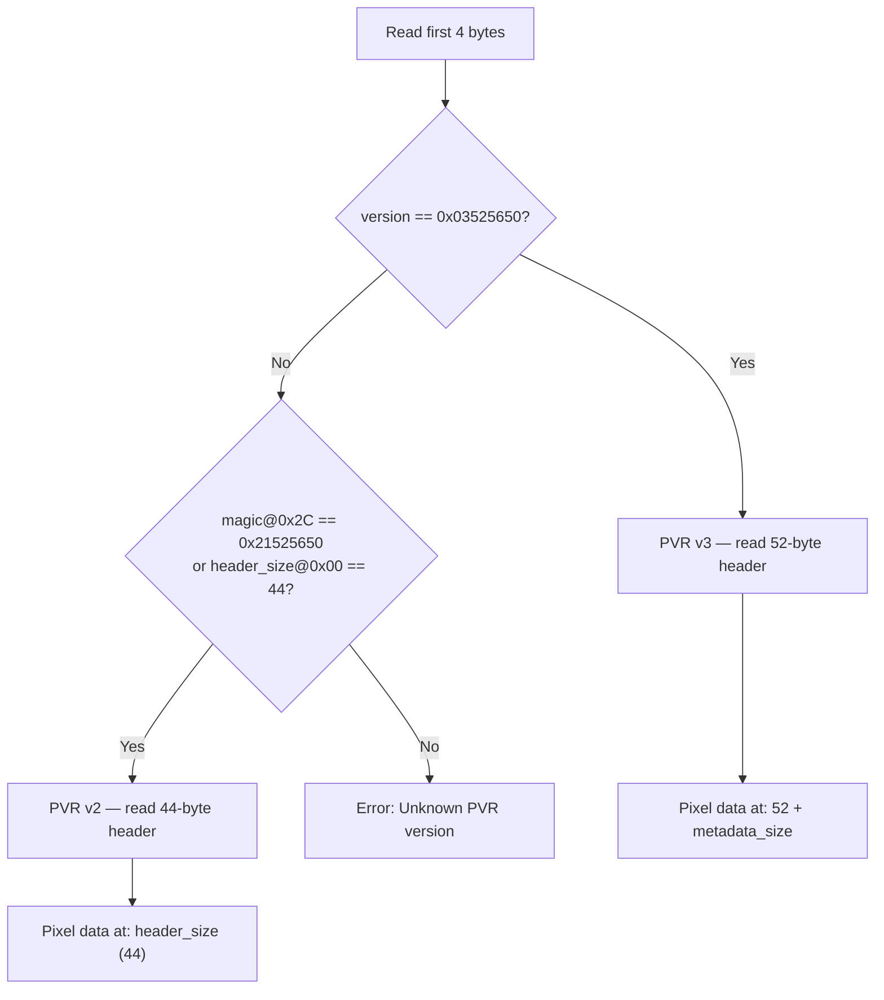
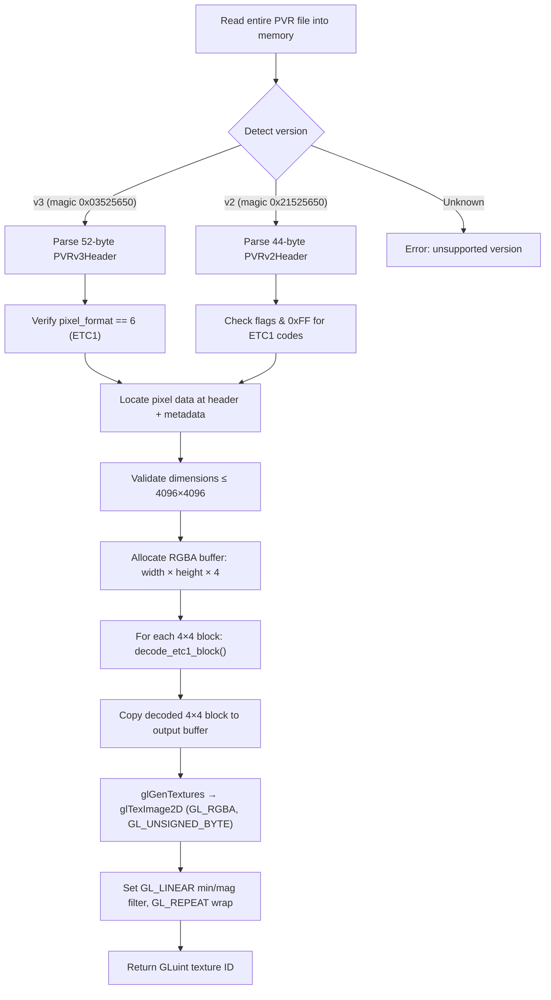

# PVR Texture Format (`.pvr`)

> [!NOTE]
> This document describes the PowerVR PVR texture format as used by Swordigo (v1.4.x).
> Implementation is in
> [pvr_loader.h](file:///home/quantumcreeper/SwordigoDesktop/src/platform/pvr_loader.h) /
> [pvr_loader.cpp](file:///home/quantumcreeper/SwordigoDesktop/src/platform/pvr_loader.cpp).

---

## Overview

PVR is a texture container format from Imagination Technologies (PowerVR SDK).
Swordigo uses PVR files for all textures — characters, environments, UI, and
backgrounds. All Swordigo textures use **ETC1 compression** (Ericsson Texture
Compression), which the loader decodes to RGBA8 in software before uploading to
OpenGL.

| Property        | Value                                        |
|-----------------|----------------------------------------------|
| Extension       | `.pvr`                                       |
| Versions        | PVR v2 (44-byte header) and v3 (52-byte header) |
| Compression     | ETC1 only (4 bits per pixel)                 |
| Byte order      | Little-endian                                |
| Max dimensions  | 4096 × 4096                                  |
| Typical size    | 2–512 KB per texture                         |
| Location        | `assets/resources/Textures/`                 |
| Parser          | `pvr_load_texture()` in `pvr_loader.cpp`     |
| Output          | RGBA8 → uploaded via `glTexImage2D()`        |

---

## PVR v3 Header (52 bytes)

The modern PVR format, identified by the magic number `0x03525650` (`"PVR\3"`):

```
Offset   Size    Type      Field          Value / Description
──────   ────    ────      ─────          ───────────────────
0x00     4       uint32    version        0x03525650 ("PVR\3")
0x04     4       uint32    flags          Format flags
0x08     8       uint64    pixel_format   6 = ETC1 (lower 32 bits)
0x10     4       uint32    color_space    0 = linear, 1 = sRGB
0x14     4       uint32    channel_type   Channel data type
0x18     4       uint32    height         Texture height in pixels
0x1C     4       uint32    width          Texture width in pixels
0x20     4       uint32    depth          Texture depth (usually 1)
0x24     4       uint32    num_surfaces   Number of surfaces (usually 1)
0x28     4       uint32    num_faces      Number of faces (1 for 2D, 6 for cubemap)
0x2C     4       uint32    mip_count      Number of mipmap levels
0x30     4       uint32    metadata_size  Size of metadata block after header
──────   ────
0x34     52 total bytes
```

### v3 Header C Struct

```cpp
#pragma pack(push, 1)
struct PVRv3Header {
    uint32_t version;       /* 0x03525650 = "PVR\3" */
    uint32_t flags;
    uint64_t pixel_format;  /* Lower 32 bits: 0=PVRTC2, 1=PVRTC4, 6=ETC1 */
    uint32_t color_space;
    uint32_t channel_type;
    uint32_t height;
    uint32_t width;
    uint32_t depth;
    uint32_t num_surfaces;
    uint32_t num_faces;
    uint32_t mip_count;
    uint32_t metadata_size;
};
#pragma pack(pop)
```

### v3 Memory Layout

```
┌────────────────────────────────────────────────────────────┐
│ Bytes 0x00–0x33:  PVRv3Header (52 bytes)                   │
├────────────────────────────────────────────────────────────┤
│ Bytes 0x34–(0x34+metadata_size-1):  Metadata block         │
│   (key-value pairs — usually empty in Swordigo files)      │
├────────────────────────────────────────────────────────────┤
│ Pixel data starts at offset:  sizeof(PVRv3Header) +        │
│                                metadata_size               │
│   = 52 + metadata_size                                     │
│                                                            │
│ ETC1 compressed blocks:                                    │
│   block_count = ceil(width/4) × ceil(height/4)             │
│   data_size   = block_count × 8 bytes                      │
└────────────────────────────────────────────────────────────┘
```

### Hex Example — v3 Header

```
50 56 52 03    ← version: 0x03525650 ("PVR\3")
00 00 00 00    ← flags: 0
06 00 00 00    ← pixel_format: 6 (ETC1)
00 00 00 00       (upper 32 bits of pixel_format)
00 00 00 00    ← color_space: 0 (linear)
00 00 00 00    ← channel_type: 0
00 02 00 00    ← height: 512
00 02 00 00    ← width: 512
01 00 00 00    ← depth: 1
01 00 00 00    ← num_surfaces: 1
01 00 00 00    ← num_faces: 1
01 00 00 00    ← mip_count: 1
00 00 00 00    ← metadata_size: 0
[ETC1 pixel data follows immediately]
```

---

## PVR v2 Header (44 bytes)

The legacy PVR format, identified by `header_size = 44` or magic `0x21525650` (`"PVR!"`):

```
Offset   Size    Type      Field          Value / Description
──────   ────    ────      ─────          ───────────────────
0x00     4       uint32    header_size    Always 44 (0x2C)
0x04     4       uint32    height         Texture height in pixels
0x08     4       uint32    width          Texture width in pixels
0x0C     4       uint32    mip_count      Number of mipmap levels
0x10     4       uint32    flags          Format + metadata flags
0x14     4       uint32    data_size      Compressed data size in bytes
0x18     4       uint32    bpp            Bits per pixel
0x1C     4       uint32    mask_r         Red channel bitmask
0x20     4       uint32    mask_g         Green channel bitmask
0x24     4       uint32    mask_b         Blue channel bitmask
0x28     4       uint32    mask_a         Alpha channel bitmask
0x2C     4       uint32    magic          0x21525650 ("PVR!")
0x30     4       uint32    num_surfaces   Number of surfaces
──────   ────
0x34     52 total bytes (header_size=44, but struct extends to 52 with magic+surfaces)
```

> [!IMPORTANT]
> The v2 header struct is technically 52 bytes including the `magic` and `num_surfaces`
> fields, but `header_size` is always 44. Pixel data starts at offset `header_size` (44),
> not at the end of the struct.

### v2 Header C Struct

```cpp
#pragma pack(push, 1)
struct PVRv2Header {
    uint32_t header_size;   /* Always 44 */
    uint32_t height;
    uint32_t width;
    uint32_t mip_count;
    uint32_t flags;
    uint32_t data_size;
    uint32_t bpp;
    uint32_t mask_r;
    uint32_t mask_g;
    uint32_t mask_b;
    uint32_t mask_a;
    uint32_t magic;         /* 0x21525650 = "PVR!" */
    uint32_t num_surfaces;
};
#pragma pack(pop)
```

### v2 Format Detection — `flags` Field

The lower byte of `flags` encodes the pixel format:

| Format Code | Hex    | Description                         |
|-------------|--------|-------------------------------------|
| `0x06`      | `0x06` | ETC_RGB_4BPP (legacy enum)          |
| `0x12`      | `0x12` | ETC1 (PowerVR SDK `ePVRTPF_ETC1` = 18) |
| `0x36`      | `0x36` | ETC_RGB_4BPP (alternate code)       |

```cpp
uint32_t fmt = v2->flags & 0xFF;
bool is_etc1 = (fmt == 0x36 || fmt == 0x06 || fmt == 0x12);
```

> [!TIP]
> If the format code isn't recognized but the file has a valid PVR v2 magic and
> reasonable dimensions, the loader **tries ETC1 anyway** — because Swordigo only
> ever uses ETC1 textures. It validates by checking that the available data matches
> the expected ETC1 compressed size.

### v2 Pixel Format Constants

```cpp
#define PVR2_MAGIC              0x21525650   // "PVR!"
#define PVR2_FORMAT_ETC1        0x0036       // ETC_RGB_4BPP
```

---

## Version Detection Logic



---

## ETC1 Compression

ETC1 (Ericsson Texture Compression 1) compresses 4×4 pixel blocks into 8 bytes,
achieving a **4:1 compression ratio** (4 bpp vs 16 bpp for RGB565, or 8:1 vs RGBA8888).

### Block Layout

Each ETC1 block is **8 bytes** (64 bits) encoding a 4×4 pixel region:

```
Bit:  63                              32 31                               0
      ├── Color data ──────────────────┤ ├── Pixel index bits ─────────────┤

Byte:  [0]  [1]  [2]  [3]  [4]  [5]  [6]  [7]
        ←── big-endian 64-bit block ──→
```

### Block Decoding (64-bit, big-endian)

| Bits      | Field          | Description                                    |
|-----------|----------------|------------------------------------------------|
| 63–60     | R1 / R (4-5b)  | Red component, sub-block 1                     |
| 59–56     | R2 / dR (4-3b) | Red component, sub-block 2 / delta             |
| 55–52     | G1 / G          | Green component, sub-block 1                  |
| 51–48     | G2 / dG         | Green component, sub-block 2 / delta          |
| 47–44     | B1 / B          | Blue component, sub-block 1                   |
| 43–40     | B2 / dB         | Blue component, sub-block 2 / delta           |
| 39–37     | table1         | Modifier table index, sub-block 1              |
| 36–34     | table2         | Modifier table index, sub-block 2              |
| 33        | diff           | 0 = Individual mode, 1 = Differential mode     |
| 32        | flip           | 0 = vertical split, 1 = horizontal split       |
| 31–16     | MSB bits       | MSB of pixel modifier index (16 pixels)        |
| 15–0      | LSB bits       | LSB of pixel modifier index (16 pixels)        |

### Encoding Modes

**Individual Mode** (`diff = 0`): Two independent RGB444 base colors

```
R1 = bits[63:60] expanded: (r << 4) | r    → 8-bit
R2 = bits[59:56] expanded: (r << 4) | r    → 8-bit
(same for G and B)
```

**Differential Mode** (`diff = 1`): RGB555 base + RGB333 signed delta

```
R base  = bits[63:59] (5 bits)     → expanded to 8-bit: (r << 3) | (r >> 2)
R delta = bits[58:56] (3 bits, signed: if > 3 then -= 8)
R2 = (R_base + R_delta) expanded to 8-bit
```

### Sub-Block Division

The `flip` bit determines how the 4×4 block is divided into two sub-blocks:

```
flip = 0 (vertical):       flip = 1 (horizontal):
┌──┬──┐                    ┌─────┐
│S1│S2│  cols 0-1 | 2-3    │ S1  │  rows 0-1
│  │  │                    ├─────┤
│  │  │                    │ S2  │  rows 2-3
└──┴──┘                    └─────┘
```

### Modifier Table

Each sub-block selects a modifier table entry (index 0–7), providing two modifier
values. The MSB/LSB per pixel select which modifier to apply (and its sign):

| Table Index | Modifier Values |
|-------------|-----------------|
| 0           | ± 2, ± 8       |
| 1           | ± 5, ± 17      |
| 2           | ± 9, ± 29      |
| 3           | ± 13, ± 42     |
| 4           | ± 18, ± 56     |
| 5           | ± 24, ± 71     |
| 6           | ± 33, ± 92     |
| 7           | ± 47, ± 127    |

```cpp
static const int etc1_modifiers[8][2] = {
    {  2,   8}, {  5,  17}, {  9,  29}, { 13,  42},
    { 18,  56}, { 24,  71}, { 33,  92}, { 47, 127}
};
```

### Per-Pixel Decoding

For each pixel in the 4×4 block:

```cpp
int pixel_idx = col * 4 + row;
int msb = (block >> (pixel_idx + 16)) & 1;   // sign bit
int lsb = (block >> pixel_idx) & 1;           // magnitude selector

int mod = etc1_modifiers[table][lsb];
if (msb) mod = -mod;

pixel_R = clamp(base_R + mod, 0, 255);
pixel_G = clamp(base_G + mod, 0, 255);
pixel_B = clamp(base_B + mod, 0, 255);
pixel_A = 255;  // ETC1 is always fully opaque
```

> [!IMPORTANT]
> **ETC1 does not support alpha channels.** All decoded pixels have `alpha = 255`.
> If transparency is needed, Swordigo uses separate `.png` files (not PVR).

---

## Full Decode Pipeline



### Block Count Calculation

```cpp
int block_w = (width + 3) / 4;     // ceil(width / 4)
int block_h = (height + 3) / 4;    // ceil(height / 4)

// Total compressed data size:
size_t etc1_data_size = block_w * block_h * 8;  // 8 bytes per block
```

### Size Examples

| Dimensions | Blocks     | Compressed Size | Decoded RGBA Size |
|------------|------------|-----------------|-------------------|
| 64 × 64   | 16 × 16   | 2,048 B (2 KB)  | 16,384 B (16 KB)  |
| 128 × 128 | 32 × 32   | 8,192 B (8 KB)  | 65,536 B (64 KB)  |
| 256 × 256 | 64 × 64   | 32,768 B (32 KB)| 262,144 B (256 KB)|
| 512 × 512 | 128 × 128 | 131,072 B (128K)| 1,048,576 B (1 MB)|
| 1024×1024  | 256 × 256 | 524,288 B (512K)| 4,194,304 B (4 MB)|
| 4096×4096  | 1024×1024  | 8,388,608 B (8M)| 67,108,864 B (64M)|

---

## GL Upload

After ETC1 decoding, the RGBA pixel data is uploaded to OpenGL:

```cpp
GLuint tex = 0;
glGenTextures(1, &tex);
glBindTexture(GL_TEXTURE_2D, tex);
glTexImage2D(GL_TEXTURE_2D, 0, GL_RGBA, width, height, 0,
             GL_RGBA, GL_UNSIGNED_BYTE, rgba.data());
glTexParameteri(GL_TEXTURE_2D, GL_TEXTURE_MIN_FILTER, GL_LINEAR);
glTexParameteri(GL_TEXTURE_2D, GL_TEXTURE_MAG_FILTER, GL_LINEAR);
glTexParameteri(GL_TEXTURE_2D, GL_TEXTURE_WRAP_S, GL_REPEAT);
glTexParameteri(GL_TEXTURE_2D, GL_TEXTURE_WRAP_T, GL_REPEAT);
```

| GL Parameter  | Value       | Notes                             |
|---------------|-------------|-----------------------------------|
| Internal fmt  | `GL_RGBA`   | 32-bit RGBA                       |
| Format        | `GL_RGBA`   | Component order                   |
| Type          | `GL_UNSIGNED_BYTE` | 8 bits per channel         |
| Min filter    | `GL_LINEAR` | Bilinear sampling (no mipmaps)    |
| Mag filter    | `GL_LINEAR` | Bilinear magnification            |
| Wrap S/T      | `GL_REPEAT` | Tiling in both axes               |

> [!TIP]
> Swordigo Desktop decodes ETC1 in **software** (no hardware ETC1 support required).
> This means the loader works on any desktop GPU, even those without OpenGL ES
> compressed texture extensions. The tradeoff is a one-time decode cost at load time.

---

## Usage Example

```cpp
#include "platform/pvr_loader.h"

int w, h;
GLuint tex = pvr_load_texture("assets/resources/Textures/darkhero.pvr", &w, &h);

if (tex) {
    printf("Loaded %dx%d texture → GL id %u\n", w, h, tex);
    glBindTexture(GL_TEXTURE_2D, tex);
    // Use in shader...
} else {
    printf("Failed to load PVR texture\n");
}
```

---

## Error Handling

The loader validates at multiple stages:

| Check                       | Action on Failure               |
|-----------------------------|---------------------------------|
| File size < 44 bytes        | Return 0 (too small for header) |
| Unknown PVR version         | Return 0 with error message     |
| Not ETC1 pixel format       | Return 0 ("Unsupported format") |
| Width or height ≤ 0         | Return 0 ("Invalid dimensions") |
| Width or height > 4096      | Return 0 ("Invalid dimensions") |
| fread incomplete            | Return 0 ("Read error")         |
| ETC1 decode failure         | Return 0                        |

---

## Modding Implications

| Mod Operation            | Feasibility | Notes                                     |
|--------------------------|-------------|-------------------------------------------|
| Replace texture          | ✅ Easy      | Drop-in `.pvr` replacement via VFS         |
| Use PNG instead          | ✅ Easy      | The engine also loads `.png` files          |
| Resize texture           | ⚠️ Care     | Must be valid ETC1 (block-aligned: multiple of 4) |
| Add alpha transparency   | ❌ No        | ETC1 has no alpha channel                  |
| Use PVRTC compression    | ❌ No        | Loader only supports ETC1                  |
| Custom mipmap levels     | ⚠️ Limited  | Loader reads only base mip (mip 0)         |

> [!WARNING]
> If you provide replacement textures as PNG files, they will be loaded through the
> separate PNG loader path and will support alpha transparency. PVR files are
> always ETC1 → always opaque. For transparent textures, use PNG.

### Creating PVR Files for Mods

To create ETC1-compressed PVR textures:

1. **PowerVR SDK** — Use `PVRTexTool` from Imagination Technologies
2. **etcpack** — Ericsson's reference ETC1 encoder
3. **Easy option** — Just use `.png` files instead (the engine supports both)

```bash
# Using PVRTexTool (from PowerVR SDK):
PVRTexToolCLI -i input.png -o output.pvr -f ETC1 -q pvrtcbest
```
