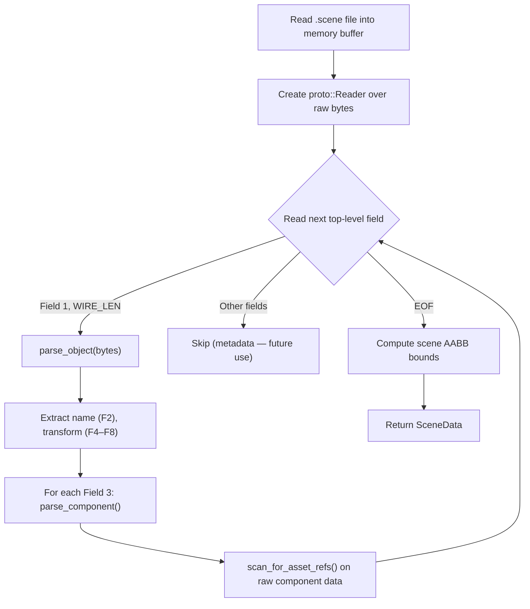

# Scene File Format (`.scene`)

> [!NOTE]
> This document describes the `.scene` file format used by Swordigo (v1.4.x ARM64).
> The format was reverse-engineered from the game binary and implemented in
> [scene_loader.h](file:///home/quantumcreeper/SwordigoDesktop/src/tools/scene_loader.h) /
> [scene_loader.cpp](file:///home/quantumcreeper/SwordigoDesktop/src/tools/scene_loader.cpp).

---

## Overview

Swordigo scenes are serialized as **Protocol Buffers wire-format** binary files — raw
protobuf encoding with no `.proto` schema file. Each `.scene` file describes a
complete game level or area: every game object, its transform (position, rotation,
scale), and its attached components (mesh renderers, lights, backgrounds, etc.).

| Property      | Value                                      |
|---------------|--------------------------------------------|
| Extension     | `.scene`                                   |
| Encoding      | Protobuf wire-format binary (no schema)    |
| Byte order    | Little-endian (protobuf standard)          |
| Typical size  | 2–80 KB per scene                          |
| Location      | `assets/resources/scenes/`                 |
| Parser        | `av::scene_load()` in `scene_loader.cpp`   |

---

## Wire Format Primer

Every protobuf field is encoded as a **tag** followed by a **value**. The tag is a
varint encoding both the field number and the wire type:

```
tag = (field_number << 3) | wire_type
```

| Wire Type | ID  | Size             | Used For                       |
|-----------|-----|------------------|--------------------------------|
| VARINT    | `0` | Variable (1–10B) | int32, int64, bool, enum       |
| I64       | `1` | 8 bytes fixed    | double, fixed64                |
| LEN       | `2` | varint + N bytes | string, bytes, nested messages |
| I32       | `5` | 4 bytes fixed    | float, fixed32                 |

---

## Top-Level Structure

The `.scene` file's top-level message contains **repeated Field 1** entries, each
carrying one `SceneObject` as a length-delimited nested message:

```
┌─────────────────────────────────────────────────┐
│              .scene file (binary)               │
├─────────────────────────────────────────────────┤
│  Field 1 (WIRE_LEN) → SceneObject #0           │
│  Field 1 (WIRE_LEN) → SceneObject #1           │
│  Field 1 (WIRE_LEN) → SceneObject #2           │
│  ...                                            │
│  Field 1 (WIRE_LEN) → SceneObject #N           │
│  [Other top-level fields — metadata, version]   │
└─────────────────────────────────────────────────┘
```

### Hex Example — Top-Level Entry

```
0A          ← tag: field 1, wire type 2 (LEN)   (0x01 << 3 | 0x02 = 0x0A)
8E 01       ← varint length: 142 bytes
[142 bytes of SceneObject protobuf data]
```

> [!IMPORTANT]
> Only **Field 1** with wire type `LEN` (0x02) carries scene objects. Other
> top-level field numbers may contain scene metadata (version, global settings) —
> these are currently skipped by the parser but preserved in the raw data.

---

## SceneObject Message

Each `SceneObject` is a nested protobuf message with the following field layout:

| Field # | Wire Type   | Name           | Type              | Description                          |
|---------|-------------|----------------|-------------------|--------------------------------------|
| 2       | `LEN` (2)   | `name`         | string            | Object name (e.g. `"darkhero"`)      |
| 3       | `LEN` (2)   | `component`    | nested (repeated) | Attached components                  |
| 4       | `I32` (5)   | `pos_x`        | float             | World X position                     |
| 5       | `I32` (5)   | `pos_y`        | float             | World Y position                     |
| 6       | `I32` (5)   | `pos_z`        | float             | World Z position                     |
| 7       | `I32` (5)   | `rot_y`        | float             | Y-axis rotation (primary)            |
| 8       | `I32` (5)   | `scale`        | float             | Uniform scale (applied to all axes)  |

### Tag Encoding Quick Reference

| Field | Calculation                  | Tag Byte(s) |
|-------|------------------------------|-------------|
| 2     | `(2 << 3) \| 2 = 0x12`      | `12`        |
| 3     | `(3 << 3) \| 2 = 0x1A`      | `1A`        |
| 4     | `(4 << 3) \| 5 = 0x25`      | `25`        |
| 5     | `(5 << 3) \| 5 = 0x2D`      | `2D`        |
| 6     | `(6 << 3) \| 5 = 0x35`      | `35`        |
| 7     | `(7 << 3) \| 5 = 0x3D`      | `3D`        |
| 8     | `(8 << 3) \| 5 = 0x45`      | `45`        |

### Hex Example — SceneObject

```
12 11                     ← Field 2 (name), LEN, length=17
  44 69 72 65 63 74 69 6F 6E 61 6C 4C 69 67 68 74 00
                          ← "DirectionalLight"
1A 1C                     ← Field 3 (component), LEN, length=28
  [28 bytes of Component message]
25 00 00 80 3F            ← Field 4 (pos_x), I32, float=1.0
2D 00 00 00 40            ← Field 5 (pos_y), I32, float=2.0
35 00 00 00 00            ← Field 6 (pos_z), I32, float=0.0
3D DB 0F C9 40            ← Field 7 (rot_y), I32, float=6.2832
45 00 00 80 3F            ← Field 8 (scale), I32, float=1.0
```

### Transform Details

```
SceneObject Transform Layout:
┌──────────────┬──────────────┬──────────────┐
│ pos_x (F4)   │ pos_y (F5)   │ pos_z (F6)   │  ← World position
├──────────────┼──────────────┼──────────────┤
│ rot_x = 0    │ rot_y (F7)   │ rot_z = 0    │  ← Rotation (only Y stored)
├──────────────┼──────────────┼──────────────┤
│ scale (F8)   │ scale (F8)   │ scale (F8)   │  ← Uniform: F8 → all axes
└──────────────┴──────────────┴──────────────┘
```

> [!TIP]
> **Field 8 (scale)** is stored as a single float but is applied as **uniform scale**
> to all three axes. When loading, the parser sets `scale_x = scale_y = scale_z = field8`.
> If Field 8 is absent, scale defaults to `1.0`.

---

## Component Message

Each component is a nested protobuf message inside SceneObject Field 3. Components
describe what behaviors/renderers are attached to an object.

| Field # | Wire Type     | Name         | Type    | Description                     |
|---------|---------------|--------------|---------|---------------------------------|
| 1       | `LEN` (2)     | `type_name`  | string  | e.g. `"MeshRenderer"`, `"Light"` |
| 2       | `VARINT` (0)  | `type_id`    | int     | Numeric type identifier         |

### Known Component Types

| `type_name`            | Description                                          | Asset References              |
|------------------------|------------------------------------------------------|-------------------------------|
| `MeshRenderer`         | Renders a 3D mesh (static objects)                   | `.pod` model, `.pvr`/`.png` texture |
| `SkinnedMeshRenderer`  | Renders an animated/skinned mesh (characters)        | `.pod` model, `.pvr`/`.png` texture |
| `Background`           | Renders a scrolling/static background plane          | `.pod` model, `.pvr`/`.png` texture |
| `Light`                | Directional / point / spot light source              | None                          |

### Hex Example — Component

```
0A 0C                     ← Field 1 (type_name), LEN, length=12
  4D 65 73 68 52 65 6E 64 65 72 65 72
                          ← "MeshRenderer"
10 03                     ← Field 2 (type_id), VARINT, value=3
```

### Raw Component Data — Asset References

Component bytes beyond Fields 1–2 often contain **embedded asset paths** as
length-delimited strings within sub-messages. The parser scans these raw bytes
for file path patterns:

```cpp
// Scan logic (simplified from scene_loader.cpp):
for each LEN field in component raw bytes:
    if value ends with ".pod"  → mesh reference
    if value ends with ".pvr"  → texture reference
    if value ends with ".png"  → texture reference (fallback)
```

Example embedded references found in component data:

| Component Type       | Typical References                               |
|----------------------|--------------------------------------------------|
| `MeshRenderer`       | `"Models/chest.pod"`, `"Textures/chest.pvr"`     |
| `SkinnedMeshRenderer`| `"Models/darkhero.pod"`, `"Textures/darkhero.pvr"`|
| `Background`         | `"Models/bg_forest.pod"`, `"Textures/bg.pvr"`    |

---

## Common Scene Objects

Representative objects found in typical Swordigo scenes:

| Object Name          | Components                     | Purpose                    |
|----------------------|--------------------------------|----------------------------|
| `DirectionalLight`   | `Light`                        | Main scene illumination    |
| `darkhero`           | `SkinnedMeshRenderer`          | Player character           |
| `chest_01`           | `MeshRenderer`                 | Loot chest                 |
| `bg_mountains`       | `Background`                   | Parallax background layer  |
| `platform_02`        | `MeshRenderer`                 | Walkable platform          |
| `enemy_skeleton_01`  | `SkinnedMeshRenderer`          | Enemy NPC                  |

---

## C++ Data Structures

The parser outputs these structs (from [scene_loader.h](file:///home/quantumcreeper/SwordigoDesktop/src/tools/scene_loader.h)):

### `SceneComponent`

```cpp
struct SceneComponent {
    std::string type_name;   // e.g. "Light", "MeshRenderer", "Background"
    int         type_id = 0;
    std::string raw_data;    // raw protobuf bytes for future detailed parsing
};
```

### `SceneObject`

```cpp
struct SceneObject {
    std::string name;        // e.g. "DirectionalLight", "darkhero"
    std::vector<SceneComponent> components;

    // Transform (extracted from fields 4-8)
    float pos_x   = 0, pos_y   = 0, pos_z   = 0;
    float rot_x   = 0, rot_y   = 0, rot_z   = 0;
    float scale_x = 1, scale_y = 1, scale_z = 1;

    // References extracted from component data
    std::string mesh_name;       // .POD model name if MeshRenderer found
    std::string texture_name;    // texture name if found in component data
    std::string background_name; // background model if Background component
};
```

### `SceneData`

```cpp
struct SceneData {
    std::vector<SceneObject> objects;
    std::string filename;        // basename of the .scene file
    int         object_count = 0;

    // Axis-aligned bounding box computed from object positions
    float bounds_min[3] = {0, 0, 0};
    float bounds_max[3] = {0, 0, 0};
};
```

---

## Parsing Pipeline



### Load Pipeline Steps

1. **Read**: Entire `.scene` file loaded into `std::vector<uint8_t>`
2. **Top-level parse**: Iterate fields; only Field 1 (`WIRE_LEN`) = SceneObject
3. **Object parse**: Extract name (F2), components (F3), transform floats (F4–F8)
4. **Component parse**: Extract `type_name` (F1), `type_id` (F2) from each component
5. **Asset scan**: Scan raw component bytes for `.pod`, `.pvr`, `.png` references
6. **Bounds**: Compute scene AABB from all object positions
7. **Return**: `SceneData` with fully populated object vector

---

## Error Handling

The parser is designed to be **resilient** — malformed fields are skipped rather than
causing crashes:

- Each `parse_object()` and `parse_component()` call is wrapped in `try/catch`
- Invalid strings (non-printable bytes) are rejected by `is_printable()` validation
- Missing transform fields default to `0.0` (position/rotation) or `1.0` (scale)
- If top-level parsing fails mid-stream, the already-parsed objects are still returned

---

## Usage Example

```cpp
#include "tools/scene_loader.h"

av::SceneData scene = av::scene_load("assets/resources/scenes/forest_01.scene");

printf("Scene: %s (%d objects)\n", scene.filename.c_str(), scene.object_count);
printf("Bounds: [%.1f,%.1f,%.1f] → [%.1f,%.1f,%.1f]\n",
       scene.bounds_min[0], scene.bounds_min[1], scene.bounds_min[2],
       scene.bounds_max[0], scene.bounds_max[1], scene.bounds_max[2]);

for (const auto& obj : scene.objects) {
    printf("  [%s] pos=(%.2f, %.2f, %.2f) rot_y=%.2f scale=%.2f\n",
           obj.name.c_str(), obj.pos_x, obj.pos_y, obj.pos_z,
           obj.rot_y, obj.scale_x);
    for (const auto& comp : obj.components) {
        printf("    Component: %s (id=%d)\n", comp.type_name.c_str(), comp.type_id);
    }
    if (!obj.mesh_name.empty())
        printf("    Mesh: %s\n", obj.mesh_name.c_str());
    if (!obj.texture_name.empty())
        printf("    Texture: %s\n", obj.texture_name.c_str());
}
```

---

## Modding Implications

> [!WARNING]
> The `.scene` protobuf format has **no schema validation**. Arbitrary field numbers
> and wire types are silently skipped. This means you can add custom fields to scene
> objects, but the game engine will ignore them — they only survive round-tripping
> through the protobuf reader/writer.

| Mod Operation         | Feasibility | Notes                                    |
|-----------------------|-------------|------------------------------------------|
| Move objects          | ✅ Easy      | Edit Fields 4–6 (pos_x/y/z)             |
| Rotate objects        | ✅ Easy      | Edit Field 7 (rot_y)                     |
| Resize objects        | ✅ Easy      | Edit Field 8 (scale)                     |
| Rename objects        | ✅ Easy      | Edit Field 2 (name string)               |
| Replace meshes        | ⚠️ Medium   | Modify mesh path in component raw bytes  |
| Replace textures      | ⚠️ Medium   | Modify texture path in component bytes   |
| Add new objects       | ⚠️ Medium   | Append new Field 1 entries               |
| Remove objects        | ⚠️ Medium   | Skip Field 1 entries during re-encode    |
| Add custom components | ❌ Hard      | Engine must know the component type       |

Use `proto::Writer` to re-serialize modified scenes — see
[Protobuf Wire Format](protobuf-wire.md) for the encoder API.
