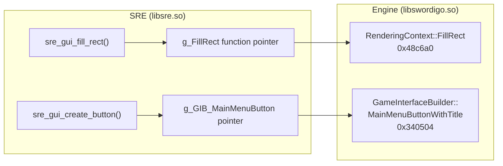

# SRE GUI Rendering API

> **Source files:** [sre_gui.h](file:///home/quantumcreeper/SwordigoDesktop/src/sre/sre_gui.h) · [sre_gui.c](file:///home/quantumcreeper/SwordigoDesktop/src/sre/sre_gui.c) · [sre_gui_native.c](file:///home/quantumcreeper/SwordigoDesktop/src/sre/sre_gui_native.c)
> **Target:** ARM64 v1.4.12 · **Init table:** 49 entries × 8 bytes = 392 bytes

The SRE GUI subsystem provides full access to the Caver engine's GUI rendering stack from C code running inside libsre.so. It wraps the engine's own C++ classes — RenderingContext, GUIView, GUILabel, GUIButton, GUIWindow, TextureLibrary, and GameInterfaceBuilder — behind a clean C API.

---

## Table of Contents

- [Architecture](#architecture)
- [Initialization](#initialization)
- [Overlay Drawing API](#overlay-drawing-api)
  - [sre_gui_begin_overlay](#sre_gui_begin_overlay)
  - [sre_gui_end_overlay](#sre_gui_end_overlay)
  - [sre_gui_fill_rect](#sre_gui_fill_rect)
  - [sre_gui_draw_rect](#sre_gui_draw_rect)
  - [sre_gui_draw_sprite](#sre_gui_draw_sprite)
- [Texture Access](#texture-access)
  - [sre_gui_get_texture](#sre_gui_get_texture)
- [View Factory (GameInterfaceBuilder)](#view-factory-gameinterfacebuilder)
  - [sre_gui_create_label](#sre_gui_create_label)
  - [sre_gui_create_button](#sre_gui_create_button)
  - [sre_gui_create_framed_button](#sre_gui_create_framed_button)
- [View Hierarchy](#view-hierarchy)
  - [sre_gui_set_frame](#sre_gui_set_frame)
  - [sre_gui_add_subview](#sre_gui_add_subview)
  - [sre_gui_remove_from_superview](#sre_gui_remove_from_superview)
- [Window & Modal Presentation](#window--modal-presentation)
  - [sre_gui_main_window](#sre_gui_main_window)
  - [sre_gui_present_modal](#sre_gui_present_modal)
  - [sre_gui_dismiss_modal](#sre_gui_dismiss_modal)
- [CppString Helpers](#cppstring-helpers)
  - [sre_gui_make_string](#sre_gui_make_string)
  - [sre_gui_free_string](#sre_gui_free_string)
- [Global State](#global-state)
- [Type Reference](#type-reference)
- [Examples](#examples)
- [Object Layout Reference](#object-layout-reference)

---

## Architecture

The GUI system bridges two worlds: SRE's C code (running inside the emulated ARM64 guest) and the Caver engine's C++ GUI classes (also guest-side, inside `libswordigo.so`). The API works by calling the engine's own methods through function pointers resolved from `nm` symbol addresses at init time.



> [!IMPORTANT]
> All GUI functions require `sre_init_gui()` to have been called first. Check `g_sre_gui_initialized` before use. The host calls this automatically during SRE bootstrap.

---

## Initialization

```c
void sre_init_gui(SreGuiAddrs* addrs);
```

Called by the host (main.cpp) during SRE boot. Receives a `SreGuiAddrs` struct containing 49 resolved engine function addresses. After init, all 49 internal function pointers are populated and `g_sre_gui_initialized` is set to `1`.

The init table covers:

| Category | Entries | Engine Class |
|----------|---------|--------------|
| RenderingContext | 14 | `Caver::RenderingContext` (0x48b–0x48c range) |
| FontText | 6 | `Caver::FontText` (0x4c5–0x4c6 range) |
| GUILabel | 3 | `Caver::GUILabel` (0x497 range) |
| GUIButton | 4 | `Caver::GUIButton` (0x495 range) |
| GUIView | 3 | `Caver::GUIView` (0x49f range) |
| GUIWindow | 4 | `Caver::GUIWindow` (0x4a2–0x4a3 range) |
| GUIAlertView | 3 | `Caver::GUIAlertView` (0x490 range) |
| GameInterfaceBuilder | 7 | `Caver::GameInterfaceBuilder` (0x33e–0x342 range) |
| TextureLibrary | 2 | `Caver::TextureLibrary` (0x4cc range) |
| FontLibrary | 3 | `Caver::FontLibrary` (0x4c3–0x4c4 range) |

---

## Overlay Drawing API

The overlay API provides immediate-mode 2D drawing on top of the 3D scene. It sets up an orthographic projection where `(0,0)` is the top-left corner and `(screenW, screenH)` is the bottom-right.

### sre_gui_begin_overlay

```c
void sre_gui_begin_overlay(void* ctx, float screenW, float screenH);
```

Sets up a 2D orthographic projection for overlay rendering. Must be called before any `fill_rect`, `draw_rect`, or `draw_sprite` calls.

| Parameter | Type | Description |
|-----------|------|-------------|
| `ctx` | `void*` | RenderingContext pointer (passed to DrawRect hooks) |
| `screenW` | `float` | Screen width in pixels (typically 960.0) |
| `screenH` | `float` | Screen height in pixels (typically 540.0) |

**What it does internally:**
1. Builds an orthographic projection matrix: `left=0, right=screenW, bottom=screenH, top=0`
2. Calls `RenderingContext::SetProjectionMatrix`
3. Sets the model matrix to identity
4. Enables alpha blending
5. Disables texturing, lighting, and depth test
6. Resets the shader program to default

### sre_gui_end_overlay

```c
void sre_gui_end_overlay(void* ctx);
```

Ends the overlay drawing pass. Currently a no-op — the engine restores its own state when the next 3D draw call happens. Included for API symmetry and future cleanup.

### sre_gui_fill_rect

```c
void sre_gui_fill_rect(void* ctx, float x, float y, float w, float h,
                        int r, int g, int b, int a);
```

Draws a filled rectangle at the specified position.

| Parameter | Type | Range | Description |
|-----------|------|-------|-------------|
| `ctx` | `void*` | — | RenderingContext pointer |
| `x`, `y` | `float` | pixels | Top-left corner position |
| `w`, `h` | `float` | pixels | Width and height |
| `r`, `g`, `b` | `int` | 0–255 | RGB color components |
| `a` | `int` | 0–255 | Alpha (0 = transparent, 255 = opaque) |

> [!NOTE]
> Color values are integers 0–255 but are converted internally to floats 0.0–1.0 before calling the engine's `RenderingContext::FillRect` (at address `0x48c6a0`).

### sre_gui_draw_rect

```c
void sre_gui_draw_rect(void* ctx, float x, float y, float w, float h,
                        int r, int g, int b, int a);
```

Draws a rectangle outline (unfilled). Same parameters as `sre_gui_fill_rect`. Calls `RenderingContext::DrawRect` at `0x48c9f8`.

### sre_gui_draw_sprite

```c
void sre_gui_draw_sprite(void* ctx, void* sprite, float x, float y);
```

Draws a texture sprite at the given position.

| Parameter | Type | Description |
|-----------|------|-------------|
| `ctx` | `void*` | RenderingContext pointer |
| `sprite` | `void*` | Sprite object (from `sre_gui_get_texture`) |
| `x`, `y` | `float` | Position in screen pixels |

**Internally:**
1. Sets model matrix to identity with translation `(x, y)`
2. Enables texturing
3. Calls `Sprite::Draw`
4. Resets model matrix to identity

---

## Texture Access

### sre_gui_get_texture

```c
void* sre_gui_get_texture(const char* name);
```

Loads a game texture by name from the Caver engine's `TextureLibrary`.

| Parameter | Type | Description |
|-----------|------|-------------|
| `name` | `const char*` | Texture name (e.g., `"gui_button"`, `"health_bar"`) |
| **Returns** | `void*` | Pointer to the texture object, or `NULL` if not found |

**Internally:**
1. Gets the shared `TextureLibrary` singleton via `0x4cc308`
2. Converts the name to a `CppString`
3. Calls `TextureLibrary::TextureForName` at `0x4cc494`
4. Returns the raw pointer from the `intrusive_ptr<Texture>` result

---

## View Factory (GameInterfaceBuilder)

These functions wrap the engine's `GameInterfaceBuilder` static factory methods. They return views via `SreSharedPtr` out-parameters — the ARM64 ABI passes large return values via a hidden first argument.

> [!WARNING]
> The returned `SreSharedPtr` manages the view's lifetime via `boost::shared_ptr` reference counting. Do **not** free or overwrite it while the view is in the hierarchy — the engine will crash.

### sre_gui_create_label

```c
void sre_gui_create_label(SreSharedPtr* out, const char* text,
                           int r, int g, int b, int a);
```

Creates a styled `GUILabel` using `GameInterfaceBuilder::NormalLabel`.

| Parameter | Type | Description |
|-----------|------|-------------|
| `out` | `SreSharedPtr*` | Receives the `shared_ptr<GUILabel>` |
| `text` | `const char*` | Label text content |
| `r`, `g`, `b`, `a` | `int` | Text color (0–255 per channel) |

The label is created with a black shadow color at 50% opacity (`rgba(0,0,0,0.5)`).

### sre_gui_create_button

```c
void sre_gui_create_button(SreSharedPtr* out, const char* title);
```

Creates a `GUIButton` styled as a main menu button using `GameInterfaceBuilder::MainMenuButtonWithTitle` (at `0x340504`).

| Parameter | Type | Description |
|-----------|------|-------------|
| `out` | `SreSharedPtr*` | Receives the `shared_ptr<GUIButton>` |
| `title` | `const char*` | Button title text |

### sre_gui_create_framed_button

```c
void sre_gui_create_framed_button(SreSharedPtr* out, const char* title);
```

Creates a `GUIButton` with a visible border frame using `GameInterfaceBuilder::FramedButtonWithTitle` (at `0x33ff98`). Called with `hasBorder=1`.

---

## View Hierarchy

### sre_gui_set_frame

```c
void sre_gui_set_frame(void* view, float x, float y, float w, float h);
```

Sets a view's position and size within its parent's coordinate space.

| Parameter | Type | Description |
|-----------|------|-------------|
| `view` | `void*` | Raw pointer to the GUIView (from `SreSharedPtr.ptr`) |
| `x`, `y` | `float` | Position relative to parent |
| `w`, `h` | `float` | Width and height |

Calls `GUIView::SetFrame` at `0x49f5c8` with a `Caver::Rectangle` struct.

### sre_gui_add_subview

```c
void sre_gui_add_subview(void* parent, SreSharedPtr* child);
```

Adds a child view to a parent view. The child's `shared_ptr` is passed directly — the engine increments the reference count internally.

| Parameter | Type | Description |
|-----------|------|-------------|
| `parent` | `void*` | Raw pointer to the parent GUIView |
| `child` | `SreSharedPtr*` | Pointer to the child's shared_ptr |

### sre_gui_remove_from_superview

```c
void sre_gui_remove_from_superview(void* view);
```

Removes a view from its parent. After this call, the view is no longer rendered or part of the hierarchy.

---

## Window & Modal Presentation

### sre_gui_main_window

```c
void* sre_gui_main_window(void);
```

Returns a pointer to the root `GUIWindow` singleton. This is the top-level container for all GUI elements. Calls `GUIWindow::mainWindow()` at `0x4a21ec`.

**Returns:** `void*` — the `GUIWindow*` pointer, or `NULL` if not available.

### sre_gui_present_modal

```c
void sre_gui_present_modal(SreSharedPtr* view, int animated);
```

Presents a view as a modal overlay on top of the main window.

| Parameter | Type | Description |
|-----------|------|-------------|
| `view` | `SreSharedPtr*` | The view to present modally |
| `animated` | `int` | `1` = animate in, `0` = instant |

Internally calls `GUIWindow::PresentModalView` at `0x4a31b4` on the main window singleton.

### sre_gui_dismiss_modal

```c
void sre_gui_dismiss_modal(void* view);
```

Dismisses a previously-presented modal view.

| Parameter | Type | Description |
|-----------|------|-------------|
| `view` | `void*` | Raw pointer to the modal view |

---

## CppString Helpers

The engine uses `std::string` (GCC COW implementation) internally. These helpers convert between C strings and the engine's string format.

### sre_gui_make_string

```c
void sre_gui_make_string(SreString* out, const char* text);
```

Constructs a `CppString` from a null-terminated C string. The caller **must** call `sre_gui_free_string()` when done.

### sre_gui_free_string

```c
void sre_gui_free_string(SreString* str);
```

Releases a `CppString` created by `sre_gui_make_string()`. Decrements the COW reference count and frees if the count reaches zero.

> [!CAUTION]
> Forgetting to call `sre_gui_free_string` causes memory leaks in the emulated guest address space. Always pair `make_string` / `free_string` calls.

---

## Global State

| Variable | Type | Default | Description |
|----------|------|---------|-------------|
| `g_sre_gui_initialized` | `int` | `0` | `1` after `sre_init_gui()` completes |
| `g_sre_gui_overlay_enabled` | `int` | `0` | `1` if the overlay system is active |
| `g_sre_gui_screen_w` | `float` | `960.0` | Current screen width (pixels) |
| `g_sre_gui_screen_h` | `float` | `540.0` | Current screen height (pixels) |

---

## Type Reference

### SreRect

```c
typedef struct { float x, y, width, height; } SreRect;
```
Maps to `Caver::Rectangle`. Used for view frames and drawing rectangles.

### SreVec2_gui

```c
typedef struct { float x, y; } SreVec2_gui;
```
Maps to `Caver::Vector2`. Used for 2D positions.

### SreSharedPtr

```c
typedef struct {
    sre_u64 ptr;            /* T* raw pointer */
    sre_u64 shared_count;   /* boost::detail::shared_count* */
} SreSharedPtr;
```

Represents a `boost::shared_ptr<T>` (16 bytes). The `ptr` field is the raw pointer to the managed object — use `(void*)sharedPtr.ptr` to access the view directly. The `shared_count` field manages the reference count; do not modify it manually.

---

## Examples

### Example 1: Custom Overlay with Rectangles

Draw a semi-transparent panel with a gold border on top of the game scene:

```c
void my_custom_overlay(void* ctx) {
    float screenW = g_sre_gui_screen_w;
    float screenH = g_sre_gui_screen_h;

    sre_gui_begin_overlay(ctx, screenW, screenH);

    /* Dark semi-transparent background */
    sre_gui_fill_rect(ctx, 0, 0, screenW, screenH, 0, 0, 0, 160);

    /* Centered panel */
    float panelW = 400.0f, panelH = 300.0f;
    float px = (screenW - panelW) / 2.0f;
    float py = (screenH - panelH) / 2.0f;

    /* Panel fill — deep navy */
    sre_gui_fill_rect(ctx, px, py, panelW, panelH, 18, 30, 50, 240);

    /* Panel border — gold accent */
    sre_gui_draw_rect(ctx, px, py, panelW, panelH, 200, 170, 80, 220);

    /* Title bar */
    sre_gui_fill_rect(ctx, px + 2, py + 2, panelW - 4, 40, 25, 42, 68, 255);

    sre_gui_end_overlay(ctx);
}
```

### Example 2: Creating and Adding a Button

Create a main-menu-style button and add it to an existing view:

```c
void add_my_button(void* parent_view) {
    SreSharedPtr button;

    /* Create a styled main menu button */
    sre_gui_create_button(&button, "My Custom Button");
    if (!button.ptr) return;  /* creation failed */

    /* Position it: x=50, y=200, w=260, h=50 */
    sre_gui_set_frame((void*)button.ptr, 50.0f, 200.0f, 260.0f, 50.0f);

    /* Add to the parent view */
    sre_gui_add_subview(parent_view, &button);

    /* IMPORTANT: Keep `button` alive in a static/global variable!
     * If this SreSharedPtr goes out of scope, the engine may garbage-collect
     * the button. Store it for the view's lifetime. */
}
```

### Example 3: Full View Hierarchy — Modal Panel with Button

Present a modal dialog containing a label and a button:

```c
/* Storage for shared_ptrs — must survive across frames */
static SreSharedPtr g_my_panel = {0, 0};
static SreSharedPtr g_my_label = {0, 0};
static SreSharedPtr g_my_close_btn = {0, 0};

void show_my_modal(void) {
    /* Create the container (framed button as a panel) */
    sre_gui_create_framed_button(&g_my_panel, "");
    if (!g_my_panel.ptr) return;
    sre_gui_set_frame((void*)g_my_panel.ptr, 200, 100, 560, 340);

    /* Create a label */
    sre_gui_create_label(&g_my_label, "Hello from SRE!",
                          255, 255, 255, 255);  /* white text */
    if (g_my_label.ptr) {
        sre_gui_set_frame((void*)g_my_label.ptr, 30, 20, 500, 40);
        sre_gui_add_subview((void*)g_my_panel.ptr, &g_my_label);
    }

    /* Create a close button */
    sre_gui_create_button(&g_my_close_btn, "Close");
    if (g_my_close_btn.ptr) {
        sre_gui_set_frame((void*)g_my_close_btn.ptr, 200, 260, 160, 50);
        sre_gui_add_subview((void*)g_my_panel.ptr, &g_my_close_btn);
    }

    /* Present as a modal on the main window */
    sre_gui_present_modal(&g_my_panel, 1 /* animated */);
}

void dismiss_my_modal(void) {
    if (g_my_panel.ptr) {
        sre_gui_dismiss_modal((void*)g_my_panel.ptr);
    }
}
```

### Example 4: Loading and Drawing a Texture Sprite

```c
static void* g_heart_texture = NULL;

void draw_health_icon(void* ctx) {
    if (!g_heart_texture) {
        g_heart_texture = sre_gui_get_texture("gui_health");
    }
    if (!g_heart_texture) return;

    sre_gui_begin_overlay(ctx, g_sre_gui_screen_w, g_sre_gui_screen_h);
    sre_gui_draw_sprite(ctx, g_heart_texture, 10.0f, 10.0f);
    sre_gui_end_overlay(ctx);
}
```

---

## Object Layout Reference

These memory layouts are used by the native GUI renderer ([sre_gui_native.c](file:///home/quantumcreeper/SwordigoDesktop/src/sre/sre_gui_native.c)) and are documented here for modders who need to read or write view properties directly.

### GUIView (Base Class)

| Offset | Type | Field |
|--------|------|-------|
| `0x00` | `void**` | vtable pointer |
| `0x20` | `void*` | Subview linked list (next) |
| `0x28` | `void*` | Subview linked list (prev) |
| `0x58` | `void*` | Parent GUIView* (superview) |
| `0x60` | `void*` | Animations linked list head |
| `0x84` | `float` | frame.x |
| `0x88` | `float` | frame.y |
| `0x8C` | `float` | frame.width |
| `0x90` | `float` | frame.height |
| `0xA4` | `float[16]` | Local transform (Matrix4, 64 bytes) |
| `0xE4` | `byte` | isHidden |
| `0xE8` | `byte` | clipsToBounds |

### GUILabel (extends GUIView)

| Offset | Type | Field |
|--------|------|-------|
| `0xF0` | `void*` | Font* (shared_ptr raw) |
| `0x100` | `char*` | Text string data pointer (std::string) |
| `0x108` | `uint32` | Text color (packed RGBA) |
| `0x120` | `void*` | FontText* (renderable text object) |
| `0x128` | `void*` | FontText refcount* |
| `0x130` | `int` | Horizontal alignment |
| `0x134` | `int` | Vertical alignment |
| `0x138` | `byte` | Word wrap enabled |

### GUIButton (extends GUIView)

| Offset | Type | Field |
|--------|------|-------|
| `0x120` | `uint32` | State flags (bit 0 = pressed, bit 1 = highlighted) |
| `0x124` | `byte` | Skip-draw flag |
| `0x128` | `void*` | Normal frame (GUIRoundedRect*) |
| `0x130` | `void*` | Highlighted frame (GUIRoundedRect*) |
| `0x138` | `void*` | Background (GUIRoundedRect*) |
| `0x140` | `void*` | Title label (GUILabel*) |
| `0x148` | `void*` | Normal image (GUITexturedRect*) |
| `0x150` | `void*` | Highlighted image (GUITexturedRect*) |
| `0x158` | `float[16]` | Image transform (Matrix4, 64 bytes) |
| `0x1B0` | `float` | Image offset X |
| `0x1B4` | `float` | Image offset Y |
| `0x1BC–1BF` | `byte[4]` | Tint color (R, G, B, A) |

---

## See Also

- [SRE Hook API](sre-hooks.md) — How GUI hooks are registered
- [Mod Config Protocol](mod-config.md) — Shared memory protocol for mod configuration
- [Architecture Overview](architecture.md) — Guest/host architecture overview
