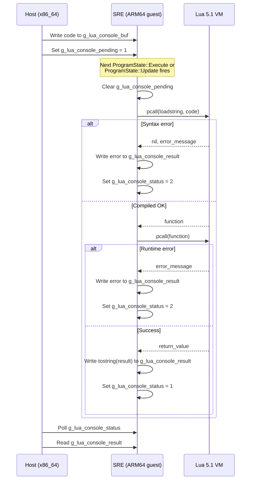

# SRE Lua API Reference

> Swordigo Runtime Engine — Lua API Surface for Mod Scripts

This document describes every Lua global, table, and function that **libsre.so** injects
into the game's Lua 5.1 states. These APIs are the primary interface for mod scripts
(RLSwordigo `.scl` files, custom mods, and the in-game console).

---

## Table of Contents

- [Architecture Overview](#architecture-overview)
- [Injection Mechanism](#injection-mechanism)
- [Mini.* Table](#mini-table)
- [LNI.* Table](#lni-table)
- [Components.* Table](#components-table)
- [Standard Library Extensions](#standard-library-extensions)
  - [math](#math-library)
  - [table](#table-library)
  - [os](#os-library)
  - [debug](#debug-library)
  - [io](#io-library)
- [Other Injected Globals](#other-injected-globals)
- [Lua Console Interface](#lua-console-interface)
- [ProgramState Lifecycle](#programstate-lifecycle)
- [Error Handling](#error-handling)
- [Source Files](#source-files)

---

## Architecture Overview

```
┌──────────────────────────────────────────────────────────┐
│  Mod Script (.scl / console input)                       │
│    calls Mini.*, LNI.*, math.*, etc.                     │
├──────────────────────────────────────────────────────────┤
│  SRE Lua API Layer (sre_mini_api.c + sre_lua_libs.c)     │
│    C functions registered as Lua closures                │
├──────────────────────────────────────────────────────────┤
│  Lua 5.1 VM (compiled as C++ inside libswordigo.so)      │
│    Function pointers resolved by host                    │
├──────────────────────────────────────────────────────────┤
│  Unicorn Engine (ARM64 emulation on x86_64 host)         │
└──────────────────────────────────────────────────────────┘
```

The engine ships only the **base** and **string** Lua libraries. SwMini (the original
Android mod loader) adds the rest by compiling Lua 5.1 source. SRE takes a different
approach: it implements the same API surface directly in C, compiled to ARM64, using
software math implementations (no libm dependency — compiled with `-nostdlib`).

---

## Injection Mechanism

SRE uses **lazy injection** rather than hooking `ProgramState::RegisterProgramLibrary`.
On every `lua_call` (which SRE has replaced globally with `sre_lua_call_safe`), the
runtime checks if the current `lua_State*` has already been initialized:

```c
// sre_mini_api.c:407
void sre_mini_ensure_injected(lua_State* L) {
    // Checks a cache of up to 8 lua_State pointers
    // If not yet injected:
    //   1. sre_open_std_libs(L)    — math, table, os, debug, io
    //   2. sre_register_mini_api(L) — Mini, LNI, Components, fs
}
```

This guarantees that **every** Lua state created by the engine receives the full
API surface before any script code runs, without needing to hook the registration
function (which would require relay stubs that crash on PC-relative instructions).

> [!NOTE]
> The injection cache holds a maximum of **8** `lua_State*` pointers. In practice,
> the engine creates 2–4 states during normal gameplay (main + coroutines), so this
> is sufficient.

---

## Mini.* Table

**Source**: `sre_mini_api.c:284–330`
**Global name**: `_G.Mini`

The `Mini` table is the primary mod API, originally provided by SwMini's `libmini.so`.
SRE reimplements it without any JNI or GlossHook dependencies.

### Functions

| Function | Signature | Returns | Description |
|----------|-----------|---------|-------------|
| `Mini.Arch()` | `() → string` | `"arm64-v8a"` | Returns the current architecture string. Always `"arm64-v8a"` on SRT. Configurable via `g_sre_mod_arch`. |
| `Mini.GetProfileID()` | `() → string` | UUID string | Returns the save profile UUID. Set by host via `g_sre_mod_profile_id`. Empty string if no save loaded. |
| `Mini.SetControlsHidden(hidden)` | `(boolean) → nil` | — | Hides or shows the on-screen touch controls. Sets `g_sre_controls_hidden` (polled by host). |
| `Mini.SetCoinLimit(n)` | `(number) → nil` | — | Sets the maximum coin count. Clamped to range `[1, 65535]`. Default: `9999`. |
| `Mini.ToggleDebug()` | `() → nil` | — | Toggles the debug overlay flag (`g_sre_debug_active`). |
| `Mini.RecreateHero()` | `() → nil` | — | **Placeholder (TODO)**. Intended to call `Caver::RecreateHero` via guest function pointer. Currently a no-op. |
| `Mini.SceneFindAll()` | `() → table` | `{}` | **Stub**. Returns an empty table. Intended to return all scene object names. |
| `Mini.map(...)` | polymorphic | `table` | Functional map operation. See [map overloads](#minimap-overloads) below. |
| `Mini.ExecuteLNI(funcName, ...)` | `(string [, string]) → nil` | — | Sends a command to the host LNI system. See [LNI command buffer](#lni-command-buffer). |
| `Mini.BindLNI(funcName)` | `(string) → function` | closure | Returns a Lua closure that calls `ExecuteLNI(funcName, ...)` when invoked. The function name is captured as an upvalue. |

### Sub-Tables

| Sub-table | Contents | Purpose |
|-----------|----------|---------|
| `Mini.Health` | `{}` (empty) | Stub for health manipulation API. Reserved for future use. |
| `Mini.Character` | `{}` (empty) | Stub for character state API. Reserved for future use. |

### Mini.map() Overloads

The `map` function is polymorphic — its behavior depends on argument types:

```lua
-- Overload 1: map(table, function) → table
-- Calls fn(value) for each element, returns results
local doubled = Mini.map({1, 2, 3}, function(v) return v * 2 end)
-- → {2, 4, 6}

-- Overload 2: map(function, table) → table
-- Same as above but with reversed argument order
local doubled = Mini.map(function(v) return v * 2 end, {1, 2, 3})

-- Overload 3: map(number, function) → table
-- Calls fn(i) for i = 1..n, returns results
local squares = Mini.map(5, function(i) return i * i end)
-- → {1, 4, 9, 16, 25}

-- Overload 4: map(string, function) → table
-- Calls fn(char) for each character in the string
local chars = Mini.map("hello", function(c) return c end)
-- → {"h", "e", "l", "l", "o"}
```

> [!IMPORTANT]
> The table+function overloads iterate using `lua_objlen` (array part only).
> Hash-part keys are **not** iterated. This matches SwMini's original behavior.

### Shared Globals (Host Communication)

These C globals are readable/writable by the host via symbol lookup in guest memory:

| Global | Type | Default | Description |
|--------|------|---------|-------------|
| `g_sre_mod_arch` | `char[32]` | `"arm64-v8a"` | Architecture string returned by `Mini.Arch()` |
| `g_sre_mod_profile_id` | `char[64]` | `""` | Profile UUID returned by `Mini.GetProfileID()` |
| `g_sre_game_speed` | `float` | `1.0` | Current game speed multiplier |
| `g_sre_controls_hidden` | `int` | `0` | Whether touch controls are hidden |
| `g_sre_coin_limit` | `int` | `9999` | Maximum coin count |
| `g_sre_debug_active` | `int` | `0` | Debug overlay toggle |

---

## LNI.* Table

**Source**: `sre_mini_api.c:333–370`
**Global name**: `_G.LNI`

The LNI (Lua Native Interface) table provides direct host actions. These functions
either modify shared globals or write commands to the LNI command buffer for the host
to process.

### Functions

| Function | Aliases | Signature | Description |
|----------|---------|-----------|-------------|
| `LNI.getSpeed()` | `LNI.GetSpeed()` | `() → number` | Returns current game speed (`g_sre_game_speed`). |
| `LNI.setSpeed(n)` | `LNI.SetSpeed(n)` | `(number) → nil` | Sets game speed. Clamped to `(0.0, 10.0]`. |
| `LNI.quit()` | `LNI.Quit()` | `() → nil` | Signals the host to exit the game. |
| `LNI.copyToClipboard(text)` | `LNI.CopyToClipboard(text)`, `LNI.copy(text)`, `LNI.Copy(text)` | `(string) → nil` | Copies text to the system clipboard via host. |
| `LNI.openUrl(url)` | `LNI.OpenUrl(url)`, `LNI.openURL(url)`, `LNI.OpenURL(url)` | `(string) → nil` | Opens a URL via the host's default browser. |

> [!TIP]
> Multiple aliases exist for each function because RLSwordigo scripts use inconsistent
> casing. All aliases point to the same C function.

### LNI Command Buffer

Commands that require host-side action (clipboard, URL, quit) use a shared memory
command buffer:

```c
char g_sre_lni_command[64];   // Function name (e.g., "copyToClipboard")
char g_sre_lni_arg[256];      // String argument (e.g., the text to copy)
int  g_sre_lni_pending;       // Set to 1 when a command is queued
```

The host polls `g_sre_lni_pending` each frame. When it's `1`, the host reads the
command/argument, performs the action, and resets pending to `0`.

---

## Components.* Table

**Source**: `sre_mini_api.c:372–387`
**Global name**: `_G.Components`

Empty stub tables that prevent `nil` index errors in mod scripts:

| Sub-table | Contents | Purpose |
|-----------|----------|---------|
| `Components.Health` | `{}` (empty, preallocated 4 hash slots) | Entity health component placeholder |
| `Components.Physics` | `{}` (empty, preallocated 4 hash slots) | Physics component placeholder |
| `Components.Entity` | `{}` (empty, preallocated 4 hash slots) | Base entity component placeholder |

---

## Standard Library Extensions

**Source**: `sre_lua_libs.c`

The vanilla engine only ships the **base** and **string** Lua libraries. SRE adds
the remaining standard libraries using custom implementations (no `libm` or `libc`
dependency — all math is done in software or via AArch64 hardware FPU instructions).

### math Library

**Source**: `sre_lua_libs.c:240–366`
**Global name**: `_G.math`

22 functions + 2 constants:

| Function | Signature | Notes |
|----------|-----------|-------|
| `math.abs(x)` | `(number) → number` | Uses `__builtin_fabs` (AArch64 `FABS` instruction) |
| `math.acos(x)` | `(number) → number` | Via `asin` → `π/2 - asin(x)` |
| `math.asin(x)` | `(number) → number` | Clamped to `[-1, 1]`, uses `atan` approximation |
| `math.atan(x)` | `(number) → number` | Polynomial: 5-term Taylor series for `|x| ≤ 1` |
| `math.atan2(y, x)` | `(number, number) → number` | Full quadrant handling |
| `math.ceil(x)` | `(number) → number` | Uses `__builtin_ceil` (AArch64 `FRINTP`) |
| `math.cos(x)` | `(number) → number` | `sin(x + π/2)` |
| `math.deg(x)` | `(number) → number` | Radians → degrees |
| `math.exp(x)` | `(number) → number` | Taylor series, 20 terms, clamped `[-700, 700]` |
| `math.floor(x)` | `(number) → number` | Uses `__builtin_floor` (AArch64 `FRINTM`) |
| `math.fmod(x, y)` | `(number, number) → number` | `x - trunc(x/y) * y` |
| `math.log(x)` | `(number) → number` | Atanh series with range reduction |
| `math.log10(x)` | `(number) → number` | `log(x) / ln(10)` |
| `math.max(...)` | `(number...) → number` | Variadic, returns largest argument |
| `math.min(...)` | `(number...) → number` | Variadic, returns smallest argument |
| `math.pow(x, y)` | `(number, number) → number` | Integer fast path for `y ∈ [1,64]`, otherwise `exp(y·ln(x))` |
| `math.rad(x)` | `(number) → number` | Degrees → radians |
| `math.random(...)` | `([m [, n]]) → number` | Xorshift64 PRNG. 0 args: `[0,1)`, 1 arg: `[1,n]`, 2 args: `[m,n]` |
| `math.randomseed(x)` | `(number) → nil` | Seeds the xorshift64 state. `0` is replaced with `1`. |
| `math.sin(x)` | `(number) → number` | Bhaskara I approximation (~0.001 accuracy) |
| `math.sqrt(x)` | `(number) → number` | Uses `__builtin_sqrt` (AArch64 `FSQRT`) |
| `math.tan(x)` | `(number) → number` | `sin(x) / cos(x)` |

| Constant | Value | Description |
|----------|-------|-------------|
| `math.pi` | `3.14159265358979323846` | π |
| `math.huge` | `inf` | Positive infinity (`__builtin_huge_val()`) |

> [!WARNING]
> Trigonometric functions use **Bhaskara I approximation**, not libm. Accuracy is
> approximately ±0.001. This is sufficient for game scripts but not for scientific
> computation. The PRNG uses **xorshift64** — fast but not cryptographically secure.

### table Library

**Source**: `sre_lua_libs.c:372–550`
**Global name**: `_G.table`

| Function | Signature | Description |
|----------|-----------|-------------|
| `table.insert(t, [pos,] val)` | `(table [, number], any) → nil` | Insert value at position (shifts elements up). If no position, appends. |
| `table.remove(t [, pos])` | `(table [, number]) → any` | Remove and return element at position. If no position, removes last. |
| `table.getn(t)` | `(table) → number` | Returns `#t` (array length via `lua_objlen`). |
| `table.maxn(t)` | `(table) → number` | Returns largest positive numeric key (iterates all keys). |
| `table.concat(t [, sep [, i [, j]]])` | `(table [, string [, number [, number]]]) → string` | Concatenate array elements with separator. |
| `table.sort(t [, comp])` | `(table [, function]) → nil` | In-place insertion sort. Optional comparator function. |

> [!NOTE]
> `table.unpack` is registered but **only as `_G.unpack`** (Lua 5.1 compatibility).
> It is not added to the `table` table itself. See [Other Injected Globals](#other-injected-globals).
> `table.sort` uses **insertion sort** — adequate for mod script data sizes but O(n²)
> for large arrays.

### os Library

**Source**: `sre_lua_libs.c:553–590`
**Global name**: `_G.os`

| Function | Signature | Description |
|----------|-----------|-------------|
| `os.time()` | `() → number` | Returns a **monotonically increasing fake timestamp** (starts at 1000000, increments by 1 each call). Not real wall-clock time. |
| `os.clock()` | `() → number` | Returns a **monotonically increasing fake clock** (starts at 0, increments by 0.001 each call). |
| `os.difftime(t2, t1)` | `(number, number) → number` | Returns `t2 - t1`. |
| `os.date()` | `([format [, time]]) → string` | **Stub** — always returns the hardcoded string `"2026-06-22"`. Ignores arguments. |
| `os.exit()` | `() → nil` | **No-op**. Does not actually exit. |

> [!CAUTION]
> `os.time()` and `os.clock()` return **fake values**, not real system time.
> Scripts that depend on real timestamps for game logic (e.g., daily rewards)
> will not work correctly. This is by design — the emulated environment has no
> reliable clock source.

### debug Library

**Source**: `sre_lua_libs.c:593–626`
**Global name**: `_G.debug`

| Function | Signature | Description |
|----------|-----------|-------------|
| `debug.getinfo(...)` | `(...) → table` | **Stub**. Returns `{what="Lua", source="?", currentline=0, name=""}`. |
| `debug.traceback([msg])` | `([string]) → string` | **Stub**. Returns the message argument (or `"traceback unavailable"`). |
| `debug.sethook(...)` | `(...) → nil` | **No-op**. Hook is silently ignored. |

### io Library

**Source**: `sre_lua_libs.c:629–640`
**Global name**: `_G.io`

| Function | Signature | Description |
|----------|-----------|-------------|
| `io.write(...)` | `(...) → nil` | **No-op stub**. Output is discarded. |
| `io.read(...)` | `(...) → nil` | **Stub**. Always returns `nil`. |

> [!NOTE]
> The io library is intentionally minimal. File I/O from within the emulated ARM64
> environment is not supported. Use the host-side save editor or LNI commands instead.

---

## Other Injected Globals

**Source**: `sre_mini_api.c:389–391`, `sre_lua_libs.c:674–676`

| Global | Value | Purpose |
|--------|-------|---------|
| `fs` | `{}` (empty table) | LuaFileSystem stub. Prevents `nil` errors in scripts that check for `fs`. |
| `unpack` | `function` | Alias for `table.unpack` — Lua 5.1 compatibility. Unpacks an array table into multiple return values. Supports `unpack(t [, i [, j]])` with an internal safety limit of 200 elements. |

---

## Lua Console Interface

**Source**: `sre_lua.c:344–465`

SRE provides a runtime Lua console that allows executing arbitrary Lua code in the
engine's active Lua state. This is implemented via a **shared memory interface**
between the host and the ARM64 guest.

### Shared Memory Layout

| Symbol | Type | Size | Description |
|--------|------|------|-------------|
| `g_lua_console_buf` | `char[]` | 4096 bytes | Lua source code to execute (written by host) |
| `g_lua_console_result` | `char[]` | 4096 bytes | Output string or error message (written by SRE) |
| `g_lua_console_pending` | `int` | 4 bytes | `1` = host has queued code for execution |
| `g_lua_console_status` | `int` | 4 bytes | `0` = idle, `1` = success, `2` = error |

### Execution Flow



### Console Usage Examples

From the host side (via the Lua console UI):

```lua
-- Query game state
return Mini.Arch()                    --> "arm64-v8a"

-- Modify game speed
LNI.setSpeed(2.0)                     --> OK

-- Inspect math
return math.pi                        --> 3.1415926535898

-- Complex expressions
return Mini.map(5, function(i) return i*i end)  --> table

-- Errors are caught gracefully
return nonexistent_function()         --> [error message]
```

> [!IMPORTANT]
> Console execution is **synchronous** within the game frame. Code runs during
> `ProgramState::Execute` or `ProgramState::Update`, whichever fires first.
> Long-running code will **block the game loop**.

### Additional Console Globals

| Symbol | Type | Description |
|--------|------|-------------|
| `g_sre_last_lua_state` | `lua_State*` | The most recently seen `lua_State`, updated every Execute/Update. Used by the host for inspection. |

---

## ProgramState Lifecycle

SRE replaces three core `ProgramState` methods to add error handling and console support.
Understanding the lifecycle helps mod authors predict when their code runs.

### Replaced Methods

| Method | Symbol | Purpose |
|--------|--------|---------|
| `ProgramState::Execute` | `_ZN5Caver12ProgramState7ExecuteEi` | Initial script execution + console dispatch |
| `ProgramState::Resume` | `_ZN5Caver12ProgramState6ResumeEi` | Coroutine resume after yield |
| `ProgramState::Update` | `_ZN5Caver12ProgramState6UpdateEf` | Timer-based coroutine resumption + per-frame console check |

### ProgramState Memory Layout (ARM64, v1.4.12)

| Offset | Field | Type | Description |
|--------|-------|------|-------------|
| `0x00` | `lua_State* L` | pointer | The Lua state for this script |
| `0x08` | coroutine | pointer | Non-null if this is a coroutine |
| `0x20` | `SceneObject*` | pointer | The scene object this script belongs to |
| `0x48` | `isSuspended` | int | `1` if waiting on a timer |
| `0x4C` | `sleepTime` | float | Remaining seconds until resume |
| `0x51` | `condition1` | bool | Internal condition flag |
| `0x52` | `paused` | bool | Script is paused |
| `0x53` | `completed` | bool | Script has finished execution |
| `0x54` | `speedScaling` | float | Speed multiplier for this script |

---

## Error Handling

SRE replaces the engine's crash-on-error behavior with graceful error recovery:

### Global lua_call → pcall Replacement

Every `lua_call` in the engine is redirected through `sre_lua_call_safe`, which:

1. Injects `Mini.*` tables if not yet present (lazy injection)
2. Pushes a **recovery entry** onto the SRE recovery stack (`setjmp`)
3. Calls `lua_pcall` instead of `lua_call`
4. On error: pops the error message, pushes `nil` for expected returns
5. On C++ exception (`__cxa_throw`): `longjmp` back to the recovery point

### luaD_throw Replacement

SRE replaces the Lua internal `luaD_throw` function to intercept **all** Lua errors
at the source. Instead of calling `__cxa_throw` (which crashes in Unicorn), it uses
the SRE recovery stack:

```
Before: luaD_throw → __cxa_throw → broken C++ unwinding → abort()
After:  sre_luaD_throw → sets error status → longjmp to recovery point
```

### Error Statistics

| Symbol | Type | Description |
|--------|------|-------------|
| `g_sre_resume_err_count` | `int` | Total Lua resume errors caught |
| `g_sre_resume_last_err` | `char[256]` | Last error message from lua_resume |

---

## Source Files

| File | Description |
|------|-------------|
| `src/sre/sre_mini_api.c` | Mini.*, LNI.*, Components.*, fs tables + lazy injection |
| `src/sre/sre_lua_libs.c` | Standard library implementations (math, table, os, debug, io) + extended Lua API init |
| `src/sre/sre_lua.c` | Lua function pointers, ProgramState replacements, console, error handling |
| `src/sre/sre_lua.h` | Type definitions, constants, ProgramState layout, function pointer declarations |
