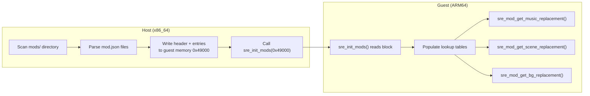

# Mod Config Shared Memory Protocol

> **Source files:** [sre_mod.c](file:///home/quantumcreeper/SwordigoDesktop/src/sre/sre_mod.c) (guest reader) · [main.cpp](file:///home/quantumcreeper/SwordigoDesktop/src/main.cpp#L2646-L2835) (host writer)
> **Guest address:** `0x49000` · **Block size:** 8KB (0x2000 bytes)

The mod config protocol defines how the host launcher communicates active mod configurations to the SRE guest code via a structured shared memory block. The host writes this block before game boot; the guest reads it during `sre_init_mods()` and populates internal lookup tables that other hooks (music, VFS, scene, background) consult at runtime.

---

## Table of Contents

- [Overview](#overview)
- [Memory Layout](#memory-layout)
  - [Header](#header-64-bytes)
  - [Music Entries](#music-entries)
  - [Scene Entries](#scene-entries)
  - [Background Entries](#background-entries)
- [Memory Map Diagram](#memory-map-diagram)
- [Initialization Flow](#initialization-flow)
  - [Host Side — Writing the Config](#host-side--writing-the-config)
  - [Guest Side — Reading the Config](#guest-side--reading-the-config)
- [Query Functions](#query-functions)
  - [sre_mod_get_music_replacement](#sre_mod_get_music_replacement)
  - [sre_mod_get_scene_replacement](#sre_mod_get_scene_replacement)
  - [sre_mod_get_bg_replacement](#sre_mod_get_bg_replacement)
- [Global Diagnostics](#global-diagnostics)
- [Constants](#constants)
- [mod.json Format](#modjson-format)
- [Implementation Details](#implementation-details)
  - [Host JSON Parser](#host-json-parser)
  - [Guest String Comparison](#guest-string-comparison)
- [Limitations](#limitations)

---

## Overview

The mod config system uses a fixed-layout memory block at guest virtual address `0x49000` (within the shared config region `0x48000–0x4AFFF`). The protocol is intentionally simple — flat arrays of fixed-size entries with no pointers, no dynamic allocation, and no complex data structures — so it can be read safely by freestanding C code with no libc.



---

## Memory Layout

### Header (64 bytes)

The header is at the base of the config block (`0x49000`). All fields are little-endian `uint32_t`.

| Offset | Type | Field | Description |
|--------|------|-------|-------------|
| `0x000` | `uint32` | `magic` | Magic number `0x4D4F4453` (ASCII `"MODS"`) |
| `0x004` | `uint32` | `version` | Protocol version (currently `1`) |
| `0x008` | `uint32` | `music_count` | Number of music replacement entries |
| `0x00C` | `uint32` | `scene_count` | Number of scene replacement entries |
| `0x010` | `uint32` | `bg_count` | Number of background replacement entries |
| `0x014` | `uint32` | `flags` | Reserved (currently `0`) |
| `0x018` | `uint32` | `total_mods` | Total number of active mod directories |
| `0x01C` | `uint32[9]` | `_reserved` | Reserved for future expansion |

**Total header size:** 7 fields × 4 bytes + 9 × 4 bytes padding = **64 bytes** (ends at `0x03F`).

> [!IMPORTANT]
> The `magic` and `version` fields are validated by `sre_init_mods()`. If either doesn't match, the entire mod system is silently disabled and all query functions return `NULL`.

### Music Entries

**Offset:** `0x040` (header base + 64)
**Entry size:** 64 bytes each
**Maximum entries:** 32

Each music entry maps an original playlist name to a replacement name:

| Entry Offset | Size | Type | Field | Description |
|-------------|------|------|-------|-------------|
| `+0x00` | 32 bytes | `char[32]` | `original` | Original playlist name, null-terminated (e.g., `"wastelands"`) |
| `+0x20` | 32 bytes | `char[32]` | `replacement` | Replacement name, null-terminated (e.g., `"my_custom_track"`) |

**Region:** `0x040` to `0x83F` (32 entries × 64 bytes = 2048 bytes)

### Scene Entries

**Offset:** `0x840` (after music region)
**Entry size:** 128 bytes each
**Maximum entries:** 16

Each scene entry maps an original scene name to a replacement:

| Entry Offset | Size | Type | Field | Description |
|-------------|------|------|-------|-------------|
| `+0x00` | 64 bytes | `char[64]` | `original` | Original scene name, null-terminated (e.g., `"plains1"`) |
| `+0x40` | 64 bytes | `char[64]` | `replacement` | Replacement scene name (e.g., `"custom_plains"`) |

**Region:** `0x840` to `0x183F` (16 entries × 128 bytes = 2048 bytes)

### Background Entries

**Offset:** `0x1840` (after scene region)
**Entry size:** 128 bytes each
**Maximum entries:** 16

Same layout as scene entries:

| Entry Offset | Size | Type | Field | Description |
|-------------|------|------|-------|-------------|
| `+0x00` | 64 bytes | `char[64]` | `original` | Original background name |
| `+0x40` | 64 bytes | `char[64]` | `replacement` | Replacement background name |

**Region:** `0x1840` to `0x1FFF` (max, but only up to 16 entries × 128 = 2048 bytes)

---

## Memory Map Diagram

```
Guest Address 0x49000                                    0x4AFFF
┌──────────────────────────────────────────────────────────────┐
│                    MOD CONFIG BLOCK (8KB)                     │
├──────────┬───────────────────────────────────────────────────┤
│ 0x000    │ Header (64 bytes)                                 │
│          │  magic=0x4D4F4453  version=1                      │
│          │  music_count  scene_count  bg_count                │
│          │  flags  total_mods  reserved[9]                    │
├──────────┼───────────────────────────────────────────────────┤
│ 0x040    │ Music Entries (64B each × max 32 = 2048B)         │
│          │  ┌──────────────────┬──────────────────┐          │
│          │  │ original[32]     │ replacement[32]  │ entry 0  │
│          │  ├──────────────────┼──────────────────┤          │
│          │  │ original[32]     │ replacement[32]  │ entry 1  │
│          │  ├──────────────────┼──────────────────┤          │
│          │  │       ...        │       ...        │          │
│          │  └──────────────────┴──────────────────┘          │
├──────────┼───────────────────────────────────────────────────┤
│ 0x840    │ Scene Entries (128B each × max 16 = 2048B)        │
│          │  ┌──────────────────┬──────────────────┐          │
│          │  │ original[64]     │ replacement[64]  │ entry 0  │
│          │  ├──────────────────┼──────────────────┤          │
│          │  │       ...        │       ...        │          │
│          │  └──────────────────┴──────────────────┘          │
├──────────┼───────────────────────────────────────────────────┤
│ 0x1840   │ Background Entries (128B each × max 16 = 2048B)   │
│          │  ┌──────────────────┬──────────────────┐          │
│          │  │ original[64]     │ replacement[64]  │ entry 0  │
│          │  ├──────────────────┼──────────────────┤          │
│          │  │       ...        │       ...        │          │
│          │  └──────────────────┴──────────────────┘          │
└──────────┴───────────────────────────────────────────────────┘
```

> [!NOTE]
> The total maximum data footprint is: 64 (header) + 2048 (music) + 2048 (scene) + 2048 (backgrounds) = **6208 bytes**, well within the 8KB (8192 byte) allocation. The remaining 1984 bytes are available for future entry types.

---

## Initialization Flow

### Host Side — Writing the Config

The host populates the config block in [main.cpp ~L2646–2835](file:///home/quantumcreeper/SwordigoDesktop/src/main.cpp#L2646-L2835). Here's the sequence:

```
1. Clear 8KB at guest address 0x49000 (memset zero)
2. Scan ~/.local/share/swordigo-desktop/mods/ for directories
3. For each mod directory (skip dot-prefixed/disabled):
   a. Read mod.json
   b. Determine mod type ("music", "scene", "background")
   c. Parse the "replace" object for key→value mappings
   d. Write entries to the appropriate region in guest memory
   e. Increment the appropriate count
4. Write the header (magic, version, counts, total_mods)
5. Call sre_init_mods(0x49000) via emulator
```

**Host code excerpt** (simplified):

```cpp
// Clear config block
memset(g_guest_memory + MOD_CONFIG_GUEST, 0, 0x2000);

// ... scan and parse mods ...

// Write music entry to guest memory
uint64_t entry_addr = MOD_CONFIG_GUEST + 0x40 + music_count * 64;
strncpy((char*)(g_guest_memory + entry_addr), orig.c_str(), 31);
strncpy((char*)(g_guest_memory + entry_addr + 32), repl.c_str(), 31);
music_count++;

// Write header after all entries
uint32_t* hdr = (uint32_t*)(g_guest_memory + MOD_CONFIG_GUEST);
hdr[0] = 0x4D4F4453;  // "MODS"
hdr[1] = 1;            // version
hdr[2] = music_count;
hdr[3] = scene_count;
hdr[4] = bg_count;
hdr[5] = 0;            // flags
hdr[6] = total_mods;

// Call guest init
g_emulator_64->call(sre_init_mods_addr, {MOD_CONFIG_GUEST});
```

> [!WARNING]
> The header is written **after** all entries. This is important because `sre_init_mods()` reads `music_count`, `scene_count`, and `bg_count` from the header to determine how many entries to process. If the header were written first with zero counts and entries written later, a race condition could occur.

### Guest Side — Reading the Config

`sre_init_mods()` in [sre_mod.c](file:///home/quantumcreeper/SwordigoDesktop/src/sre/sre_mod.c#L172-L235):

```c
void sre_init_mods(uint64_t config_addr);
```

| Parameter | Type | Description |
|-----------|------|-------------|
| `config_addr` | `uint64_t` | Guest virtual address of the config block (`0x49000`) |

**Validation steps:**
1. If `config_addr == 0` → mod support disabled, return
2. Read `magic` — must be `0x4D4F4453`
3. Read `version` — must be `1`
4. If either check fails → proceed without mods

**Processing steps:**
1. Read `music_count`, cap at `SRE_MAX_MUSIC_REPL` (32)
2. Copy music entries from `config_addr + 0x40` into `g_music_replacements[]`
3. Read `scene_count`, cap at `SRE_MAX_SCENE_REPL` (16)
4. Copy scene entries from `config_addr + 0x840` into `g_scene_replacements[]`
5. Read `bg_count`, cap at `SRE_MAX_BG_REPL` (16)
6. Copy background entries from `config_addr + 0x1840` into `g_bg_replacements[]`
7. Set `g_sre_mod_initialized = 1`

---

## Query Functions

These are called by other SRE hooks at runtime to check if a given asset has a mod override. All use simple linear search — with max 32/16 entries, performance is not a concern.

### sre_mod_get_music_replacement

```c
const char* sre_mod_get_music_replacement(const char* original_name);
```

Checks if a music playlist name has a mod override.

| Parameter | Type | Description |
|-----------|------|-------------|
| `original_name` | `const char*` | Track/playlist name (e.g., `"wastelands"`) |
| **Returns** | `const char*` | Replacement name, or `NULL` if no override |

**Called by:** `sre_PlayMusicWithName()` in [sre_music.c](file:///home/quantumcreeper/SwordigoDesktop/src/sre/sre_music.c#L142-L153) before loading any track.

### sre_mod_get_scene_replacement

```c
const char* sre_mod_get_scene_replacement(const char* original_name);
```

Checks if a scene name has a mod override.

| Parameter | Type | Description |
|-----------|------|-------------|
| `original_name` | `const char*` | Scene name (e.g., `"plains1"`) |
| **Returns** | `const char*` | Replacement name, or `NULL` if no override |

**Called by:** Scene loader hooks (future implementation).

### sre_mod_get_bg_replacement

```c
const char* sre_mod_get_bg_replacement(const char* original_name);
```

Checks if a background name has a mod override.

| Parameter | Type | Description |
|-----------|------|-------------|
| `original_name` | `const char*` | Background identifier |
| **Returns** | `const char*` | Replacement name, or `NULL` if no override |

**Called by:** Background draw hooks (future implementation).

---

## Global Diagnostics

These `volatile` globals are set by `sre_init_mods()` and can be read by both the guest and host for diagnostic purposes:

| Variable | Type | Description |
|----------|------|-------------|
| `g_sre_mod_count` | `volatile int` | Total number of active mod directories |
| `g_sre_mod_music_count` | `volatile int` | Number of music replacement entries loaded |
| `g_sre_mod_scene_count` | `volatile int` | Number of scene replacement entries loaded |
| `g_sre_mod_initialized` | `volatile int` | `1` after `sre_init_mods()` completes |

---

## Constants

Defined in `sre_mod.c`:

| Constant | Value | Description |
|----------|-------|-------------|
| `SRE_MOD_MAGIC` | `0x4D4F4453` | ASCII `"MODS"` — config block magic number |
| `SRE_MOD_VERSION` | `1` | Current protocol version |
| `SRE_MAX_MUSIC_REPL` | `32` | Maximum music replacement entries |
| `SRE_MAX_SCENE_REPL` | `16` | Maximum scene replacement entries |
| `SRE_MAX_BG_REPL` | `16` | Maximum background replacement entries |
| `SRE_MOD_NAME_LEN` | `32` | Max chars for music names (including null) |
| `SRE_MOD_PATH_LEN` | `64` | Max chars for scene/bg names (including null) |

---

## mod.json Format

Each mod directory must contain a `mod.json` file. The host parses this to determine what to write into the shared memory block.

### Music Mod

```json
{
  "id": "epic-music-pack",
  "name": "Epic Music Pack",
  "version": "1.0",
  "author": "ModAuthor",
  "description": "Replaces boss and wastelands music",
  "type": "music",
  "replace": {
    "wastelands": "my_wastelands",
    "boss": "epic_boss_theme"
  }
}
```

### Scene Mod

```json
{
  "id": "custom-scenes",
  "name": "Custom Scene Pack",
  "version": "1.0",
  "author": "ModAuthor",
  "description": "Custom level layouts",
  "type": "scene",
  "replace": {
    "plains1": "custom_plains",
    "dungeon_entrance": "my_dungeon"
  }
}
```

### Background Mod

```json
{
  "id": "hd-backgrounds",
  "name": "HD Backgrounds",
  "version": "1.0",
  "author": "ModAuthor",
  "description": "High-resolution background replacements",
  "type": "background",
  "replace": {
    "sky_plains": "hd_sky_plains",
    "sky_cave": "hd_sky_cave"
  }
}
```

> [!TIP]
> **Disabling a mod** — Rename the mod directory with a dot prefix (e.g., `my-mod/` → `.my-mod/`). The host skips dot-prefixed directories during scanning.

---

## Implementation Details

### Host JSON Parser

The host uses a minimal inline JSON parser (not a full library) to extract fields from `mod.json`. It searches for quoted key strings and extracts the corresponding quoted values. This means:

- Only simple `"key": "value"` string pairs are supported
- The `"replace"` block must use `{}` braces with `"key": "value"` pairs
- Nested objects, arrays, numbers, and booleans in the replace block are **not** supported
- Comments are not supported (standard JSON doesn't allow them either)

### Guest String Comparison

The guest code uses a custom `mod_strcmp` function (no libc `strcmp` available in the freestanding environment):

```c
static int mod_strcmp(const char* a, const char* b) {
    while (*a && *b && *a == *b) { a++; b++; }
    return *a - *b;
}
```

String matching is **case-sensitive** — `"Wastelands"` and `"wastelands"` are different entries.

---

## Limitations

| Limitation | Value | Reason |
|------------|-------|--------|
| Max music replacements | 32 | Fixed array in guest memory |
| Max scene replacements | 16 | Fixed array in guest memory |
| Max background replacements | 16 | Fixed array in guest memory |
| Max music name length | 31 chars | 32 bytes including null terminator |
| Max scene/bg name length | 63 chars | 64 bytes including null terminator |
| Config block size | 8KB | Fits in shared config region `0x48000–0x4AFFF` |
| Mod types per mod.json | 1 | Each mod.json has a single `"type"` field |

> [!CAUTION]
> Names exceeding the max length are silently truncated via `strncpy` on the host side. Ensure playlist, scene, and background names stay within limits.

If you need more entries or longer names, both the host writer and the guest reader must be updated in lockstep. Increase the version number when changing the memory layout.

---

## See Also

- [Music System](music-api.md) — How `sre_mod_get_music_replacement()` integrates with the music pipeline
- [Modding Guide](modding-guide.md) — Complete guide to creating and installing mods
- [Architecture Overview](architecture.md) — Guest/host shared memory architecture
- [Data Layout](data-layout.md) — Directory structure including `mods/`
