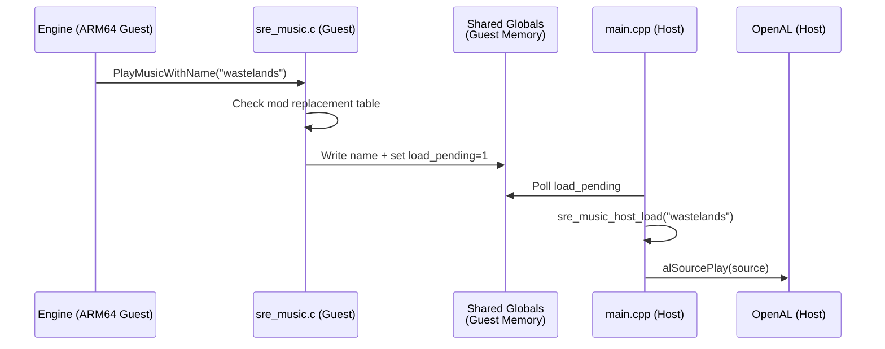
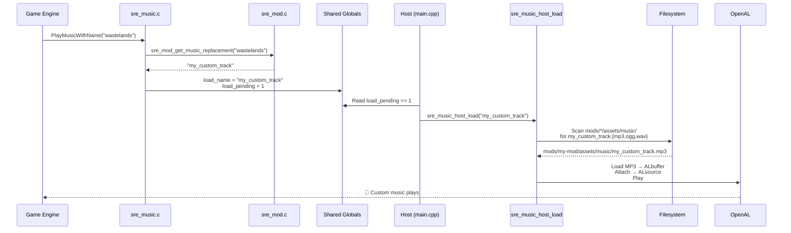

# SRE Music System API

> **Source files:** [sre_music.c](file:///home/quantumcreeper/SwordigoDesktop/src/sre/sre_music.c) (guest) · [jni_bridge_arm64.cpp](file:///home/quantumcreeper/SwordigoDesktop/src/jni/jni_bridge_arm64.cpp#L6477-L6677) (host) · [main.cpp](file:///home/quantumcreeper/SwordigoDesktop/src/main.cpp#L3395-L3460) (host poll loop)
> **Target:** ARM64 v1.4.12

The SRE music system completely replaces the Caver engine's `MusicPlayer` class. The original C++ implementation relied on `boost::shared_ptr` and exceptions for playlist management — all of which break under Unicorn emulation. SRE replaces it with a clean guest→host command interface that routes music playback through OpenAL on the host side.

---

## Table of Contents

- [Architecture](#architecture)
- [SRE Guest Hooks](#sre-guest-hooks)
  - [sre_PlayMusicWithName](#sre_playmusicwithname)
  - [sre_MusicPlayer_FadeIn](#sre_musicplayer_fadein)
  - [sre_MusicPlayer_FadeOut](#sre_musicplayer_fadeout)
  - [sre_MusicPlayer_Update](#sre_musicplayer_update)
  - [sre_AudioSystem_SetMusicVolume](#sre_audiosystem_setmusicvolume)
  - [sre_MusicPlayer_SetEnabled](#sre_musicplayer_setenabled)
  - [sre_MusicPlayer_SetSuspended](#sre_musicplayer_setsuspended)
- [Guest→Host Command Interface](#guesthost-command-interface)
- [Host-Side Functions](#host-side-functions)
  - [sre_music_host_load](#sre_music_host_load)
  - [sre_music_host_play / pause / stop](#sre_music_host_play--pause--stop)
  - [sre_music_host_set_volume](#sre_music_host_set_volume)
  - [sre_music_host_set_looping](#sre_music_host_set_looping)
- [Playlist→Track Mapping](#playlisttrack-mapping)
- [Music Modding](#music-modding)
  - [End-to-End Flow](#end-to-end-flow)
  - [Mod Directory Layout](#mod-directory-layout)
  - [File Search Order](#file-search-order)
- [Internal State](#internal-state)

---

## Architecture

The music system uses a split architecture: hooks on the guest (ARM64) side intercept engine calls and write commands to shared globals; the host (x86_64) side polls those globals every frame and executes them via OpenAL.



> [!IMPORTANT]
> The guest SRE code has **no access to libc, OpenAL, or the filesystem**. It can only communicate with the host through shared global variables in guest memory. The host polls these globals in its main loop (~60Hz).

---

## SRE Guest Hooks

These functions are compiled into `libsre.so` and replace the original `Caver::MusicPlayer` methods via trampoline hooks.

### sre_PlayMusicWithName

```c
void sre_PlayMusicWithName(void* self, void* name_ref, int restart);
```

**Replaces:** `Caver::MusicPlayer::PlayMusicWithName` at `0x4811a0`

| Parameter | ARM64 Reg | Type | Description |
|-----------|-----------|------|-------------|
| `self` | X0 | `MusicPlayer*` | The engine's MusicPlayer instance |
| `name_ref` | X1 | `const std::string&` | Pointer to a COW `std::string` |
| `restart` | X2 | `bool` | `1` = restart even if same track |

**Behavior (matching original decompilation):**

1. Reads the track name from the `std::string` (COW layout: data pointer at `+0`, length at `data-24`)
2. Checks the mod replacement table via `sre_mod_get_music_replacement()` — if a mod overrides this track, the replacement name is used instead
3. If the same track is already playing (and `restart=0`), returns immediately
4. If a different track is playing, starts a fadeout and queues the new track as "pending" — `sre_MusicPlayer_Update` handles the transition
5. If nothing is playing, writes directly to `g_sre_music_load_name` and sets `g_sre_music_load_pending=1`, then starts a fadein

> [!NOTE]
> The `restart` parameter rarely comes from the engine as `1`. Most game transitions pass `0`, which triggers duplicate detection. The SRE implementation also checks pending tracks to avoid queueing the same transition twice.

### sre_MusicPlayer_FadeIn

```c
void sre_MusicPlayer_FadeIn(void* self, float duration);
```

**Replaces:** `0x4814a8` — Sets `s_fade_target = 1.0` and `s_fade_speed = 1.0 / duration`.

If `duration ≤ 0.01`, the volume is set to full immediately and the dirty flag is raised.

### sre_MusicPlayer_FadeOut

```c
void sre_MusicPlayer_FadeOut(void* self, float duration);
```

**Replaces:** `0x4815d8` — Sets `s_fade_target = 0.0` and `s_fade_speed = 1.0 / duration`.

If `duration ≤ 0.01`, the volume is set to zero immediately and the dirty flag is raised.

### sre_MusicPlayer_Update

```c
void sre_MusicPlayer_Update(void* self, float deltaTime);
```

**Replaces:** `0x482090` — Called every frame by the engine. Handles three critical tasks:

1. **Volume sync** — Reads `this+4` (the MusicPlayer object's volume field) and uses it as `s_master_volume`. This is necessary because `SetVolume` at `0x482064` **cannot be hooked** — it's only 8 bytes before `SetLooping`, causing a trampoline collision.

2. **Looping sync** — Reads `this+8` (the looping flag). Same reason as above — `SetLooping` at `0x48206c` can't be hooked independently.

3. **Fade processing** — Applies the fade transition:
   - Adjusts `s_fade_volume` toward `s_fade_target` at `s_fade_speed * deltaTime`
   - When a fadeout completes (`s_fade_volume ≤ 0.001`):
     - If a pending track is queued → loads it and starts a fadein
     - Otherwise → sends a stop command

4. **Volume commit** — Computes `master_volume × fade_volume`, clamps to `[0.0, 1.0]`, writes to `g_sre_music_volume`, and sets `g_sre_music_volume_dirty = 1`.

> [!TIP]
> The default fade transition speed is `0.667` (defined as `FADE_TRANSITION_SPEED`), matching the original game's `1.0 / 1.5` second crossfade.

### sre_AudioSystem_SetMusicVolume

```c
void sre_AudioSystem_SetMusicVolume(void* self, float vol);
```

**Replaces:** `Caver::AudioSystem::SetMusicVolume` at `0x47f5f0`

Called when the music volume slider changes. The original would call `MusicPlayer::SetVolume → MusicPlayerJNI::SetVolume` through the broken JNI bridge. SRE bypasses all of that:

1. Clamps `vol` to `[0.0, 1.0]`
2. Updates `s_master_volume`
3. Computes effective volume: `vol × s_fade_volume`
4. Writes to `g_sre_music_volume` and sets `g_sre_music_volume_dirty = 1`

### sre_MusicPlayer_SetEnabled

```c
void sre_MusicPlayer_SetEnabled(void* self, int enabled);
```

**Replaces:** `0x481e88` — Controls whether music is enabled system-wide.

- If disabled while playing → sends `g_sre_music_stop_pending = 1`
- If enabled while a track is loaded → sends `g_sre_music_play_pending = 1`

### sre_MusicPlayer_SetSuspended

```c
void sre_MusicPlayer_SetSuspended(void* self, int suspended);
```

**Replaces:** `0x481fc0` — Controls music suspension (typically for app backgrounding).

- If suspended while playing → sends `g_sre_music_pause_pending = 1`
- If unsuspended and enabled → sends `g_sre_music_play_pending = 1`

---

## Guest→Host Command Interface

These global variables live in `sre_music.c` (guest memory) and form the communication protocol between the emulated game code and the host's OpenAL playback system. The host reads/clears them every frame.

### Load Command

| Variable | Type | Description |
|----------|------|-------------|
| `g_sre_music_load_name[256]` | `char[256]` | Track name to load (e.g., `"wastelands"`) |
| `g_sre_music_load_pending` | `int` | `1` = host should load and play this track |
| `g_sre_music_load_restart` | `int` | `1` = restart even if same track is already loaded |

### Playback Commands

| Variable | Type | Description |
|----------|------|-------------|
| `g_sre_music_play_pending` | `int` | `1` = host should resume playback |
| `g_sre_music_pause_pending` | `int` | `1` = host should pause |
| `g_sre_music_stop_pending` | `int` | `1` = host should stop |

### Volume & Looping

| Variable | Type | Description |
|----------|------|-------------|
| `g_sre_music_volume` | `float` | Effective volume `[0.0, 1.0]` (master × fade) |
| `g_sre_music_volume_dirty` | `int` | `1` = volume changed, host should apply |
| `g_sre_music_looping` | `int` | `1` = loop, `0` = play once |
| `g_sre_music_looping_dirty` | `int` | `1` = looping state changed |

> [!NOTE]
> The host clears all `_pending` and `_dirty` flags to `0` after processing. This prevents duplicate processing on the next frame.

---

## Host-Side Functions

These run natively on x86_64 in `jni_bridge_arm64.cpp` and directly control OpenAL.

### sre_music_host_load

```c
bool sre_music_host_load(const std::string& name);
```

The main music loading function. Handles playlist name resolution, mod override scanning, and multi-format audio loading.

**Steps:**
1. Resolve the playlist name to a track filename via the [playlist→track map](#playlisttrack-mapping)
2. Detect death events (if name contains `"gameover"`, sets `g_death_detected_countdown`)
3. Stop any current playback (`alSourceStop`)
4. Scan mod directories for override files (see [File Search Order](#file-search-order))
5. Build a list of candidate file paths (mod paths first, then vanilla)
6. Try loading each path in order: `.mp3` via minimp3, `.wav` via raw PCM, `.ogg` via stb_vorbis
7. On success: attach buffer to source, set looping/volume, start playback
8. Returns `true` if loaded successfully

### sre_music_host_play / pause / stop

```c
void sre_music_host_play();
void sre_music_host_pause();
void sre_music_host_stop();
```

Direct OpenAL source control — each wraps a single `alSourcePlay`, `alSourcePause`, or `alSourceStop` call.

### sre_music_host_set_volume

```c
void sre_music_host_set_volume(float vol);
```

Clamps to `[0.0, 1.0]` and calls `alSourcef(source, AL_GAIN, vol)`.

### sre_music_host_set_looping

```c
void sre_music_host_set_looping(bool loop);
```

Sets `alSourcei(source, AL_LOOPING, loop ? AL_TRUE : AL_FALSE)`.

> [!NOTE]
> The host poll loop also contains a **loop watchdog**: if looping is enabled but `alGetSourcei` reports the source has stopped (e.g., OGG stream ended naturally), it restarts playback automatically. This compensates for `AL_LOOPING` not always working with decoded-to-buffer audio.

---

## Playlist→Track Mapping

The engine calls `PlayMusicWithName` with **playlist names** (e.g., `"outdoors_light"`), not audio filenames. The host resolves these to actual track filenames:

| Playlist Name | Track Filename | Context |
|---------------|----------------|---------|
| `menu` | `1_hero2` | Main menu / title screen |
| `title` | `1_hero2` | Title screen (alias) |
| `house` | `1_plaintest2` | House interior |
| `outdoors_light` | `squire_new2` | Plains / outdoors light |
| `outdoors_dark` | `1_hero2` | Dark outdoors, adventure |
| `dungeon1` | `1_dung73` | Dungeons |
| `cave` | `2cave2` | Caves |
| `forest` | `2cave2` | Forest areas |
| `boss` | `1_boss23` | Boss fights |
| `bosskill` | `momentofwonder` | After killing a boss |
| `gameover` | `gameover` | Death screen |
| `heartbeat` | `heartbeat` | Tension / danger moments |
| `momentofwonder` | `momentofwonder` | Discovery / portals |
| `squire` | `squire_new2` | Town / shop |

If the playlist name isn't in this table, it's used as-is (passthrough).

> [!TIP]
> Some playlists map to the same track (e.g., `menu` and `outdoors_dark` both use `1_hero2`; `cave` and `forest` both use `2cave2`). This matches the original game's music reuse patterns.

---

## Music Modding

### End-to-End Flow

Here's the complete journey when a modded music track plays:



**Step-by-step:**

1. **Engine call** — The game calls `PlayMusicWithName("wastelands")` when entering the Wastelands area
2. **SRE intercepts** — `sre_PlayMusicWithName` reads the std::string, extracts `"wastelands"`
3. **Mod lookup** — Calls `sre_mod_get_music_replacement("wastelands")` which checks the mod config shared memory block. If a mod has `"wastelands" → "my_custom_track"`, it returns `"my_custom_track"`
4. **Write command** — SRE writes `"my_custom_track"` to `g_sre_music_load_name` and sets `g_sre_music_load_pending = 1`
5. **Host polls** — The host main loop detects `load_pending == 1`, reads the name, clears the flag
6. **Host loads** — `sre_music_host_load("my_custom_track")` is called:
   - Resolves playlist name (passthrough since `"my_custom_track"` isn't in the vanilla map)
   - Scans `mods/*/assets/music/` for `my_custom_track.{mp3,ogg,wav}`
   - Finds `mods/my-mod/assets/music/my_custom_track.mp3`
   - Decodes and loads into an OpenAL buffer
7. **Playback starts** — OpenAL plays the custom track with the current volume and looping settings

### Mod Directory Layout

```
~/.local/share/swordigo-desktop/mods/
└── my-music-mod/
    ├── mod.json
    └── assets/
        └── music/
            ├── my_custom_track.mp3
            ├── boss_remix.ogg
            └── menu_theme.wav
```

The `mod.json` defines which playlist names get replaced:

```json
{
  "id": "my-music-mod",
  "name": "Epic Music Pack",
  "version": "1.0",
  "author": "ModAuthor",
  "description": "Custom music for wastelands and boss fights",
  "type": "music",
  "replace": {
    "wastelands": "my_custom_track",
    "boss": "boss_remix",
    "menu": "menu_theme"
  }
}
```

### File Search Order

When loading a track, the host searches for files in this exact order (first match wins):

| Priority | Path Pattern | Source |
|----------|-------------|--------|
| 1 | `mods/*/assets/music/{playlist_name}.mp3` | Mod override (by playlist name) |
| 2 | `mods/*/assets/music/{playlist_name}.ogg` | Mod override |
| 3 | `mods/*/assets/music/{playlist_name}.wav` | Mod override |
| 4 | `mods/*/assets/music/{track_name}.mp3` | Mod override (by resolved track name) |
| 5 | `mods/*/assets/music/{track_name}.ogg` | Mod override |
| 6 | `mods/*/assets/music/{track_name}.wav` | Mod override |
| 7 | `mods/*/assets/music/music_{playlist_name}.mp3` | Mod override (music_ prefix) |
| 8 | `mods/*/assets/music/music_{track_name}.mp3` | Mod override (music_ prefix) |
| 9 | `assets/resources/music/music_{track_name}.ogg` | Vanilla game asset |
| 10 | `assets/resources/music/{track_name}.ogg` | Vanilla game asset |
| 11 | `res/raw/music_{track_name}.mp3` | Vanilla res/raw |
| 12 | `res/raw/{track_name}.mp3` | Vanilla res/raw |

> [!TIP]
> Mod directories prefixed with `.` (dot) are treated as **disabled** and skipped during scanning. To temporarily disable a mod, rename its folder from `my-mod/` to `.my-mod/`.

### Supported Audio Formats

| Format | Decoder | Notes |
|--------|---------|-------|
| `.mp3` | minimp3 | Most common mod format |
| `.ogg` | stb_vorbis | Used by vanilla game assets |
| `.wav` | Raw PCM | Uncompressed, larger files |

---

## Internal State

These static variables in `sre_music.c` track the music system's internal state. They are not directly accessible to mods — only the shared globals above are visible to the host.

| Variable | Type | Default | Description |
|----------|------|---------|-------------|
| `s_master_volume` | `float` | `1.0` | Engine-set master volume |
| `s_fade_volume` | `float` | `1.0` | Current fade multiplier (0.0–1.0) |
| `s_fade_target` | `float` | `1.0` | Fade destination (0.0 or 1.0) |
| `s_fade_speed` | `float` | `0.0` | Fade rate per second |
| `s_enabled` | `int` | `1` | Music enabled by engine |
| `s_suspended` | `int` | `0` | Music suspended (app backgrounded) |
| `s_playing` | `int` | `0` | A track is loaded and playing |
| `s_current_name[256]` | `char[]` | `""` | Currently playing track name |
| `s_pending_name[256]` | `char[]` | `""` | Track queued for crossfade transition |
| `s_has_pending` | `int` | `0` | A track is queued for transition |
| `s_pending_restart` | `int` | `0` | Pending track should force restart |

**Fade transition constant:**

```c
#define FADE_TRANSITION_SPEED 0.667f  /* 1.0 / 1.5 seconds */
```

---

## See Also

- [Mod Config Protocol](mod-config.md) — How the mod replacement table is populated
- [Modding Guide](modding-guide.md) — Complete guide to creating mods
- [SRE Hook API](sre-hooks.md) — All 34+ engine hooks including music hooks
