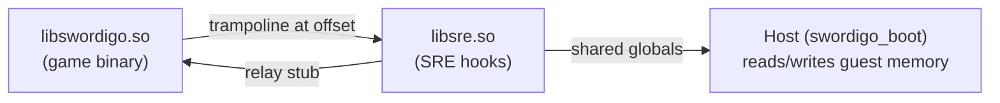

# SRE Hook API Reference

> Complete reference for all hooks in **libsre.so** — the Swordigo Runtime Engine.
> Target binary: **libswordigo.so v1.4.12 ARM64** (`arm64-v8a`).

---

## Architecture Overview

libsre.so is an ARM64 shared library loaded as a guest dependency alongside libswordigo.so.
After loading, the host writes **16-byte trampolines** at each hook's target offset in
libswordigo.so, redirecting execution to the corresponding SRE function.



### Hook Registration Flow

1. Host loads `libsre.so` and resolves `sre_hook_table`
2. For each `SreHookEntry`, host writes a trampoline at `swordigo_base + target_offset`
3. Host stores the **relay stub address** (original function entry) in `orig_func`
4. Host calls `sre_init()`, `sre_init_lua()`, `sre_init_background()`, etc.
5. Game execution begins — hooked functions redirect to SRE

---

## Hook Table Format

> [!IMPORTANT]
> The hook table is the single source of truth for all active hooks.
> See [sre_init.c:37–194](file:///home/quantumcreeper/SwordigoDesktop/src/sre/sre_init.c#L37-L194).

### SreHookEntry Struct

```c
// Defined in sre.h:79-83
typedef struct {
    uint64_t    target_offset;  // File offset in libswordigo.so (0 = dynamic resolution)
    const char* symbol_name;    // Symbol name in libsre.so to redirect to
    uint64_t    orig_func;      // Set by host: relay stub address for calling original
} SreHookEntry;
```

### Trampoline Mechanism

The host writes a **16-byte ARM64 trampoline** at each `target_offset`:

```asm
; 16 bytes — replaces first 4 instructions of the target function
LDR  X16, [PC, #8]      ; load 64-bit absolute address
BR   X16                 ; branch to SRE function
.quad <sre_func_addr>    ; 8-byte address of the SRE replacement
```

The **relay stub** (stored in `orig_func`) is a copy of the overwritten instructions
followed by a branch back to `target + 16`, allowing SRE to call the original function.

For hooks with `target_offset = 0`, the host resolves the offset dynamically from the
symbol table (e.g., `ProgramState::Execute`, `ProgramState::Resume`).

### Active Hook Count

```c
const int sre_hook_count = (sizeof(sre_hook_table) / sizeof(sre_hook_table[0])) - 1;
```

The table is terminated by a sentinel entry `{ 0, 0, 0 }`.

---

## Hook Summary Table

| # | Hook Function | Offset | Category | Source File |
|---|---|---|---|---|
| 1 | `sre_CppString_from_char_p` | `0x566bb8` | CppString | `sre_string.c:190` |
| 2 | `sre_CppString_assign` | `0x56918c` | CppString | `sre_string.c:233` |
| 3 | `sre_CppString_append` | `0x567254` | CppString | `sre_string.c:256` |
| 4 | `sre_CppString_release` | `0x565220` | CppString | `sre_string.c:287` |
| 5 | `sre_ProgramState_Execute` | dynamic | Lua Error | `sre_lua.c:474` |
| 6 | `sre_ProgramState_Resume` | dynamic | Lua Error | `sre_lua.c:534` |
| 7 | `sre_luaD_throw` | `0x4eb814` | Lua Error | `sre_lua.c:172` |
| 8 | `sre_ProgramPanic` | `0x5c0ab4` | Lua Error | `sre_effects.c:257` |
| 9 | `sre_cxa_throw` | `0x51e108` | Lua Error | `sre_effects.c:208` |
| 10 | `sre_BackgroundComponent_Draw` | `0x21ded4` | Background | `sre_background.c:106` |
| 11 | `sre_RotatingBackgroundComponent_Draw` | `0x2b6760` | Background | `sre_background.c:207` |
| 12 | `sre_RotatingBackgroundComponent_Update` | `0x2b66f8` | Background | `sre_background.c:222` |
| 13 | `sre_GUIWindow_DrawRect` | `0x4a28bc` | GUI Stack | `sre_gui_native.c:1019` |
| 14 | `sre_GUIView_DrawRect` | `0x49f310` | GUI Stack | `sre_gui_native.c:993` |
| 15 | `sre_GUIButton_DrawRect` | `0x49565c` | GUI Stack | `sre_gui_native.c:1007` |
| 16 | `sre_GUILabel_DrawRect` | `0x497aa0` | GUI Stack | `sre_gui_native.c:1002` |
| 17 | `sre_GUIFrameView_DrawRect` | `0x497658` | GUI Stack | `sre_gui_native.c:1012` |
| 18 | `sre_GUIAlertView_DrawRect` | `0x491b54` | GUI Stack | `sre_gui_native.c:1029` |
| 19 | `sre_GUISlider_DrawRect` | `0x49cd40` | GUI Stack | `sre_gui_native.c:1036` |
| 20 | `sre_NewMenuView_DrawRect` | `0x42bae4` | GUI Stack | `sre_gui_native.c:1043` |
| 21 | `sre_MainMenuVC_DidOpenShop` | `0x36f394` | Menu/Death | `sre_gui_native.c:1124` |
| 22 | `sre_GameOverVC_ShowAdMaybe` | `0x347efc` | Menu/Death | `sre_gui_native.c:1203` |
| 23 | `sre_StartTextInputWithDelegate` | `0x4792ac` | Text Input | `sre_gui_native.c:1282` |
| 24 | `sre_StopTextInputWithDelegate` | `0x4793dc` | Text Input | `sre_gui_native.c:1302` |
| 25 | `sre_textInputTextDidChange` | `0x4790dc` | Text Input | `sre_gui_native.c:1315` |
| 26 | `sre_textInputDidFinish` | `0x479290` | Text Input | `sre_gui_native.c:1346` |
| 27 | `sre_PlayMusicWithName` | `0x4811a0` | Music | `sre_music.c:125` |
| 28 | `sre_MusicPlayer_FadeIn` | `0x4814a8` | Music | `sre_music.c:224` |
| 29 | `sre_MusicPlayer_FadeOut` | `0x4815d8` | Music | `sre_music.c:242` |
| 30 | `sre_MusicPlayer_Update` | `0x482090` | Music | `sre_music.c:264` |
| 31 | `sre_AudioSystem_SetMusicVolume` | `0x47f5f0` | Music | `sre_music.c:98` |
| 32 | `sre_MusicPlayer_SetEnabled` | `0x481e88` | Music | `sre_music.c:362` |
| 33 | `sre_MusicPlayer_SetSuspended` | `0x481fc0` | Music | `sre_music.c:376` |
| 34 | `sre_GameSceneView_Update` | `0x34ed2c` | Game State | `sre_scene_update.c:186` |

**Total active hooks: 34**

---

## 1. CppString Hooks

> [!NOTE]
> These hooks eliminate **atomic LDAXR/STLXR reference counting** from GNU libstdc++ COW
> `std::string`. In the single-threaded Unicorn emulator, atomics cause infinite spin loops.
> All replacements use simple non-atomic operations.

**Source**: [sre_string.c](file:///home/quantumcreeper/SwordigoDesktop/src/sre/sre_string.c)

### GNU libstdc++ COW String Layout

```c
// SreStringRep — matches GNU libstdc++ _Rep layout on AArch64
typedef struct {
    uint64_t length;       // offset 0:  current string length
    uint64_t capacity;     // offset 8:  allocated capacity (excl. NUL)
    int32_t  refcount;     // offset 16: reference count (-1=static, 0=sole, >0=shared)
    int32_t  _pad;         // offset 20: padding for 8-byte alignment
    // char data[] follows at offset 24
} SreStringRep;

// std::string object — just a pointer to data after _Rep header
typedef struct {
    char* data;  // points to character data after _Rep header
} SreString;
```

**Refcount convention** (GNU libstdc++):
- `-1` = leaked/static (never delete — empty string sentinel)
- `0` = one reference (not shared)
- `>0` = N+1 references (shared)

### 1.1 sre_CppString_from_char_p

| Property | Value |
|---|---|
| **Offset** | `0x566bb8` |
| **Replaces** | `std::string::string(const char*)` — constructor from C string |
| **Signature** | `void sre_CppString_from_char_p(SreString* self, const char* src)` |
| **ARM64 ABI** | `X0 = this (SreString*)`, `X1 = src (const char*)` |
| **Source** | [sre_string.c:190](file:///home/quantumcreeper/SwordigoDesktop/src/sre/sre_string.c#L190) |

**What it does:**

ALL game strings pass through this constructor. It:

1. Checks for NULL source → assigns empty sentinel
2. **Applies the string replacement table** — every string is compared against
   `g_sre_string_replacements[]` and substituted if matched
3. Allocates a new `SreStringRep` with non-atomic refcount
4. Copies the source data and sets the string pointer

**String Replacement Table** ([sre_string.c:160–169](file:///home/quantumcreeper/SwordigoDesktop/src/sre/sre_string.c#L160-L169)):

```c
static const char* g_sre_string_replacements[][2] = {
    /* { "Start",          "Singleplayer" }, */
    /* { "Achievements",   "Online"       }, */
    /* { "Offers",         "Settings"     }, */
    /* { "Credits",        "About"        }, */
    /* { "Privacy Policy", "SRE v1.0"     }, */
    { 0, 0 }  // sentinel
};
```

> [!TIP]
> To change ANY text in the game, add entries to this table and rebuild libsre.so.
> The GUI text override system (Phase 2) in `sre_gui_native.c` provides a higher-level
> alternative that modifies labels at render time instead.

### 1.2 sre_CppString_assign

| Property | Value |
|---|---|
| **Offset** | `0x56918c` |
| **Replaces** | `std::string::assign(const char*, size_t)` |
| **Signature** | `void sre_CppString_assign(SreString* self, const char* src, uint64_t len)` |
| **ARM64 ABI** | `X0 = this`, `X1 = src`, `X2 = len` |
| **Source** | [sre_string.c:233](file:///home/quantumcreeper/SwordigoDesktop/src/sre/sre_string.c#L233) |

Releases old data, then either reuses the existing buffer (via `sre_string_mutate`) or
allocates a new one. Handles COW detachment when the buffer is shared.

### 1.3 sre_CppString_append

| Property | Value |
|---|---|
| **Offset** | `0x567254` |
| **Replaces** | `std::string::append(const char*, size_t)` |
| **Signature** | `void sre_CppString_append(SreString* self, const char* src, uint64_t len)` |
| **ARM64 ABI** | `X0 = this`, `X1 = src`, `X2 = len` |
| **Source** | [sre_string.c:256](file:///home/quantumcreeper/SwordigoDesktop/src/sre/sre_string.c#L256) |

Appends data to the string. Ensures exclusive ownership and sufficient capacity via
`sre_string_mutate` (with 2× growth factor). No-op if `src` is NULL or `len` is 0.

### 1.4 sre_CppString_release

| Property | Value |
|---|---|
| **Offset** | `0x565220` |
| **Replaces** | `std::string` destructor / `_Rep::_M_dispose()` |
| **Signature** | `void sre_CppString_release(SreString* self)` |
| **ARM64 ABI** | `X0 = this` |
| **Source** | [sre_string.c:287](file:///home/quantumcreeper/SwordigoDesktop/src/sre/sre_string.c#L287) |

Decrements the refcount non-atomically. Frees memory when the last reference is released.
Empty sentinel strings (refcount = -1) are never freed. After release, the pointer is
reset to the global empty sentinel.

---

## 2. Lua Error Handling

> [!IMPORTANT]
> This is the **crown jewel** of SRE Phase 1. The vanilla engine uses C++ exceptions
> (`__cxa_throw`) for Lua error handling, which crashes in Unicorn because the unwinder
> cannot capture guest registers. SRE replaces the entire error path with
> **setjmp/longjmp recovery**.

**Source files**:
- [sre_lua.c](file:///home/quantumcreeper/SwordigoDesktop/src/sre/sre_lua.c) — ProgramState hooks, lua_call_safe, luaD_throw
- [sre_lua.h](file:///home/quantumcreeper/SwordigoDesktop/src/sre/sre_lua.h) — Lua API types, ProgramState layout
- [sre_effects.c](file:///home/quantumcreeper/SwordigoDesktop/src/sre/sre_effects.c) — __cxa_throw, ProgramPanic
- [sre_setjmp.S](file:///home/quantumcreeper/SwordigoDesktop/src/sre/sre_setjmp.S) — ARM64 setjmp/longjmp
- [sre_setjmp.h](file:///home/quantumcreeper/SwordigoDesktop/src/sre/sre_setjmp.h) — recovery stack types

### Recovery Stack

```c
// sre_setjmp.h:20-24
typedef struct {
    sre_jmp_buf buf;           // 176 bytes — saved registers
    void*       saved_errorJmp; // L->errorJmp before pcall
    void*       lua_state;      // L pointer for this level
} sre_recovery_entry;

#define SRE_MAX_RECOVERY 16
extern sre_recovery_entry g_sre_recovery_stack[SRE_MAX_RECOVERY];
extern int g_sre_recovery_depth;
```

The recovery stack handles nested `lua_call → pcall → lua_call → pcall` chains.
Each entry saves its own `jmp_buf` and the Lua state's `errorJmp` pointer (at offset
`0xA8` in `lua_State`).

### ProgramState Object Layout (ARM64 v1.4.12)

```c
// sre_lua.h:130-143
#define PS_LUA_STATE     0x00  // lua_State* L
#define PS_COROUTINE     0x08  // coroutine pointer (NULL = not a thread)
#define PS_SCENE_OBJECT  0x20  // SceneObject*
#define PS_IS_SUSPENDED  0x48  // int isSuspended
#define PS_SLEEP_TIME    0x4c  // float sleepTime
#define PS_CONDITION1    0x51  // bool condition1
#define PS_PAUSED        0x52  // bool paused
#define PS_COMPLETED     0x53  // bool completed
#define PS_SPEED_SCALING 0x54  // float speedScaling
```

### 2.1 sre_ProgramState_Execute

| Property | Value |
|---|---|
| **Offset** | Dynamic (resolved by symbol: `_ZN5Caver12ProgramState7ExecuteEi`) |
| **Replaces** | `Caver::ProgramState::Execute(int)` |
| **Signature** | `void sre_ProgramState_Execute(void* self, int stackIndex)` |
| **ARM64 ABI** | `X0 = ProgramState*`, `W1 = stackIndex` |
| **Source** | [sre_lua.c:474](file:///home/quantumcreeper/SwordigoDesktop/src/sre/sre_lua.c#L474) |

**What it does:**

1. Captures `lua_State*` into `g_sre_last_lua_state` (for host inspection)
2. Calls `sre_mini_ensure_injected(L)` — lazy Mini.* API injection
3. Checks for pending **Lua console commands** and executes them via `sre_run_console(L)`
4. Pushes a recovery entry (setjmp)
5. **Branches on coroutine state:**
   - Non-coroutine: calls `lua_pcall(L, stackIndex, 0, 0)` instead of `lua_call`
   - Coroutine: calls `lua_resume(L, stackIndex)`, marks completed if not `LUA_YIELD`
6. On error: catches via setjmp/longjmp recovery, cleans up stack

### 2.2 sre_ProgramState_Resume

| Property | Value |
|---|---|
| **Offset** | Dynamic (resolved by symbol: `_ZN5Caver12ProgramState6ResumeEi`) |
| **Replaces** | `Caver::ProgramState::Resume(int)` |
| **Signature** | `void sre_ProgramState_Resume(void* self, int stackIndex)` |
| **ARM64 ABI** | `X0 = ProgramState*`, `W1 = stackIndex` |
| **Source** | [sre_lua.c:534](file:///home/quantumcreeper/SwordigoDesktop/src/sre/sre_lua.c#L534) |

**What it does:**

1. Injects Mini.* API for coroutine states
2. Clears the `isSuspended` flag
3. Pushes recovery entry, wraps `lua_resume` in setjmp
4. On C++ exception: longjmps to recovery, marks ProgramState as completed
5. On normal return: checks `LUA_YIELD` status

### 2.3 sre_luaD_throw

| Property | Value |
|---|---|
| **Offset** | `0x4eb814` |
| **Replaces** | `luaD_throw(lua_State* L, int errcode)` — root of ALL Lua error handling |
| **Signature** | `void sre_luaD_throw(lua_State* L, int errcode)` |
| **ARM64 ABI** | `X0 = lua_State*`, `W1 = errcode` |
| **Source** | [sre_lua.c:172](file:///home/quantumcreeper/SwordigoDesktop/src/sre/sre_lua.c#L172) |

**What it does:**

Every Lua error flows through `luaD_throw`. The original has two crash paths:

- **Path A** (`L->errorJmp != NULL`): sets `errorJmp->status = errcode`, then calls `__cxa_throw` → crash
- **Path B** (`L->errorJmp == NULL`): sets `L->status = errcode`, calls `ProgramPanic` → crash

Our replacement:

1. Sets the error status field (same as original):
   - With errorJmp: `*(int*)((char*)errorJmp + 12) = errcode`
   - Without errorJmp: `*((char*)L + 10) = (char)errcode`
2. Uses the SRE recovery stack to `longjmp` to the nearest safe point
3. Restores the saved `errorJmp` for the recovery level
4. If no recovery point exists: just returns (imperfect but prevents crash)

### 2.4 sre_ProgramPanic

| Property | Value |
|---|---|
| **Offset** | `0x5c0ab4` |
| **Replaces** | `Caver::ProgramPanic(lua_State*)` — the `lua_atpanic` handler |
| **Signature** | `int sre_ProgramPanic(void* L)` |
| **ARM64 ABI** | `X0 = lua_State*` |
| **Source** | [sre_effects.c:257](file:///home/quantumcreeper/SwordigoDesktop/src/sre/sre_effects.c#L257) |

**What it does:**

Safety net — should never fire now that `luaD_throw` is hooked. The original would
allocate a C++ exception and call `__cxa_throw`, crashing the emulator.

Our replacement:
1. Increments diagnostic counter `g_sre_panic_count`
2. If recovery stack has entries: triggers `sre_cxa_throw(NULL, NULL, NULL)` which longjmps
3. Otherwise: returns 0 (caller `luaD_throw` proceeds to `exit(1)`, which is non-fatal)

### 2.5 sre_cxa_throw

| Property | Value |
|---|---|
| **Offset** | `0x51e108` |
| **Replaces** | `__cxa_throw(void*, void*, void(*)(void*))` — C++ exception throw |
| **Signature** | `void sre_cxa_throw(void* thrown_exception, void* tinfo, void(*dest)(void*))` |
| **ARM64 ABI** | `X0 = exception`, `X1 = typeinfo`, `X2 = destructor` |
| **Source** | [sre_effects.c:208](file:///home/quantumcreeper/SwordigoDesktop/src/sre/sre_effects.c#L208) |

**What it does:**

Intercepts ALL C++ exception throws. In Unicorn, the unwind machinery cannot capture
guest registers, so exceptions always lead to `abort()`.

1. If `recovery_depth > 0`: pops the most recent recovery entry, restores `errorJmp`,
   and calls `sre_longjmp(entry->buf, 1)` — returns to the nearest `sre_setjmp` caller
2. If `recovery_depth == 0`: captures the caller's LR for diagnostics, increments
   `g_sre_cxa_throw_unrecovered`, and **returns** (instead of BRK/abort)

> [!WARNING]
> `__cxa_throw` is `[[noreturn]]` in the C++ spec, but our replacement returns.
> The calling code (`luaD_throw`) will then call `ProgramPanic` (hooked to be safe)
> and then `exit(1)` (made non-fatal by the host).

### Additional Lua Functions (not in hook table)

#### sre_lua_call_safe

| Property | Value |
|---|---|
| **Offset** | Not in hook table (trampoline installed late by host) |
| **Replaces** | `lua_call(L, nargs, nresults)` globally |
| **Signature** | `void sre_lua_call_safe(lua_State* L, int nargs, int nresults)` |
| **Source** | [sre_lua.c:209](file:///home/quantumcreeper/SwordigoDesktop/src/sre/sre_lua.c#L209) |

Replaces `lua_call` with `lua_pcall` protection globally. Also triggers lazy Mini.* injection
and sets up a setjmp recovery point to catch C++ exceptions from `__cxa_throw`.

#### sre_lua_resume_safe

| Property | Value |
|---|---|
| **Offset** | Not a trampoline — host patches BL instructions targeting `lua_resume` |
| **Replaces** | All `lua_resume` call sites in libswordigo.so |
| **Signature** | `int sre_lua_resume_safe(lua_State* L, int narg)` |
| **Source** | [sre_lua.c:309](file:///home/quantumcreeper/SwordigoDesktop/src/sre/sre_lua.c#L309) |

Wraps the original `lua_resume` with setjmp recovery. Captures error messages into
`g_sre_resume_last_err[256]`.

---

## 3. Background Rendering

> [!NOTE]
> SRE fully owns the sky rendering pipeline. The original engine draws baked-texture
> backgrounds via `BackgroundComponent::Draw`. SRE reimplements this with full control
> over the rendering, exporting camera and sprite data for the host's FBO shader pipeline.

**Source**: [sre_background.c](file:///home/quantumcreeper/SwordigoDesktop/src/sre/sre_background.c)

### BackgroundComponent Object Layout

```
BackgroundComponent + 0x70: float[2] — direction/scale
BackgroundComponent + 0x78: float   — Z scale
BackgroundComponent + 0x80: Sprite* — the sky texture sprite
Camera + 0x18: float — Z position
Camera + 0xf0: float — aspect ratio
Camera + 0xf4: float — field of view (radians)
Sprite + 0x10: float — width (pixels)
Sprite + 0x14: float — height (pixels)
RotatingBG + 0x90: float — rotation angle
```

### 3.1 sre_BackgroundComponent_Draw

| Property | Value |
|---|---|
| **Offset** | `0x21ded4` |
| **Replaces** | `BackgroundComponent::Draw(RenderingContext*, Camera*) const` |
| **Mangled** | `_ZNK5Caver19BackgroundComponent4DrawEPNS_16RenderingContextEPNS_6CameraE` |
| **Signature** | `void sre_BackgroundComponent_Draw(void* self, void* ctx, void* camera)` |
| **ARM64 ABI** | `X0 = this`, `X1 = RenderingContext*`, `X2 = Camera*` |
| **Source** | [sre_background.c:106](file:///home/quantumcreeper/SwordigoDesktop/src/sre/sre_background.c#L106) |

**What it does:**

Full sky renderer replacement:

1. Reads camera Z, FOV, aspect ratio from the Camera object
2. Reads sprite dimensions from `this + 0x80`
3. Computes depth to background plane at `z = -11000`
4. Calculates `tanf` via polynomial approximation (no libc)
5. Computes uniform scale for the sprite
6. **Exports data** to `g_sre_bg_*` globals for host FBO shaders
7. Applies parallax offset and color tint
8. Builds column-major OpenGL matrix with `Z = 0.99` (pushes to back of depth range)
9. Disables depth writes via `glDepthMask(GL_FALSE)`
10. Calls `RenderingContext::SetMatrix` + `Sprite::Draw`
11. Re-enables depth writes

**Exported globals** (host reads each frame):

| Global | Type | Description |
|---|---|---|
| `g_sre_bg_sprite_w` | `float` | Sprite texture width |
| `g_sre_bg_sprite_h` | `float` | Sprite texture height |
| `g_sre_bg_cam_z` | `float` | Camera Z position |
| `g_sre_bg_cam_fov` | `float` | Camera FOV (radians) |
| `g_sre_bg_cam_aspect` | `float` | Camera aspect ratio |
| `g_sre_bg_scale` | `float` | Computed uniform scale |
| `g_sre_bg_depth` | `float` | Distance to BG plane |
| `g_sre_bg_mode` | `int` | 0=render, 1=NOP/black |
| `g_sre_bg_draw_count` | `int` | Draws per frame |
| `g_sre_bg_frame` | `int` | Frame counter |

**Host-writable controls:**

| Global | Type | Default | Description |
|---|---|---|---|
| `g_sre_bg_tint_r/g/b/a` | `float` | `1.0` | Color tint RGBA |
| `g_sre_bg_brightness` | `float` | `1.0` | Brightness multiplier |
| `g_sre_bg_parallax_x` | `float` | `0.0` | Extra parallax X |
| `g_sre_bg_parallax_y` | `float` | `0.7` | Sky height offset |

### 3.2 sre_RotatingBackgroundComponent_Draw

| Property | Value |
|---|---|
| **Offset** | `0x2b6760` |
| **Replaces** | `RotatingBackgroundComponent::Draw() const` |
| **Signature** | `void sre_RotatingBackgroundComponent_Draw(void* self, void* ctx, void* camera)` |
| **Source** | [sre_background.c:207](file:///home/quantumcreeper/SwordigoDesktop/src/sre/sre_background.c#L207) |

Currently delegates to `sre_BackgroundComponent_Draw`. Rotation from `this + 0x90` is
not yet applied (TODO).

### 3.3 sre_RotatingBackgroundComponent_Update

| Property | Value |
|---|---|
| **Offset** | `0x2b66f8` |
| **Replaces** | `RotatingBackgroundComponent::Update(float)` |
| **Signature** | `void sre_RotatingBackgroundComponent_Update(void* self, float dt)` |
| **Source** | [sre_background.c:222](file:///home/quantumcreeper/SwordigoDesktop/src/sre/sre_background.c#L222) |

Updates the rotation angle at `this + 0x90` with `dt * 0.02f` (slow cloud rotation).

---

## 4. GUI Stack

> [!NOTE]
> SRE hooks the **entire GUI rendering tree**. Every GUI class's `DrawRect` passes
> through SRE code, giving total control over menu rendering, text display, button
> behavior, and menu detection. All hooks use relay stubs to call the original engine
> code after SRE processing.

**Source files**:
- [sre_gui.c](file:///home/quantumcreeper/SwordigoDesktop/src/sre/sre_gui.c) — init, factory wrappers, relay pointers
- [sre_gui.h](file:///home/quantumcreeper/SwordigoDesktop/src/sre/sre_gui.h) — types, init struct (49 entries, 392 bytes)
- [sre_gui_native.c](file:///home/quantumcreeper/SwordigoDesktop/src/sre/sre_gui_native.c) — native DrawRect implementations

### DrawRect Calling Convention (ARM64)

All `DrawRect` hooks use an **8-parameter** signature to capture the full ARM64 register state:

```c
typedef void (*pfn_DrawRect_N)(void* self, void* ctx, void* rect, void* mat,
                                void* p4, void* p5, void* p6, void* p7);
```

Parameters `p4–p7` carry extra data through `X4–X7` that `GUIView::DrawRect` needs
for child iteration, transforms, and animations. All 8 params must be forwarded.

### Menu Detection Flags

SRE exports a bitfield `g_sre_menu_active` that the host reads each frame to control
PostFX rendering:

```c
#define SRE_MENU_MAIN_MENU   0x01  // NewMenuView visible
#define SRE_MENU_ALERT       0x02  // GUIAlertView visible (popup/dialog)
#define SRE_MENU_SLIDER      0x04  // GUISlider visible (settings panel)
```

Cleared to `0` in `GUIWindow::DrawRect` (fires first each frame as root).
Set by child `DrawRect` hooks during the same frame.

### GUIView Object Layout

```
GUIView + 0x00:  vtable*
GUIView + 0x20:  subviews linked list head (next ptr; sentinel = &this+0x20)
GUIView + 0x28:  subviews linked list (prev ptr)
GUIView + 0x58:  parent GUIView*
GUIView + 0x60:  animations linked list head
GUIView + 0x84:  frame.x (float)
GUIView + 0x88:  frame.y (float)
GUIView + 0x8C:  frame.w (float)
GUIView + 0x90:  frame.h (float)
GUIView + 0xA4:  local transform (Matrix4 = 64 bytes)
GUIView + 0xE4:  isHidden (byte)
GUIView + 0xE8:  clipsToBounds (byte)
```

### 4.1 sre_GUIWindow_DrawRect

| Property | Value |
|---|---|
| **Offset** | `0x4a28bc` |
| **Replaces** | `GUIWindow::DrawRect(...)` |
| **Signature** | `void sre_GUIWindow_DrawRect(void* self, void* ctx, void* rect, void* mat, ...)` |
| **Source** | [sre_gui_native.c:1019](file:///home/quantumcreeper/SwordigoDesktop/src/sre/sre_gui_native.c#L1019) |

Root of the render tree. Clears `g_sre_menu_active = 0`, then relays to the original.
Also the hook point for the Options menu overlay (currently WIP/disabled).

### 4.2 sre_GUIView_DrawRect

| Property | Value |
|---|---|
| **Offset** | `0x49f310` |
| **Replaces** | `GUIView::DrawRect(...)` — base class view iteration |
| **Source** | [sre_gui_native.c:993](file:///home/quantumcreeper/SwordigoDesktop/src/sre/sre_gui_native.c#L993) |

Pure relay — forwards all 8 params to the original engine code. Child iteration
(transforms, animations, clipping) is too complex to reimplement safely. SRE owns
the leaf classes, not the tree walker.

### 4.3 sre_GUIButton_DrawRect

| Property | Value |
|---|---|
| **Offset** | `0x49565c` |
| **Replaces** | `GUIButton::DrawRect(...)` |
| **Source** | [sre_gui_native.c:1007](file:///home/quantumcreeper/SwordigoDesktop/src/sre/sre_gui_native.c#L1007) |

**Native reimplementation** with Phase 2 features:

1. **Button hide list**: buttons with titles in `g_hidden_buttons[]` are permanently hidden
   (e.g., "Privacy Policy")
2. **MainMenuView detection**: when "Start" button is seen, walks the view hierarchy
   to locate `g_main_menu_view_ptr`
3. **Icon-only button hiding**: icon buttons that are descendants of MainMenuView are
   hidden (Twitter, Facebook, music toggles)
4. **Options button polling**: detects press→release transitions on the custom Options button
5. Renders background, frame, image, and label using engine primitives
6. Dims tint/label color by 50%/30% when pressed

**GUIButton layout:**

```
GUIButton + 0x120: state flags (bit0=pressed, bit1=highlighted)
GUIButton + 0x124: skip-draw flag (byte)
GUIButton + 0x128: normal frame GUIRoundedRect*
GUIButton + 0x130: highlighted frame GUIRoundedRect*
GUIButton + 0x138: background GUIRoundedRect*
GUIButton + 0x140: title GUILabel*
GUIButton + 0x148: normal image GUITexturedRect*
GUIButton + 0x150: highlighted image GUITexturedRect*
GUIButton + 0x158: image transform (Matrix4, 64 bytes)
GUIButton + 0x1B0: image offset x (float)
GUIButton + 0x1B4: image offset y (float)
GUIButton + 0x1BC: tint color RGBA (4 bytes)
```

### 4.4 sre_GUILabel_DrawRect

| Property | Value |
|---|---|
| **Offset** | `0x497aa0` |
| **Replaces** | `GUILabel::DrawRect(...)` |
| **Source** | [sre_gui_native.c:1002](file:///home/quantumcreeper/SwordigoDesktop/src/sre/sre_gui_native.c#L1002) |

**Native reimplementation** with Phase 2 text override:

1. Reads label text from `this + 0x100` (SreString)
2. Checks `g_text_overrides[]` — if matched, permanently replaces the label text
   via `sre_apply_text_override()` (rebuilds FontText)
3. Calls `ApplyTransform` virtual (`vtable[0x128/8]`)
4. Sets identity matrix, draws FontText
5. Relays to original GUIView::DrawRect for children

**Text Override Table** ([sre_gui_native.c:66–73](file:///home/quantumcreeper/SwordigoDesktop/src/sre/sre_gui_native.c#L66-L73)):

```c
static const SreTextOverride g_text_overrides[] = {
    { "Offers", "Options" },  // repurpose Offers button
    { 0, 0 }                  // sentinel
};
```

### 4.5 sre_GUIFrameView_DrawRect

| Property | Value |
|---|---|
| **Offset** | `0x497658` |
| **Replaces** | `GUIFrameView::DrawRect(...)` — styled frames |
| **Source** | [sre_gui_native.c:1012](file:///home/quantumcreeper/SwordigoDesktop/src/sre/sre_gui_native.c#L1012) |

Native reimplementation: calls ApplyTransform, handles pivot flag (X flip around center),
draws textured rect background and rounded rect background, then relays children.

### 4.6 sre_GUIAlertView_DrawRect

| Property | Value |
|---|---|
| **Offset** | `0x491b54` |
| **Replaces** | `GUIAlertView::DrawRect(...)` — modal dialogs |
| **Source** | [sre_gui_native.c:1029](file:///home/quantumcreeper/SwordigoDesktop/src/sre/sre_gui_native.c#L1029) |

Sets `g_sre_menu_active |= SRE_MENU_ALERT`, then relays to original.
Used by host to detect popup/dialog/death screen visibility.

### 4.7 sre_GUISlider_DrawRect

| Property | Value |
|---|---|
| **Offset** | `0x49cd40` |
| **Replaces** | `GUISlider::DrawRect(...)` |
| **Source** | [sre_gui_native.c:1036](file:///home/quantumcreeper/SwordigoDesktop/src/sre/sre_gui_native.c#L1036) |

Sets `g_sre_menu_active |= SRE_MENU_SLIDER`, then relays. Indicates settings panel visible.

### 4.8 sre_NewMenuView_DrawRect

| Property | Value |
|---|---|
| **Offset** | `0x42bae4` |
| **Replaces** | `NewMenuView::DrawRect(...)` — main menu / tab bar |
| **Source** | [sre_gui_native.c:1043](file:///home/quantumcreeper/SwordigoDesktop/src/sre/sre_gui_native.c#L1043) |

Sets `g_sre_menu_active |= SRE_MENU_MAIN_MENU`, then relays.

---

## 5. Menu / Death Hooks

### 5.1 sre_MainMenuVC_DidOpenShop

| Property | Value |
|---|---|
| **Offset** | `0x36f394` |
| **Replaces** | `MainMenuViewController::MainMenuViewDidOpenShop(MainMenuView*)` |
| **Signature** | `void sre_MainMenuVC_DidOpenShop(void* self, void* view)` |
| **ARM64 ABI** | `X0 = MainMenuViewController*`, `X1 = MainMenuView*` |
| **Source** | [sre_gui_native.c:1124](file:///home/quantumcreeper/SwordigoDesktop/src/sre/sre_gui_native.c#L1124) |

Intercepts the "Offers" button click at the **delegate level**. Instead of opening
the broken IAP/shop screen, this is a no-op (Options menu is WIP).

> [!NOTE]
> We hook the delegate method rather than `ButtonPressed` to avoid PC-relative relay
> issues with ADRP instructions.

### 5.2 sre_GameOverVC_ShowAdMaybe

| Property | Value |
|---|---|
| **Offset** | `0x347efc` |
| **Replaces** | `GameOverViewController::ShowAdMaybe()` |
| **Signature** | `void sre_GameOverVC_ShowAdMaybe(void* self)` |
| **ARM64 ABI** | `X0 = GameOverViewController*` |
| **Source** | [sre_gui_native.c:1203](file:///home/quantumcreeper/SwordigoDesktop/src/sre/sre_gui_native.c#L1203) |

**Fixes the death screen permanent hang.** On desktop there's no ad SDK, so `ShowAdMaybe`
would wait forever for an ad callback. Our replacement computes the address of
`GameOverViewDidContinue` at offset `0x348060` and calls it directly:

```c
pfn_GameOverVC_DidContinue didContinue =
    (pfn_GameOverVC_DidContinue)(g_swordigo_base + 0x348060);
didContinue(self, 0);  // skip ad, go straight to respawn
```

---

## 6. Text Input

> [!WARNING]
> The vanilla text input subsystem is **completely broken** under Unicorn. The
> `GUITextFieldImpl` vtable has corrupt entries that cause wild jumps to `0x2d6ce4c`.
> SRE intercepts the entire text input chain.

**Source**: [sre_gui_native.c:1212–1382](file:///home/quantumcreeper/SwordigoDesktop/src/sre/sre_gui_native.c#L1212-L1382)

### Strategy (3-layer defense)

1. **Layer 1**: Hook `StartTextInputWithDelegate` / `StopTextInputWithDelegate` to capture
   the delegate pointer in SRE's own global, clear `DAT_007f3ca8` to prevent draw-cycle
   vtable dispatch
2. **Layer 2**: Hook JNI `textInput*` functions to read/write `GUITextFieldImpl` fields
   directly (no vtable calls)
3. **Layer 3**: Host maps a safety RET-page at `0x2d6ce4c` to catch remaining wild vtable jumps

### GUITextFieldImpl Layout

```
+0x000  GUIView base class (primary vtable)
+0x140  ITextInputDelegate sub-object (secondary vtable)
+0x148  GUILabel* shared_ptr data (display label)
+0x188  SreString — current text
+0x190  SreString — placeholder text
+0x198  uint8_t — isEditing flag
+0x199  uint8_t — cursor blink toggle
+0x19C  float — blink timer
```

### 6.1 sre_StartTextInputWithDelegate

| Property | Value |
|---|---|
| **Offset** | `0x4792ac` |
| **Replaces** | `Caver::StartTextInputWithDelegate(ITextInputDelegate*, const std::string*)` |
| **Signature** | `void sre_StartTextInputWithDelegate(void* delegate, void* text)` |
| **ARM64 ABI** | `X0 = ITextInputDelegate*`, `X1 = const std::string*` |
| **Source** | [sre_gui_native.c:1282](file:///home/quantumcreeper/SwordigoDesktop/src/sre/sre_gui_native.c#L1282) |

Stores delegate in `g_sre_text_delegate`, sets `g_sre_text_input_active = 1`, clears
`DAT_007f3ca8` (BSS offset `0x7f3ca8`).

### 6.2 sre_StopTextInputWithDelegate

| Property | Value |
|---|---|
| **Offset** | `0x4793dc` |
| **Replaces** | `Caver::StopTextInputWithDelegate(ITextInputDelegate*)` |
| **Signature** | `void sre_StopTextInputWithDelegate(void* delegate)` |
| **Source** | [sre_gui_native.c:1302](file:///home/quantumcreeper/SwordigoDesktop/src/sre/sre_gui_native.c#L1302) |

Clears `g_sre_text_delegate`, `g_sre_text_input_active`, and `DAT_007f3ca8`.

### 6.3 sre_textInputTextDidChange

| Property | Value |
|---|---|
| **Offset** | `0x4790dc` |
| **Replaces** | `Java_..._textInputTextDidChange(JNIEnv*, jclass, jstring)` |
| **Signature** | `void sre_textInputTextDidChange(void* env, void* cls, void* jstring_text)` |
| **Source** | [sre_gui_native.c:1315](file:///home/quantumcreeper/SwordigoDesktop/src/sre/sre_gui_native.c#L1315) |

Called by host when user types (SDL_EVENT_TEXT_INPUT). Computes `GUITextFieldImpl*` from
delegate via `delegate - 0x140`, updates both the text field's internal string
(`tf + 0x188`) and the display label (`tf + 0x148 → label + 0x100`).

### 6.4 sre_textInputDidFinish

| Property | Value |
|---|---|
| **Offset** | `0x479290` |
| **Replaces** | `Java_..._textInputDidFinish(JNIEnv*, jclass)` |
| **Signature** | `void sre_textInputDidFinish(void* env, void* cls)` |
| **Source** | [sre_gui_native.c:1346](file:///home/quantumcreeper/SwordigoDesktop/src/sre/sre_gui_native.c#L1346) |

Called when user presses Enter/Escape. Clears editing state (`tf + 0x198 = 0`),
clears both globals, clears `DAT_007f3ca8`.

---

## 7. Music System

> [!NOTE]
> SRE **fully replaces** the Caver MusicPlayer. The original uses `boost::shared_ptr`
> and C++ exceptions for playlist management — all of which break under Unicorn.
> SRE writes commands to shared globals, the host reads them each frame and executes
> via OpenAL.

**Source**: [sre_music.c](file:///home/quantumcreeper/SwordigoDesktop/src/sre/sre_music.c)

### Command Interface Globals

| Global | Type | Direction | Description |
|---|---|---|---|
| `g_sre_music_load_name[256]` | `char[]` | SRE→Host | Music name to load |
| `g_sre_music_load_pending` | `int` | SRE→Host | 1 = load requested |
| `g_sre_music_load_restart` | `int` | SRE→Host | 1 = restart even if same |
| `g_sre_music_play_pending` | `int` | SRE→Host | 1 = play |
| `g_sre_music_pause_pending` | `int` | SRE→Host | 1 = pause |
| `g_sre_music_stop_pending` | `int` | SRE→Host | 1 = stop |
| `g_sre_music_volume` | `float` | SRE→Host | Current effective volume |
| `g_sre_music_volume_dirty` | `int` | SRE→Host | 1 = volume changed |
| `g_sre_music_looping` | `int` | SRE→Host | Loop flag |
| `g_sre_music_looping_dirty` | `int` | SRE→Host | 1 = looping changed |

### 7.1 sre_PlayMusicWithName

| Property | Value |
|---|---|
| **Offset** | `0x4811a0` |
| **Replaces** | `Caver::MusicPlayer::PlayMusicWithName(const std::string&, bool)` |
| **Signature** | `void sre_PlayMusicWithName(void* self, void* name_ref, int restart)` |
| **ARM64 ABI** | `X0 = MusicPlayer*`, `X1 = const std::string&`, `W2 = restart` |
| **Source** | [sre_music.c:125](file:///home/quantumcreeper/SwordigoDesktop/src/sre/sre_music.c#L125) |

Matching original decompilation behavior:
1. Reads `std::string` data pointer and COW `_Rep::_M_length`
2. **Checks mod music replacement** via `sre_mod_get_music_replacement()`
3. Skips if same track already playing or pending (duplicate detection)
4. If currently playing: starts fadeout, queues new track as pending
5. If nothing playing: loads immediately with fadein

### 7.2 sre_MusicPlayer_FadeIn

| Property | Value |
|---|---|
| **Offset** | `0x4814a8` |
| **Replaces** | `MusicPlayer::FadeIn(float duration)` |
| **Signature** | `void sre_MusicPlayer_FadeIn(void* self, float duration)` |
| **Source** | [sre_music.c:224](file:///home/quantumcreeper/SwordigoDesktop/src/sre/sre_music.c#L224) |

Sets fade target to 1.0 with speed = `1.0 / duration`. Matches decompiled: `this+0x20 = 1, this+0x24 = 1.0/duration`.

### 7.3 sre_MusicPlayer_FadeOut

| Property | Value |
|---|---|
| **Offset** | `0x4815d8` |
| **Replaces** | `MusicPlayer::FadeOut(float duration)` |
| **Signature** | `void sre_MusicPlayer_FadeOut(void* self, float duration)` |
| **Source** | [sre_music.c:242](file:///home/quantumcreeper/SwordigoDesktop/src/sre/sre_music.c#L242) |

Sets fade target to 0.0 with speed = `1.0 / duration`. Matches decompiled: `this+0x20 = -1, this+0x24 = 1.0/duration`.

### 7.4 sre_MusicPlayer_Update

| Property | Value |
|---|---|
| **Offset** | `0x482090` |
| **Replaces** | `MusicPlayer::Update(float deltaTime)` |
| **Signature** | `void sre_MusicPlayer_Update(void* self, float deltaTime)` |
| **Source** | [sre_music.c:264](file:///home/quantumcreeper/SwordigoDesktop/src/sre/sre_music.c#L264) |

Called every frame. Handles:
1. **Syncs master volume** from `this+4` (SetVolume can't be hooked — trampoline collision)
2. **Syncs looping flag** from `this+8` (SetLooping same collision)
3. Applies fade transitions (in/out)
4. When fadeout completes with pending track: loads new track + starts fadein
5. Writes combined volume (`master × fade`) to `g_sre_music_volume` every frame

> [!WARNING]
> `SetVolume` (0x482064) and `SetLooping` (0x48206c) are only **8 bytes apart**.
> Our 16-byte trampoline would clobber one from the other. Instead, Update reads
> the values directly from the MusicPlayer object.

### 7.5 sre_AudioSystem_SetMusicVolume

| Property | Value |
|---|---|
| **Offset** | `0x47f5f0` |
| **Replaces** | `AudioSystem::SetMusicVolume(float)` — high-level volume setter |
| **Signature** | `void sre_AudioSystem_SetMusicVolume(void* self, float vol)` |
| **ARM64 ABI** | `X0 = AudioSystem*`, `S0 = float volume` |
| **Source** | [sre_music.c:98](file:///home/quantumcreeper/SwordigoDesktop/src/sre/sre_music.c#L98) |

Called by the engine UI when the music volume slider changes. Routes slider value
directly to OpenAL via the command interface, bypassing the broken
`MusicPlayer::SetVolume → MusicPlayerJNI::SetVolume → JNI` chain.

### 7.6 sre_MusicPlayer_SetEnabled

| Property | Value |
|---|---|
| **Offset** | `0x481e88` |
| **Replaces** | `MusicPlayer::SetEnabled(bool)` |
| **Signature** | `void sre_MusicPlayer_SetEnabled(void* self, int enabled)` |
| **Source** | [sre_music.c:362](file:///home/quantumcreeper/SwordigoDesktop/src/sre/sre_music.c#L362) |

Tracks enabled state. Sends stop/play commands when toggled.

### 7.7 sre_MusicPlayer_SetSuspended

| Property | Value |
|---|---|
| **Offset** | `0x481fc0` |
| **Replaces** | `MusicPlayer::SetSuspended(bool)` |
| **Signature** | `void sre_MusicPlayer_SetSuspended(void* self, int suspended)` |
| **Source** | [sre_music.c:376](file:///home/quantumcreeper/SwordigoDesktop/src/sre/sre_music.c#L376) |

Tracks suspended state (app backgrounded). Sends pause/play commands.

---

## 8. Game State

### 8.1 sre_GameSceneView_Update

| Property | Value |
|---|---|
| **Offset** | `0x34ed2c` |
| **Replaces** | `GameSceneView::Update(float deltaTime)` |
| **Signature** | `void sre_GameSceneView_Update(void* self, float deltaTime)` |
| **ARM64 ABI** | `X0 = GameSceneView*`, `S0 = float deltaTime` |
| **Source** | [sre_scene_update.c:186](file:///home/quantumcreeper/SwordigoDesktop/src/sre/sre_scene_update.c#L186) |

**Full reimplementation** of `GameSceneView::Update`. Reads HP, mana, coins, XP, levels
every frame and exports them to host-visible globals. Implements:

1. **Health bar update** — reads `GameState+0xA8` (currentHP), computes max from
   `healthAttribute * 2 + 4`, triggers damage flash (red overlay) on HP decrease
2. **Mana bar update** — reads `GameState+0xAC` (currentMana), computes max from
   `magicAttribute * 20 + 10`
3. **Skill button** — reads current skill shared_ptr from `GameState+0x68`, calls
   `CanCastSkill` with non-atomic shared_ptr refcounting
4. **Coin bar** — smart visibility: always visible in shops (music = "house"/"squire"),
   shows for 3s on coin pickup, 2s on world transition, hidden otherwise
5. **Controls visibility** — hides controls when enemy count ≥ 1 or combat flag set
6. **Use/Pickup button** — polls `CanPickup` and `CanUse` from CharControllerComponent
7. **Cinematic skip button** — counts down timer, hides when expired
8. **GUI effects** — updates cinematic bars, screen effect 2, damage flash
9. **Base GUIView::Update** — calls animation system

### Exported Player Stats

| Global | Type | Description |
|---|---|---|
| `g_sre_player_hp` | `volatile int` | Current HP |
| `g_sre_player_max_hp` | `volatile int` | Max HP |
| `g_sre_player_mana` | `volatile int` | Current mana |
| `g_sre_player_max_mana` | `volatile int` | Max mana |
| `g_sre_player_coins` | `volatile int` | Coins |
| `g_sre_player_hp_level` | `volatile int` | Health attribute level |
| `g_sre_player_mana_level` | `volatile int` | Magic attribute level |
| `g_sre_player_xp` | `volatile int` | Experience points |
| `g_sre_player_level` | `volatile int` | Experience level |
| `g_sre_player_atk_level` | `volatile int` | Attack attribute level |
| `g_sre_gamestate_ptr` | `volatile uint64_t` | Guest pointer to GameState |
| `g_sre_gui_scene_active` | `volatile int` | 1 when in gameplay |

### GameState Object Layout

```
GameState + 0x68:  current Skill shared_ptr (px)
GameState + 0x70:  current Skill shared_ptr (pn / shared_count*)
GameState + 0xA8:  currentHP (int)            — proto field 2
GameState + 0xAC:  currentMana (int)          — proto field 3
GameState + 0xB0:  coins (int)               — proto field 4
GameState + 0xB4:  experiencePoints (int)     — proto field 5
GameState + 0xB8:  experienceLevel (int)      — proto field 6
GameState + 0xBC:  healthAttribute (int)      — proto field 15
GameState + 0xC0:  attackAttribute (int)      — proto field 16
GameState + 0xC4:  magicAttribute (int)       — proto field 17
GameState + 0x1CA: coinDoublerShift (byte)
```

### GameSceneView Object Layout

```
GameSceneView + 0xF0:  shared_ptr<GameSceneController> (px)
GameSceneView + 0x100: GameOverlayView* (raw ptr)
GameSceneView + 0x110: DebugInfoOverlay*
GameSceneView + 0x120: NotificationView*
GameSceneView + 0x130: ItemInfoPopupView*
GameSceneView + 0x148: CinematicSkipButton*
GameSceneView + 0x158: skip button visible flag (byte)
GameSceneView + 0x15C: skip button timer (float)
GameSceneView + 0x160: GUIEffect* (screen effect 2)
GameSceneView + 0x170: GUIEffect* (damage flash)
GameSceneView + 0x188: GUIEffect* (cinematic bars)
GameSceneView + 0x198: combat flag (byte)
```

---

## 9. Disabled / Future Hooks

These hooks exist in source but are **commented out** in the hook table
([sre_init.c](file:///home/quantumcreeper/SwordigoDesktop/src/sre/sre_init.c)):

### Disabled Active Hooks

| Hook | Offset | Reason for Disable |
|---|---|---|
| `sre_ProgramState_Update` | dynamic | Disabled for testing — reduces per-frame overhead. Lua resume errors will crash without this. |
| `sre_lua_call_safe` | dynamic | Installed as LATE trampoline in main.cpp (after sre_init_lua), not in table. |

### Disabled Visual Effects

| Hook | Offset | Reason for Disable |
|---|---|---|
| `sre_PortalEffectComponent_Draw` | `0x2ae884` | Vanilla rendering works after STXR patches. Keep for future portal sound/glow. |
| `sre_SimpleGlowComponent_Draw` | `0x2b0e90` | Same — glow-based lighting for FBO composite. |
| `sre_WeaponGlowComponent_Draw` | `0x2cb828` | Same — weapon trail particle enhancements. |

**Source**: [sre_effects.c](file:///home/quantumcreeper/SwordigoDesktop/src/sre/sre_effects.c) — implementations exist, extracting position/color data for host FBO shaders.

### Disabled Mod Support

| Hook | Offset | Reason for Disable |
|---|---|---|
| `sre_RegisterProgramLibrary` | `0x4c0f18` | Relay stubs crash — original uses PC-relative ADRP. Mini.* injection done via `sre_lua_call_safe` piggyback. |
| `sre_FileExistsAtPath` | `0x4b44b8` | Same trampoline issue. Stub returns 1 optimistically, breaking actual file checks. |

### Disabled Menu Hooks

| Hook | Offset | Reason for Disable |
|---|---|---|
| `sre_CreditsVC_LoadView` | `0x38d604` | Options menu WIP for v6. |
| `sre_CreditsVC_ButtonPressed` | `0x38d904` | Options menu WIP for v6. |

---

## 10. Initialization Functions

The host calls these functions after loading libsre.so, in order, to set up function
pointers and engine addresses that SRE needs.

### 10.1 sre_init

```c
void sre_init(uint64_t swordigo_base, uint64_t empty_bss_off);
```

| Param | Description |
|---|---|
| `swordigo_base` | Guest virtual address where libswordigo.so is loaded |
| `empty_bss_off` | BSS offset of the empty string sentinel (`0x14880` for v1.4.12) |

**Source**: [sre_init.c:211](file:///home/quantumcreeper/SwordigoDesktop/src/sre/sre_init.c#L211)

Sets `g_swordigo_base` and `g_empty_sentinel`. Also patches the `ITextInputDelegate`
vtable at binary offset `0x7e1688` with safe SRE handlers.

### 10.2 sre_init_lua

```c
void sre_init_lua(SreLuaAddrs* addrs);
```

**Struct** ([sre_lua.c:55–78](file:///home/quantumcreeper/SwordigoDesktop/src/sre/sre_lua.c#L55-L78)):

```c
typedef struct {
    sre_u64 lua_pcall;           sre_u64 lua_resume;
    sre_u64 lua_settop;          sre_u64 lua_gettop;
    sre_u64 lua_tolstring;       sre_u64 lua_call;
    sre_u64 lua_pushstring;      sre_u64 lua_pushcclosure;
    sre_u64 lua_setfield;        sre_u64 lua_getfield;
    sre_u64 lua_createtable;     sre_u64 lua_pushnumber;
    sre_u64 lua_pushboolean;     sre_u64 lua_pushnil;
    sre_u64 lua_tonumber;        sre_u64 lua_toboolean;
    sre_u64 lua_type;            sre_u64 luaL_register;
    sre_u64 lua_touserdata;      sre_u64 lua_pushlightuserdata;
    sre_u64 lua_error;           sre_u64 getSpeedMultiplier;
} SreLuaAddrs;
```

**Source**: [sre_lua.c:80](file:///home/quantumcreeper/SwordigoDesktop/src/sre/sre_lua.c#L80)

Sets 22 Lua API function pointers resolved from libswordigo.so's symbol table.

### 10.3 sre_init_lua_ext

```c
void sre_init_lua_ext(SreLuaExtAddrs* addrs);
```

**Struct** ([sre_lua_libs.c:47–67](file:///home/quantumcreeper/SwordigoDesktop/src/sre/sre_lua_libs.c#L47-L67)):

```c
typedef struct {
    sre_u64 lua_pushvalue;    sre_u64 lua_remove;
    sre_u64 lua_insert;       sre_u64 lua_replace;
    sre_u64 lua_checkstack;   sre_u64 lua_rawget;
    sre_u64 lua_rawset;       sre_u64 lua_rawgeti;
    sre_u64 lua_rawseti;      sre_u64 lua_next;
    sre_u64 lua_objlen;       sre_u64 lua_settable;
    sre_u64 lua_gettable;     sre_u64 lua_isnumber;
    sre_u64 lua_isstring;     sre_u64 lua_tointeger;
    sre_u64 lua_pushinteger;  sre_u64 lua_concat;
    sre_u64 lua_pushlstring;
} SreLuaExtAddrs;
```

**Source**: [sre_lua_libs.c:69](file:///home/quantumcreeper/SwordigoDesktop/src/sre/sre_lua_libs.c#L69)

Sets 19 extended Lua API function pointers needed by the standard library implementations
(`math`, `table`, `os`, `debug`, `io`).

### 10.4 sre_init_background

```c
void sre_init_background(SreBgAddrs* addrs);
```

**Struct** ([sre_background.c:71–76](file:///home/quantumcreeper/SwordigoDesktop/src/sre/sre_background.c#L71-L76)):

```c
typedef struct {
    sre_u64 setMatrix;     // RenderingContext::SetMatrix
    sre_u64 setColor;      // RenderingContext::SetColor
    sre_u64 spriteDraw;    // Sprite::Draw
    sre_u64 glDepthMask;   // PLT entry: 0x1fb820
} SreBgAddrs;
```

**Source**: [sre_background.c:78](file:///home/quantumcreeper/SwordigoDesktop/src/sre/sre_background.c#L78)

### 10.5 sre_init_gui

```c
void sre_init_gui(SreGuiAddrs* addrs);
```

**Struct**: [sre_gui.h:122–191](file:///home/quantumcreeper/SwordigoDesktop/src/sre/sre_gui.h#L122-L191)
— 49 entries × 8 bytes = **392 bytes** covering:
- RenderingContext (14 entries)
- FontText (6 entries)
- GUILabel (3 entries)
- GUIButton (4 entries)
- GUIView (3 entries)
- GUIWindow (4 entries)
- GUIAlertView (3 entries)
- GameInterfaceBuilder (7 entries)
- TextureLibrary (2 entries)
- FontLibrary (3 entries)

**Source**: [sre_gui.c:111](file:///home/quantumcreeper/SwordigoDesktop/src/sre/sre_gui.c#L111)

### 10.6 sre_init_gui_native

```c
void sre_init_gui_native(SreGuiNativeAddrs* addrs);
```

**Struct** ([sre_gui_native.c:502–509](file:///home/quantumcreeper/SwordigoDesktop/src/sre/sre_gui_native.c#L502-L509)):

```c
typedef struct {
    sre_u64 GUIRoundedRect_Draw;
    sre_u64 GUIRoundedRect_SetColor;
    sre_u64 GUITexturedRect_Draw;
    sre_u64 glEnable;               // PLT
    sre_u64 glDisable;              // PLT
    sre_u64 glScissor;              // PLT
} SreGuiNativeAddrs;
```

**Source**: [sre_gui_native.c:511](file:///home/quantumcreeper/SwordigoDesktop/src/sre/sre_gui_native.c#L511)

### 10.7 sre_init_mods

```c
void sre_init_mods(uint64_t config_addr);
```

**Source**: [sre_mod.c:172](file:///home/quantumcreeper/SwordigoDesktop/src/sre/sre_mod.c#L172)

Reads mod configuration from a shared memory block. Config format:

```
[0x000] uint32_t magic = 0x4D4F4453 ("MODS")
[0x004] uint32_t version = 1
[0x008] uint32_t music_count
[0x00C] uint32_t scene_count
[0x010] uint32_t bg_count
[0x040] Music entries (64B each): original[32] + replacement[32]
[0x840] Scene entries (128B each): original[64] + replacement[64]
[0x1840] Background entries (128B each)
```

### 10.8 sre_vfs_init

```c
void sre_vfs_init(const char* mod_prefix);
```

**Source**: [sre_vfs.c:45](file:///home/quantumcreeper/SwordigoDesktop/src/sre/sre_vfs.c#L45)

Configures VFS mod prefix (e.g. `"rl_assets"`). When active, resource lookups try the
mod path first, falling back to vanilla.

### Initialization Order

```
1. sre_init(swordigo_base, empty_bss_off)
2. sre_init_lua(&lua_addrs)
3. sre_init_lua_ext(&lua_ext_addrs)
4. sre_init_background(&bg_addrs)
5. sre_init_gui(&gui_addrs)
6. sre_init_gui_native(&gui_native_addrs)
7. sre_init_mods(config_addr)        // 0 if no mods
8. sre_vfs_init(mod_prefix)          // NULL if no mods
9. [Host writes trampolines from sre_hook_table]
10. [Host sets relay pointers (g_orig_*) for each hook]
11. [Game execution begins]
```

---

## Source File Map

| File | Lines | Description |
|---|---|---|
| [sre.h](file:///home/quantumcreeper/SwordigoDesktop/src/sre/sre.h) | 109 | Public header — types, SreHookEntry, CppString layout |
| [sre_init.c](file:///home/quantumcreeper/SwordigoDesktop/src/sre/sre_init.c) | 247 | Hook table, sre_init(), globals |
| [sre_string.c](file:///home/quantumcreeper/SwordigoDesktop/src/sre/sre_string.c) | 292 | CppString replacements, string replacement table |
| [sre_lua.c](file:///home/quantumcreeper/SwordigoDesktop/src/sre/sre_lua.c) | 672 | Lua error handling, ProgramState, console, recovery stack |
| [sre_lua.h](file:///home/quantumcreeper/SwordigoDesktop/src/sre/sre_lua.h) | 146 | Lua API typedefs, ProgramState layout, function pointers |
| [sre_lua_libs.c](file:///home/quantumcreeper/SwordigoDesktop/src/sre/sre_lua_libs.c) | 678 | Lua 5.1 standard libs (math, table, os, debug, io) |
| [sre_setjmp.S](file:///home/quantumcreeper/SwordigoDesktop/src/sre/sre_setjmp.S) | 66 | ARM64 setjmp/longjmp implementation |
| [sre_setjmp.h](file:///home/quantumcreeper/SwordigoDesktop/src/sre/sre_setjmp.h) | 33 | Recovery stack types, jmp_buf layout |
| [sre_background.c](file:///home/quantumcreeper/SwordigoDesktop/src/sre/sre_background.c) | 227 | Sky rendering, data extraction for FBO |
| [sre_effects.c](file:///home/quantumcreeper/SwordigoDesktop/src/sre/sre_effects.c) | 272 | Visual effects, __cxa_throw, ProgramPanic |
| [sre_gui.c](file:///home/quantumcreeper/SwordigoDesktop/src/sre/sre_gui.c) | 390 | GUI init, factory wrappers, relay pointers |
| [sre_gui.h](file:///home/quantumcreeper/SwordigoDesktop/src/sre/sre_gui.h) | 239 | GUI types, SreGuiAddrs (392 bytes) |
| [sre_gui_native.c](file:///home/quantumcreeper/SwordigoDesktop/src/sre/sre_gui_native.c) | 1382 | Native DrawRect, text override, text input, death fix |
| [sre_music.c](file:///home/quantumcreeper/SwordigoDesktop/src/sre/sre_music.c) | 395 | Full MusicPlayer replacement, command interface |
| [sre_scene_update.c](file:///home/quantumcreeper/SwordigoDesktop/src/sre/sre_scene_update.c) | 446 | GameSceneView::Update, player stats extraction |
| [sre_mini_api.c](file:///home/quantumcreeper/SwordigoDesktop/src/sre/sre_mini_api.c) | 430 | SwMini-compatible Lua API (Mini.*, LNI.*, Components.*) |
| [sre_mod.c](file:///home/quantumcreeper/SwordigoDesktop/src/sre/sre_mod.c) | 236 | Mod config reader, replacement tables |
| [sre_vfs.c](file:///home/quantumcreeper/SwordigoDesktop/src/sre/sre_vfs.c) | 177 | Virtual filesystem, path rewriting |

**Total SRE source**: ~5,864 lines across 18 files.
