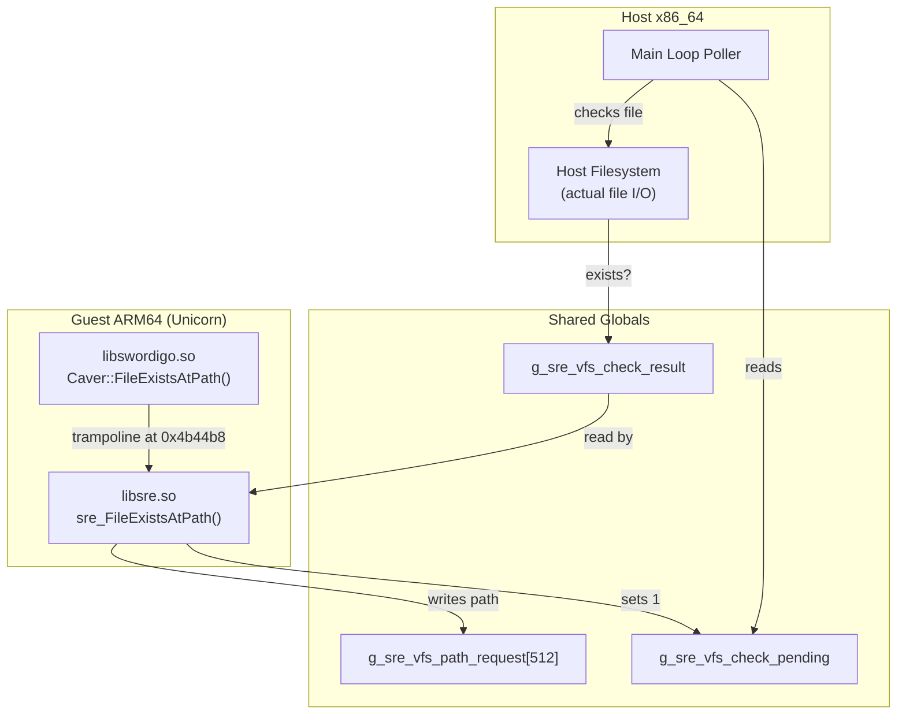

# VFS (Virtual Filesystem) API

> [!WARNING]
> The VFS hook is currently **DISABLED**. The hook entry in `sre_init.c` (line 190) is
> commented out. See [Why It's Disabled](#why-its-disabled) for details.

## Overview

The Virtual Filesystem provides **asset layering** for mod support. When a mod binary
is loaded, resource lookups are intercepted to check the mod's asset directory first,
falling back to the vanilla game assets if the mod doesn't provide a replacement.

This is the Swordigo Desktop equivalent of SwMini's `MiniPaths` system, reimplemented
from scratch to be clean and modular.

**Source file:** [sre_vfs.c](file:///home/quantumcreeper/SwordigoDesktop/src/sre/sre_vfs.c)
**Hook table entry:** [sre_init.c:190](file:///home/quantumcreeper/SwordigoDesktop/src/sre/sre_init.c#L186-L190)

---

## Architecture



The VFS cannot perform file I/O directly because it runs inside the Unicorn ARM64
emulator. Instead, it communicates with the host via shared memory globals — the same
pattern used by the [music system](music-api.md).

---

## Hooked Engine Functions

The VFS replaces two engine functions from `Caver` (the game's platform layer):

| Original Function | Hook Offset (v1.4.12) | SRE Replacement |
|---|---|---|
| `Caver::FileExistsAtPath(const std::string&)` | `0x4b44b8` | `sre_FileExistsAtPath` |
| `Caver::NewByteBufferFromAndroidAsset(const std::string&, uint32_t*)` | *(not yet hooked)* | *(planned)* |

---

## Functions

### `sre_vfs_init(const char* mod_prefix)`

Configures the VFS for mod support. Called by the host when a mod binary (e.g. RLSwordigo) is selected.

**Parameters:**
| Parameter | Type | Description |
|---|---|---|
| `mod_prefix` | `const char*` | Mod asset directory name (e.g. `"rl_assets"`), or `NULL` for vanilla mode |

**Behavior:**
- If `mod_prefix` is non-NULL and non-empty:
  - Copies the prefix into `g_sre_vfs_mod_prefix` (bounded to 255 chars)
  - Sets `g_sre_vfs_active = 1`
- If `mod_prefix` is NULL or empty:
  - Clears `g_sre_vfs_mod_prefix`
  - Sets `g_sre_vfs_active = 0` (passthrough mode)

```c
// Example: host calls this when loading a mod
sre_vfs_init("rl_assets");   // Mod mode — try rl_assets/ first
sre_vfs_init(NULL);          // Vanilla mode — passthrough
```

---

### `sre_FileExistsAtPath(SreString* path_str)`

Replacement for `Caver::FileExistsAtPath`. Intercepts file existence checks and
rewrites paths when a mod is active.

**ARM64 ABI:** `X0 = const std::string& path`
**Returns:** `int` — `1` if file exists, `0` if not found

**Behavior:**
1. Extracts the C string from the `SreString*` argument (Caver's `std::string` layout)
2. If VFS is active and the path starts with `"resources/"`, rewrites it:
   - `"resources/levels/town.scene"` → `"rl_assets/resources/levels/town.scene"`
3. Writes the (possibly rewritten) path into `g_sre_vfs_path_request`
4. Sets `g_sre_vfs_check_pending = 1`
5. Returns `1` (optimistic — see [Why It's Disabled](#why-its-disabled))

> [!CAUTION]
> The current implementation **always returns 1** regardless of whether the file
> actually exists. This is the primary reason the hook is disabled.

---

## Shared Globals

These globals live in `libsre.so`'s BSS/data segment and are accessed by both the
guest ARM64 code and the host x86_64 code via the shared guest memory mapping.

### VFS Configuration

| Global | Type | Description |
|---|---|---|
| `g_sre_vfs_mod_prefix[256]` | `char[256]` | Mod resource directory name (e.g. `"rl_assets"`) |
| `g_sre_vfs_active` | `int` | `1` = VFS active (mod loaded), `0` = passthrough |

### File Existence Check Protocol

| Global | Type | Written By | Read By | Description |
|---|---|---|---|---|
| `g_sre_vfs_path_request[512]` | `char[512]` | Guest (SRE) | Host | Path to check or load |
| `g_sre_vfs_check_pending` | `int` | Guest (SRE) | Host | `1` = file check requested |
| `g_sre_vfs_check_result` | `int` | Host | Guest (SRE) | `1` = file exists |

### File Load Protocol (Planned)

| Global | Type | Written By | Read By | Description |
|---|---|---|---|---|
| `g_sre_vfs_load_pending` | `int` | Guest (SRE) | Host | `1` = load requested |
| `g_sre_vfs_load_result_ptr` | `uint64_t` | Host | Guest (SRE) | Guest pointer to loaded data |
| `g_sre_vfs_load_result_size` | `uint32_t` | Host | Guest (SRE) | Size of loaded data in bytes |

### Original Function Pointers

| Global | Type | Description |
|---|---|---|
| `g_orig_FileExistsAtPath` | `uint64_t` | Guest address of original `Caver::FileExistsAtPath` (for fallback) |
| `g_orig_NewByteBuffer` | `uint64_t` | Guest address of original `Caver::NewByteBufferFromAndroidAsset` (for fallback) |

> [!NOTE]
> These original function pointers are intended for relay-stub trampolines, but are
> not currently used since the VFS hook is disabled.

---

## String Helpers

The VFS includes freestanding string utilities (no libc dependency, since SRE runs
in the emulated guest context):

### `sre_strlen(const char* s)` (static)

Returns the length of a guest string. Includes a NULL guard — returns `0` if `s` is NULL.

```c
static int sre_strlen(const char* s) {
    if (!s) return 0;
    int n = 0;
    while (s[n]) n++;
    return n;
}
```

### Other Helpers (static, internal)

| Function | Signature | Description |
|---|---|---|
| `sre_strncmp` | `(const char* a, const char* b, int n)` | Bounded string comparison |
| `sre_strcpy` | `(char* dst, const char* src)` | String copy |
| `sre_strcat` | `(char* dst, const char* src)` | String concatenation |

---

## Path Rewriting

### `sre_vfs_rewrite_path(const char* original, char* rewritten, int max_len)` (static)

Checks if a path is a game resource path and rewrites it for mod lookup.

**Rewrite rules:**
- Paths starting with `"resources/"` → `"{mod_prefix}/resources/..."`
- All other paths → no rewrite (passthrough)

**Example:**

```
Input:  "resources/levels/town.scene"
Prefix: "rl_assets"
Output: "rl_assets/resources/levels/town.scene"
```

**Returns:** `1` if rewrite was performed, `0` if passthrough.

**Safety:** Checks that the rewritten path fits in `max_len` before writing. Skips
the rewrite (returns `0`) if the concatenated path would overflow.

---

## Why It's Disabled

The VFS hook is disabled in the hook table ([sre_init.c:190](file:///home/quantumcreeper/SwordigoDesktop/src/sre/sre_init.c#L186-L190)):

```c
/* Virtual Filesystem — mod asset layering.
 * DISABLED: Same trampoline issue — replaces FileExistsAtPath entirely.
 * Our stub returns 1 optimistically, breaking actual file checks.
 * Re-enable after implementing host-side file check delegation. */
/* { 0x4b44b8, "sre_FileExistsAtPath" }, */
```

**Root cause:** `sre_FileExistsAtPath` always returns `1`, because the host-side file
check delegation is not yet implemented. The function writes the path to shared memory
and sets the pending flag, but there is no synchronous way for the guest to wait for
the host's response — and the host doesn't yet poll `g_sre_vfs_check_pending`.

This optimistic return breaks the game's file existence logic. When the engine asks
"does `resources/textures/missing.pvr` exist?" and gets `1`, it then tries to load
the file and crashes or produces errors.

---

## Future Plans

### Phase 1: Synchronous File Check Delegation

The host main loop needs to poll `g_sre_vfs_check_pending` after each emulation step:

```
1. Guest sets g_sre_vfs_path_request = "rl_assets/resources/levels/town.scene"
2. Guest sets g_sre_vfs_check_pending = 1
3. Host detects pending check
4. Host calls access() or stat() on the actual filesystem
5. Host sets g_sre_vfs_check_result = (file_exists ? 1 : 0)
6. Host clears g_sre_vfs_check_pending = 0
7. Guest reads g_sre_vfs_check_result
```

### Phase 2: Asset Loading Delegation

Once file checks work, implement `NewByteBufferFromAndroidAsset` replacement:
- Guest writes requested path to shared buffer
- Host loads the file from the mod directory (or vanilla fallback)
- Host writes the data to guest memory and sets the result pointer/size
- Guest returns the pointer to the engine

### Phase 3: Full Mod Asset Overlay

With both hooks working, mods can overlay files on top of vanilla assets:

```
~/.local/share/swordigo-desktop/
  ├── assets/resources/          ← Vanilla assets (read-only)
  └── mods/my-mod/
      └── assets/resources/      ← Mod assets (checked first)
          └── textures/
              └── hero.pvr       ← Replaces vanilla hero texture
```

The VFS checks the mod directory first. If the file exists there, it's loaded from
the mod. Otherwise, the vanilla file is used. This enables:

- **Texture replacement** — custom character/enemy/environment textures
- **Model replacement** — modified `.POD` meshes
- **Scene modification** — custom level layouts
- **Script modding** — modified Lua scripts (when combined with LNI hooks)

All without modifying any original game files.

---

## Related Documentation

- [SRE Hook API](sre-hooks.md) — Full hook table reference
- [Modding Guide](modding-guide.md) — How to create mods
- [Music System](music-api.md) — Uses the same shared-globals pattern
- [Architecture Overview](architecture.md) — Guest/host communication model
