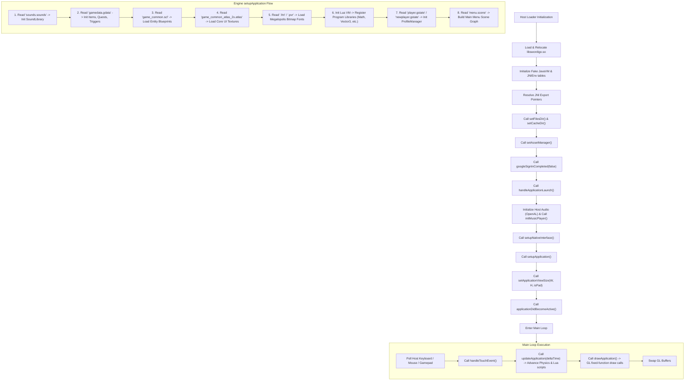

# Engine Intelligence & Vita Correlation Report

This report serves as the **Engine Intelligence Officer's** guide for bootstrapping the desktop runner of *Swordigo* (version 1.4.6), mapping dependencies, analyzing JNI usage, comparing against the Vita port implementation, and detailing the path to first-frame rendering.

---

## 1. Startup Dependency Graph

Below is the chronological and structural flow of the *Swordigo* startup sequence, detailing the interaction between the host runner, JNI emulation, and the native C++ engine (`Caver`).



---

## 2. JNI Usage Discovery

This list classifies the JNI calls based on their necessity for a working desktop runner running version 1.4.6 of the native library.

### Required JNI Calls
These functions are essential for the basic handshake, lifecycle config, and audio callbacks:
*   **`GetJavaVM` / `GetEnv`**: Used to bootstrap and obtain pointers to JNI structures from the guest side.
*   **`FindClass`**: Called by `setupNativeInterface` to locate `com/touchfoo/swordigo/Native`.
*   **`GetMethodID` / `GetStaticMethodID`**: Required to resolve method IDs for callbacks.
*   **`NewGlobalRef`**: Necessary for saving references to instances passed to native code (specifically the `MusicPlayer` object).
*   **`GetObjectClass`**: Used to get the class of dynamic arguments (e.g. retrieving `com/touchfoo/swordigo/MusicPlayer` class inside `initMusicPlayer`).
*   **`NewStringUTF` / `GetStringUTFChars` / `GetStringUTFLength` / `GetStringUTFRegion`**: Crucial for retrieving and converting Java string arguments (paths, filenames, quest IDs, and text input) to standard C-strings.
*   **`CallVoidMethodV` / `CallBooleanMethodV`**: Used to trigger playback and load commands on the JNI `MusicPlayer` instance:
    *   `loadFile(String)`
    *   `play()`
    *   `pause()`
    *   `stop()`
    *   `setLooping(boolean)`
    *   `setVolume(float)`

### Optional JNI Calls
These calls are made by the engine but can be safely stubbed or bypassed with default behaviors without crashing or altering gameplay:
*   **`CallStaticVoidMethodV`**:
    *   `reportAchievementProgress(String, int, boolean)`: Can be bypassed or redirected to a local achievement tracker (like the Vita port's local trophy system).
*   **`CallStaticBooleanMethodV`**:
    *   `isAgeKnown()`: Can always return `true`.
    *   `getPlatformConsentState()`: Can return `1` (Not Required/Obtained) to skip consent popups.
*   **`GetIntField` / `GetBooleanField` / `GetFloatField` / `GetFieldID`**: Standard property accessors. If they return fallback defaults (e.g., `true` or `0`), the engine remains stable.

### Potentially Ignorable JNI Calls
These functions are either not reached in the core gameplay execution path or relate to systems (ads, Google Play cloud saving) that should be bypassed:
*   **`ThrowNew`**: Can be stubbed to return `0` since C++ exception handling (`__cxa_throw`) is used internally by the engine for logic control.
*   **`PushLocalFrame` / `PopLocalFrame` / `DeleteLocalRef` / `DeleteGlobalRef` / `ReleaseStringUTFChars`**: Safe to stub as empty functions (`ret0`) in a desktop loader environment where memory allocations for JNI shims are trivial.
*   **`GetArrayLength` / `GetObjectArrayElement` / `NewIntArray` / `GetIntArrayElements` / `ReleaseIntArrayElements` / `SetIntArrayRegion`**: Primarily used for passing binary data packets (like Google Play Games cloud save snapshots). Since cloud saving is disabled in favor of local files, these can return `NULL`/`0`.
*   **`RegisterNatives`**: Can be stubbed to do nothing.

---

## 3. Vita Port Correlation & Checklist

The Vita port (`swordigo-vita-master`) acts as a native `.so` loader that patches the Android ARMv7 binary at load time, mapping all dynamic dependencies to custom wrappers.

### JNI Functions actually needed vs. stubbed
*   **Implemented (Faked)**: `FindClass` (returns dummy pointer `0x41414141`), `GetMethodID`, `CallVoidMethodV`, `CallBooleanMethodV`, `CallStaticBooleanMethodV`, `CallStaticVoidMethodV`, `NewGlobalRef`, `GetObjectClass`, `NewStringUTF`, `GetStringUTFChars`, `GetStringUTFLength`, `GetStringUTFRegion`, `GetJavaVM`.
*   **Stubbed (Returns 0 / NOP)**: `ThrowNew`, `PushLocalFrame`, `PopLocalFrame`, `DeleteLocalRef`, `DeleteGlobalRef`, `ReleaseStringUTFChars`, `RegisterNatives`, `GetArrayLength`, `GetObjectArrayElement`, `GetIntArrayElements`, `ReleaseIntArrayElements`, `SetIntArrayRegion`.

### Android APIs Stubbed or Wrapped
*   **`AAssetManager`**: Fully mocked. The Vita loader maps `AAssetManager_open` to standard `open()` calls by prepending `"ux0:data/swordigo/assets/"` to asset requests. It wraps the resulting file descriptors directly for `AAsset_read()`, `AAsset_seek()`, and `AAsset_getLength()`.
*   **`AAsset_openFileDescriptor`**: Returns the same file descriptor, setting a global flag `skip_close = 1` to prevent the wrapper from prematurely calling `close()` during standard stream iterations.
*   **OpenGL ES**: Uniform mapping is patched inside `glGetUniformLocation` (mapping `"texture"` to `"_texture"`) and attribute locations are patched inside `glBindAttribLocation` (binding index `2` to `"extents"` and `"vertcol"`).

### Systems Bypassed
*   **Google Play Games Cloud Saves**: Cloud sync calls (`loadSnapshot`, `saveSnapshot`, `deleteSnapshot`) are ignored. The engine natively reads/writes save slots (e.g. `slot0.gstate`) directly to the path provided in `setFilesDir`.
*   **Ad Networks**: The dynamic method `Caver::OnlineController_Android::ShowInterstitialAd` is hooked directly and replaced with a `ret0` patch, preventing all ad rendering.
*   **Trophy/Achievement System**: Google Play achievement reporting is intercepted via `CallStaticVoidMethodV(REPORT_ACHIEVEMENT_PROGRESS)` and redirected to the Vita's native trophy API.

### Concise Compatibility Checklist for Host Loader
1.  [ ] **Relocation & RelSymbol Resolution**: Correctly resolve external imports (`open`, `read`, `write`, `gzopen`, etc.) to host libc equivalents.
2.  [ ] **OpenAL Shim**: Wrap or forward all `al*` and `alc*` audio calls to the host system's OpenAL library.
3.  [ ] **Asset Path Remapping**: Provide a custom `AAssetManager` wrapper that redirects `AAssetManager_open` to a local files folder on the host machine.
4.  [ ] **Fake JNIEnv & JavaVM Tables**: Build a structure with the JNIEnv offset layout, routing method-lookups to a mapper that detects `loadFile`, `play`, `pause`, etc., and links them to the host audio player.
5.  [ ] **Memory Alignment**: Ensure the `.bss` segment of the guest ELF is allocated and zeroed out properly.

---

## 4. Asset Expectations

### First Files Loaded
1.  **`sounds.sounds`**: Holds definitions matching sound identifiers (e.g., `coin_get`) to audio asset paths.
2.  **`gamedata.gdata`**: Protobuf wire format file holding the database for quests, quest triggers, items, and target scenes.
3.  **`game_common.scl`**: The global entity configuration catalog defining all blueprints (e.g., default health, speed, and components).
4.  **`game_common_atlas_2x.atlas`** and **`game_common_atlas_2x.pvr`**: Primary sprite sheets used for main menu and GUI elements.
5.  **`font_megalopolis_*.fnt`**: Fonts loaded for UI rendering.
6.  **`menu.scene`**: The initial scene representing the main menu layout.

### Resource Path Assumptions
The engine assumes assets are placed under a root `assets/resources/` directory. File search paths are built dynamically by appending the requested filename to the assets root (e.g., `resources/gamedata.gdata`).

### Save Path Assumptions
Save files are created in the folder designated by `setFilesDir` (e.g., `ux0:data/swordigo` on Vita). The engine creates `slotX.gstate` (where X is 0, 1, or 2) to store progress, and `options.gopt` to store settings.

### Asset Manager Assumptions
The engine expects standard Android NDK asset manager semantics. A custom loader must intercept NDK asset manager calls and translate them to direct filesystem reads.

---

## 5. First Frame Roadmap

If `setupApplication` returned successfully tomorrow, the following sequence of dependencies must be fulfilled before a frame can be displayed:

```
[setupApplication Returns]
         │
         ▼
[setApplicationViewSize(W, H, isPad)]  <─── Sets up projection matrices and GL Viewport
         │
         ▼
[applicationDidBecomeActive()]         <─── Resumes engine tickers & game timers
         │
         ▼
[Host GL Context Hook]                 <─── Must bind native GL context (GLFW/SDL)
         │
         ▼
[Texture Decompression (PVR -> RGBA)] <─── Decompresses PVRTC textures for desktop GPUs
         │
         ▼
[Loop: updateApplication(0.0166f)]     <─── Advances Lua scripting, animations, physics
         │
         ▼
[Loop: drawApplication()]              <─── Renders screen via GLES 1.1 calls
         │
         ▼
[Swap Buffers]                         <─── Displays frame on host window
```

### Detailed Dependencies
1.  **Viewport Initialization**: `setApplicationViewSize` must be called to allocate rendering boundaries. Failing to call this results in an empty or crashed viewport.
2.  **State Activation**: `applicationDidBecomeActive` is required to signal the engine to start processing ticks and update timers.
3.  **GLES 1.1 Pipeline Bindings**: The desktop runner must expose a valid OpenGL context (compatible with OpenGL ES 1.1 fixed-function pipelines). Dynamic functions like `glVertexPointer`, `glTexCoordPointer`, and `glDrawElements` must map directly to host GL functions.
4.  **PVR Texture Decoders**: Desktop GPUs do not natively support the `PVRTC` compression format used on mobile devices. Texture loaders must decompress `.pvr` textures into raw `RGBA8888` arrays at load time before calling `glTexImage2D`.
5.  **Input Translation**: Keyboard, mouse, or gamepad inputs from the host must be mapped and forwarded to the native `handleTouchEvent` callback to interact with menu buttons.
