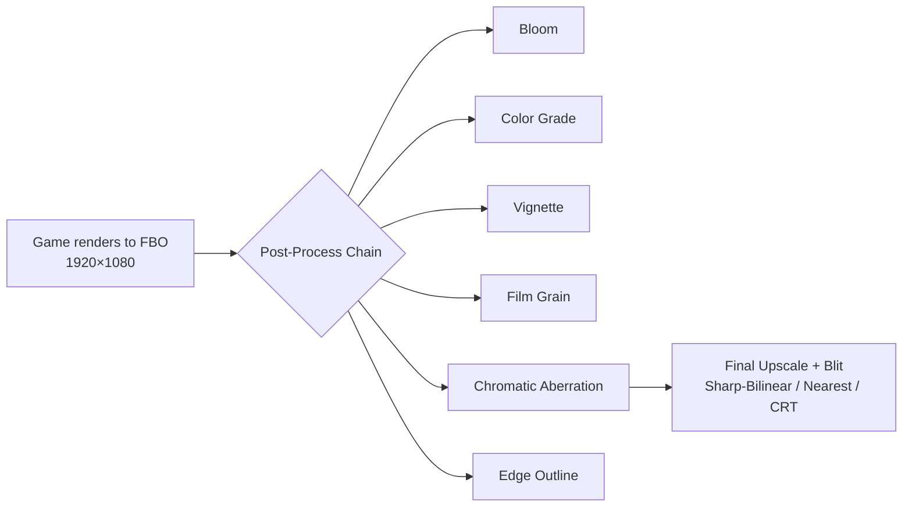

# 🎨 Rendering Tweaks Catalog — SwordigoDesktop

Optional visual enhancements, organized by difficulty. All injected as post-processing passes between the game FBO and final screen blit.

## Architecture



**Injection point:** `fbo_scaler.cpp` line 245, after game FBO unbind, before final blit quad

---

## Tier 1 — Easy Wins (No Pipeline Changes) 🟢

| Effect | Perf Impact | Visual Impact | Implementation |
|--------|-------------|---------------|----------------|
| **Vignette** | Negligible | ⭐⭐ | Already in CRT! Extract as standalone |
| **Film Grain** | Negligible | ⭐⭐ | Noise function + time uniform |
| **Chromatic Aberration** | Negligible | ⭐⭐ | Offset R/G/B channel UVs |
| **Color Grading** | Negligible | ⭐⭐⭐ | LUT texture lookup — mood changer |
| **Saturation/Contrast** | Negligible | ⭐⭐ | Simple color math in shader |
| **Sharpen** | Negligible | ⭐⭐ | Unsharp mask (center − neighbors) |

### Proposed Toggle System
Each effect gets an on/off flag + intensity slider, accessible via:
- **F4 key** (cycles scale modes — already exists)
- **New F6 key** — cycles through post-FX presets
- **Settings panel** — individual effect controls

---

## Tier 2 — Medium Effort (Extra FBO passes) 🟡

| Effect | Perf Impact | Visual Impact | Implementation |
|--------|-------------|---------------|----------------|
| **Bloom/Glow** | Low-Med | ⭐⭐⭐ | Brightness threshold → blur → additive blend |
| **Edge Detection** | Low | ⭐⭐⭐ | Sobel on color buffer → outline overlay |
| **HDR Tone Mapping** | Low | ⭐⭐ | Reinhard/ACES curve on final color |
| **Motion Blur** | Medium | ⭐⭐ | Accumulation buffer (80/20 blend) |

---

## Tier 3 — Depth-Based Effects (Need depth texture) 🟠

> [!IMPORTANT]
> Currently the depth buffer is a **renderbuffer** (not sampleable). Requires converting to a depth texture in `fbo_init()`.

| Effect | Perf Impact | Visual Impact | Implementation |
|--------|-------------|---------------|----------------|
| **Depth of Field** | Medium | ⭐⭐⭐ | Blur based on depth distance from focus |
| **SSAO** | High | ⭐⭐ | Depth-only ambient occlusion |
| **Volumetric Fog** | High | ⭐⭐⭐ | Screen-space raymarching with depth |

---

## Tier 4 — Major Architecture Changes 🔴

| Effect | Notes |
|--------|-------|
| **Shadow Mapping** | Extra render pass from light POV |
| **Dynamic Lighting** | Replace fixed-function pipeline |
| **Water Reflections** | Geometry identification + mirror render |

---

## Proposed Implementation: Tier 1 Effects

All toggled via a `PostFXState` struct in `fbo_scaler.h`:

```cpp
struct PostFXState {
    // Master toggle
    bool enabled = false;
    
    // Individual effects
    bool vignette = false;
    float vignette_intensity = 0.3f;    // 0.0 = none, 1.0 = heavy
    
    bool film_grain = false;
    float grain_intensity = 0.06f;       // subtle
    
    bool chromatic_aberration = false;
    float ca_offset = 0.002f;            // UV offset for R/B channels
    
    bool color_grade = false;
    float saturation = 1.0f;             // 1.0 = normal
    float contrast = 1.0f;
    float brightness = 0.0f;
    float warmth = 0.0f;                 // -1.0 = cool, +1.0 = warm
    
    bool sharpen = false;
    float sharpen_strength = 0.4f;
    
    // Presets
    // "Cinematic"  = vignette + grain + warm color grade
    // "Retro"      = CRT mode + grain + saturation boost
    // "Fantasy"    = bloom + saturation + warm + vignette
    // "Noir"       = desaturated + high contrast + vignette + grain
};
```

### F6 Key Cycle: Off → Cinematic → Retro → Fantasy → Noir → Custom → Off

Each preset configures the above flags. "Custom" uses whatever the user set in Settings.
