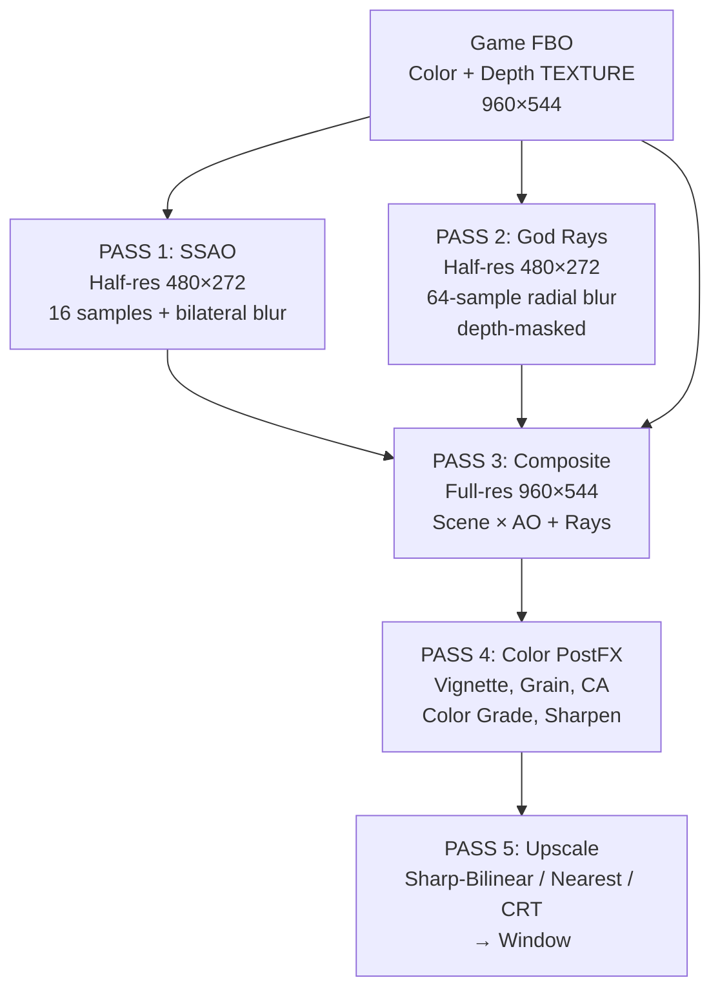

# 🎨 Advanced Rendering Pipeline — Implemented

## Architecture

## Key Changes

### Depth Buffer: Renderbuffer → Texture
The depth-stencil attachment is now a **GL_DEPTH24_STENCIL8 texture** instead of a renderbuffer. This enables all depth-based shaders (SSAO, god rays) to sample it directly.

### 8 GLSL Shader Programs
| Shader | Purpose | Samples |
|--------|---------|---------|
| **Vertex** | Fullscreen quad | — |
| **Sharp-Bilinear** | Upscale with sub-pixel blending | 1 |
| **Nearest** | Raw pixel upscale | 1 |
| **CRT** | Scanlines + barrel + vignette | 1 |
| **PostFX** | Color effects (vignette, grain, CA, etc.) | 5-9 |
| **SSAO** | Ambient occlusion from depth | 16 |
| **God Rays** | Radial blur from sun, depth-masked | 64 |
| **Gaussian Blur** | 9-tap separable blur for SSAO | 9 |
| **Composite** | Scene × AO + god rays additive | 3 |

### 7 Visual Presets (F6 key)

| Preset | Effects | Mood |
|--------|---------|------|
| **Off** | None | Default |
| **Cinematic** 🎬 | Vignette + Grain + Warm tones | Hollywood |
| **Retro** 📼 | Grain + Saturation + Chromatic Aberration | 90s arcade |
| **Fantasy** ✨ | Vignette + Saturation + Warmth + Sharpen | Enchanted |
| **Noir** 🖤 | Heavy vignette + Grain + Desaturated + High contrast | Dark detective |
| **Ethereal** 🌅 | **God Rays** + Warm glow + Vignette | Heavenly light |
| **Atmospheric** 🌫️ | **SSAO** + **Volumetric Light** + Vignette | Immersive depth |

### Half-Resolution Optimization
SSAO and God Rays render at **half resolution** (480×272) then upscale during composite. This keeps the performance impact minimal while still looking great.
